# Design Document — Adaptive Skill-Building Session (`adaptive`)

## Overview

This feature adds a fifth conceptual practice mode, the **`adaptive`** session type (parent-facing label **"Skill builder"**), to ApexMaths. An adaptive session samples **15 questions across all six topics** in 20 minutes, weighting topics by the child's per-topic mastery so that practice concentrates where it helps most. The default weighting is **weak-weighted** (inverse mastery): weaker topics get proportionally more questions.

The guiding design principle is **maximum reuse, minimum new surface area**. The entire existing session lifecycle — entitlement gate, ownership check, zombie sweep, one-active-session guard, `createSession`, the answer firewall, server-authoritative idempotent grading, server-enforced timer expiry, the per-session AI review in `after()`, audit logging, and the PII firewall — is **type-agnostic** and is reused unchanged. The **only new behaviour** is *how the ordered list of question ids is chosen* when `type === "adaptive"`.

That new behaviour is split into two cleanly separated pieces:

- **`Selection_Core`** — a **pure, deterministic, I/O-free** function (new module `lib/practice/adaptive-selection.ts`) that performs all weighting, allocation, difficulty targeting, recency exclusion, fallback, and cold-start logic. It takes plain data plus an injected RNG and returns selected ids, a per-topic allocation map, and metadata. Because it is pure it is fully property-testable with `fast-check` (already a repo dependency).
- **`Selection_Service`** — a thin **server-only** orchestrator (new module `lib/db/adaptive.ts`) that gathers the core's inputs from Aurora (mastery, accuracy-by-difficulty, candidate pools, recently-answered set), calls `Selection_Core`, and returns the selected ids plus their per-question topics in the shape `createSession` already expects.

One schema migration is in scope: adding `adaptive` to the `session_type` enum and a composite recency index on `session_answers(session_id, answered_at)`. No other schema change is made.

### Research notes / grounding in the codebase

- **Session creation already accepts an arbitrary ordered id list + per-question topics.** `createSession({ ..., questionIds, questionTopics, timeLimitSeconds })` (`lib/db/sessions.ts`) inserts the session row and pre-seeds `session_answers` slots. The adaptive branch only needs to produce `questionIds` + `questionTopics`; everything downstream is identical to `warmup`/`mock`.
- **`pickQuestionIds`** (`lib/db/questions.ts`) is the existing `ORDER BY random() LIMIT n` sampler. The adaptive path replaces *only this call* with `Selection_Service`. Cold-start uniform sampling reuses the same "mixed topics" idea, but inside the pure core so it remains testable.
- **Inputs already exist as live Aurora reads.** `getChildProgress` (`lib/db/progress.ts`) returns per-topic `{ attempts, masteryScore }` for all six topics (zero-filled). `getAccuracyByDifficulty` (`lib/db/analytics.ts`) returns `{ difficulty, attempts, correct, pct }` per attempted difficulty. Both are reused as-is.
- **The recency anti-join must go through `sessions`.** `session_answers` has `session_id`, `question_id`, `answered_at`, `topic`; `child_id` lives on `sessions`. So the recently-answered query joins `session_answers → sessions ON session_id` and filters `sessions.child_id` + `session_answers.answered_at`. This shape dictates the index choice in Req 10.
- **`migrate.mjs` runs each statement individually (not wrapped in a transaction).** `splitSql` splits on `;` respecting `$$`/quotes/comments, and `exec()` sends each statement in its own `ExecuteStatementCommand`. This is exactly what `ALTER TYPE ... ADD VALUE` requires (it cannot run inside a transaction block), so the migration is compatible.
- **The review path is already type-agnostic and PII-safe.** `finishSessionAction` persists score + per-topic summary before any AI, then runs `generateReviewExplanations` in `after()` with deterministic fallback; `ReviewItemContext` carries only maths content + year group. Nothing here needs to change for `adaptive`.

---

## Architecture

The adaptive session reuses the entire existing pipeline. The only new branch is inside `startSessionAction`: when `type === "adaptive"`, question ids come from `Selection_Service`/`Selection_Core` instead of `pickQuestionIds`.

```mermaid
flowchart TD
    A["startSessionAction(formData)"] --> B["requireEntitledParent() gate (Req 11)"]
    B --> C["startSchema.safeParse — adaptive in enum;<br/>reject topic supplied for adaptive (Req 1.6)"]
    C --> D["getChildForParent — ownership (Req 11.2)"]
    D --> E["expireElapsedForChild — zombie sweep (Req 12.2)"]
    E --> F["getActiveSession — one-active guard (Req 12.1, 12.4)"]
    F -->|active exists| G["return { activeSession } — resume/end"]
    F -->|none| H{"type === 'adaptive' ?"}

    H -->|"no (warmup/topic/mock)"| I["pickQuestionIds(count, topic)"]
    H -->|yes| J["Selection_Service.selectAdaptiveQuestions(childId)"]

    subgraph SVC["Selection_Service (server-only, lib/db/adaptive.ts)"]
        J --> J1["getChildProgress — mastery + attempts"]
        J --> J2["getAccuracyByDifficulty — per-difficulty accuracy"]
        J --> J3["getCandidatePools — active questions per topic (NEW SQL)"]
        J --> J4["getRecentlyAnsweredSet — recency anti-join (NEW SQL)"]
        J1 & J2 & J3 & J4 --> K
    end

    subgraph CORE["Selection_Core (PURE, no I/O, lib/practice/adaptive-selection.ts)"]
        K["selectAdaptiveQuestions(input, rng)"] --> K1["1. detect Cold_Start"]
        K1 --> K2["2. Topic_Weight = (100 - mastery)^gamma"]
        K2 --> K3["3. normalise to real quotas summing to total"]
        K3 --> K4["4. Coverage_Floor + Hamilton largest-remainder"]
        K4 --> K5["5. Target_Difficulty_Band (accuracy closest to 0.75)"]
        K5 --> K6["6. per topic: exclude recency, order by |d-target|, RNG tie-break"]
        K6 --> K7["7. Fallback_Chain: widen → drop recency → reallocate"]
        K7 --> R["{ selectedIds, allocation, metadata }"]
    end

    I --> M["getQuestionsByIds → orderedIds + questionTopics"]
    R --> M2["selectedIds + per-question topics (from candidate pools)"]
    M --> N["createSession(... questionIds, questionTopics, timeLimitSeconds)"]
    M2 --> N
    N --> O["audit session.started (Req 17.1)"]
    O --> P["redirect /practice/&#123;id&#125;"]

    P --> PG["player page reads getChildProgress (pre-session state) →<br/>derive cold-start ⇒ calibrating note (Req 9.4);<br/>allocation from question_ids→topic (Req 9.3)"]
    PG --> Q["PracticePlayer → submitAnswerAction (firewall + idempotent grading)"]
    Q --> S["finishSessionAction → completeSession → applySessionToProgress<br/>(progress now rolled in — cold-start no longer derivable)"]
    S --> T["after(): generateReviewExplanations (PII-free) → review_reports"]
    T --> U["result page renders score + per-topic +<br/>allocation breakdown ONLY (no calibrating note)"]
```



> **Where the calibrating note and allocation surface (design decision).** The `Allocation_Explanation` and the **calibrating** note are surfaced on the **practice player page** (`app/(app)/practice/[sessionId]/page.tsx`) **during the active session, before the session finishes**, because the child's `progress` is only updated at `finishSessionAction` (`applySessionToProgress`). At creation/play time the **pre-session** state is still intact, so cold-start (calibrating) is correctly derivable there. The **result page** (post-finish) MAY still show the per-topic allocation breakdown (recoverable from `question_ids → questions.topic`), but does **not** attempt the calibrating note: by then progress has been updated and cold-start is no longer derivable from `progress`. This honours Req 10.6 — no schema change beyond the recency index + the new enum value (no `calibrating` column is persisted).

### Layering and separation of concerns

| Layer | Module | Purity | Responsibility |
|-------|--------|--------|----------------|
| Practice_Service | `app/(app)/practice/actions.ts` | server action (I/O) | gate, validate, guard, branch on type, `createSession`, audit, redirect |
| Selection_Service | `lib/db/adaptive.ts` | server-only (I/O) | gather Aurora inputs, call core, shape result for `createSession` |
| Selection_Core | `lib/practice/adaptive-selection.ts` | **pure** | weighting, allocation, ZPD, recency, fallback, cold-start |
| Config/Domain | `lib/domain.ts` | pure | enums, `SESSION_TYPE_CONFIG`, tunable constants |

The pure/impure boundary is the testability boundary: `Selection_Core` depends only on its arguments and an injected `() => number` RNG, so its invariants (Req 19) are verified directly with `fast-check`. `Selection_Service` is thin enough to cover with a small number of example/integration tests.

---

## Components and Interfaces

### 1. Domain / configuration changes (`lib/domain.ts`)

Add `adaptive` to the session-type tuple and config map. Because `SessionType` is derived as `(typeof SESSION_TYPES)[number]`, appending one member widens the union without breaking existing exhaustiveness — every existing `switch`/`Record<SessionType, …>` still type-checks, and `SESSION_TYPE_CONFIG` gains a required key the compiler enforces.

```typescript
export const SESSION_TYPES = ["warmup", "topic", "mock", "adaptive"] as const
export type SessionType = (typeof SESSION_TYPES)[number]

// added entry in SESSION_TYPE_CONFIG: Record<SessionType, SessionTypeConfig>
adaptive: {
  type: "adaptive",
  label: "Skill builder",                 // Req 1.4
  questionCount: 15,                       // Req 1.2
  timeLimitSeconds: 20 * 60,               // 1200s, Req 1.2
  mixedTopics: true,                       // Req 1.3
  description: "15 questions tuned to your child's level across all topics in 20 minutes.",
},
```

New **pure tuning constants** (exported from `lib/domain.ts` so both the core and tests import one source of truth):

```typescript
// ---- Adaptive selection configuration ----
export const WEIGHTING_DIRECTIONS = ["weak_weighted", "strong_weighted"] as const
export type WeightingDirection = (typeof WEIGHTING_DIRECTIONS)[number]

export const DEFAULT_WEIGHTING_DIRECTION: WeightingDirection = "weak_weighted" // Req 2.2
export const WEIGHTING_GAMMA = 1.5          // exponent applied to the (in)mastery base (Req 2.3/2.4)
export const COVERAGE_FLOOR = 1             // questions per Attempted_Topic (Req 4)
export const ZPD_TARGET_ACCURACY = 0.75     // centre of the 70–80% window (Req 5.1)
export const DEFAULT_DIFFICULTY = 3         // mid of 1–5 when accuracy data absent (Req 5.6/5.7)
export const DIFFICULTY_MIN = 1
export const DIFFICULTY_MAX = 5
export const RECENCY_WINDOW_DAYS = 1        // Req 6.4
export const MASTERY_MIN = 0
export const MASTERY_MAX = 100
```

### 2. `Selection_Core` — pure module (`lib/practice/adaptive-selection.ts`)

All inputs are plain serialisable data; the RNG is injected. No imports from `server-only`, the DB, or `next/*`.

```typescript
import {
  TOPICS, type Topic, type WeightingDirection,
  COVERAGE_FLOOR, WEIGHTING_GAMMA, ZPD_TARGET_ACCURACY,
  DEFAULT_DIFFICULTY, DIFFICULTY_MIN, DIFFICULTY_MAX,
} from "@/lib/domain"

/** A selectable question, reduced to only what selection needs. */
export interface Candidate {
  id: string
  difficulty: number // 1..5
}

/** Per-topic mastery snapshot (mirrors getChildProgress output). */
export interface TopicMasteryInput {
  masteryScore: number // 0..100
  attempts: number      // graded attempts; >=1 ⇒ Attempted_Topic
}

/** Per-difficulty accuracy snapshot (mirrors getAccuracyByDifficulty output). */
export interface DifficultyAccuracyInput {
  difficulty: number // 1..5
  attempts: number
  pct: number        // 0..100
}

export interface SelectionConfig {
  total: number                         // session total (15 for adaptive)
  weightingDirection: WeightingDirection
  gamma: number
  coverageFloor: number
  targetAccuracy: number                // 0..1
  defaultDifficulty: number
  difficultyMin: number
  difficultyMax: number
}

export interface SelectionInput {
  mastery: Record<Topic, TopicMasteryInput>      // all six topics present
  accuracyByDifficulty: DifficultyAccuracyInput[] // only attempted levels need be present
  candidatePools: Record<Topic, Candidate[]>      // active questions per topic
  recentlyAnswered: ReadonlySet<string>           // question ids answered within the window
  config: SelectionConfig
}

export interface SelectionMetadata {
  calibrating: boolean                    // Cold_Start ⇒ true (Req 8.4)
  deficit: number                         // total - selectedIds.length, >=0 (Req 7.6)
  targetDifficulty: number                // chosen ZPD centre (Req 5)
  fallbacksApplied: {                     // per-topic record of relaxations (Req 7)
    widenedDifficulty: Topic[]
    droppedRecency: Topic[]
    reallocatedFrom: Topic[]              // topics that gave up shortfall
    reallocatedTo: Topic[]                // topics that absorbed shortfall
  }
}

export interface SelectionResult {
  selectedIds: string[]                   // ordered, distinct (Req 7.7)
  allocation: Record<Topic, number>       // per-topic counts; sums to selectedIds.length
  metadata: SelectionMetadata
}

/**
 * PURE. Deterministic given (input, rng). No I/O (Req 19.1).
 * `rng` returns a float in [0,1) and is used ONLY for tie-breaks (Req 5.3).
 */
export function selectAdaptiveQuestions(
  input: SelectionInput,
  rng: () => number,
): SelectionResult
```

Supporting pure helpers in the same module (each individually unit/property-testable):

```typescript
export function isColdStart(mastery: Record<Topic, TopicMasteryInput>): boolean
export function computeTopicWeights(
  mastery: Record<Topic, TopicMasteryInput>,
  direction: WeightingDirection,
  gamma: number,
): Record<Topic, number>                  // only Attempted_Topics get > 0 (Req 2, 3.7)
export function hamiltonAllocate(
  weights: Record<Topic, number>,
  total: number,
  coverageFloor: number,
): Record<Topic, number>                   // sums to total exactly (Req 3, 4)
export function targetDifficultyBand(
  accuracy: DifficultyAccuracyInput[],
  targetAccuracy: number,
  defaultDifficulty: number,
): number                                   // Req 5.1, 5.6, 5.7
```

A small seeded RNG (`mulberry32`) lives in `lib/practice/rng.ts` so the service can derive a deterministic-under-test seed and tests can supply a fixed one:

```typescript
// lib/practice/rng.ts (pure)
export function mulberry32(seed: number): () => number
```

### 3. `Selection_Service` — server orchestration (`lib/db/adaptive.ts`)

```typescript
import "server-only"
import { query } from "@/lib/aws/rds-data"
import { getChildProgress } from "@/lib/db/progress"
import { getAccuracyByDifficulty } from "@/lib/db/analytics"
import { selectAdaptiveQuestions, type Candidate, type SelectionResult } from "@/lib/practice/adaptive-selection"
import { mulberry32 } from "@/lib/practice/rng"
import {
  TOPICS, type Topic, SESSION_TYPE_CONFIG,
  DEFAULT_WEIGHTING_DIRECTION, WEIGHTING_GAMMA, COVERAGE_FLOOR,
  ZPD_TARGET_ACCURACY, DEFAULT_DIFFICULTY, DIFFICULTY_MIN, DIFFICULTY_MAX,
  RECENCY_WINDOW_DAYS,
} from "@/lib/domain"

export interface AdaptiveSelection {
  questionIds: string[]
  questionTopics: Topic[]             // topic per id, same order, for createSession
  allocation: Record<Topic, number>
  metadata: SelectionResult["metadata"]
}

/** Gather Aurora inputs, run the pure core, and shape the result for createSession. */
export async function selectAdaptiveQuestionsForChild(childId: string): Promise<AdaptiveSelection>

/** Active questions per topic, reduced to {id, difficulty}. */
async function getCandidatePools(): Promise<Record<Topic, Candidate[]>>

/** Distinct question ids the child answered within the recency window. */
async function getRecentlyAnsweredSet(childId: string, windowDays: number): Promise<Set<string>>
```

**New SQL — candidate pools (Req 7 inputs).** All active questions, projected to id + difficulty + topic, grouped client-side into per-topic pools. Mirrors `pickQuestionIds` conventions (no string interpolation of values, `::topic` casts only where binding a topic):

```sql
-- getCandidatePools()
SELECT id, topic, difficulty
FROM questions
WHERE active
ORDER BY topic, difficulty;
```

```typescript
async function getCandidatePools(): Promise<Record<Topic, Candidate[]>> {
  const rows = await query<{ id: string; topic: Topic; difficulty: number }>(
    `SELECT id, topic, difficulty FROM questions WHERE active ORDER BY topic, difficulty`,
  )
  const pools = Object.fromEntries(TOPICS.map((t) => [t, [] as Candidate[]])) as Record<Topic, Candidate[]>
  for (const r of rows) pools[r.topic].push({ id: r.id, difficulty: r.difficulty })
  return pools
}
```

**New SQL — recently-answered set (Req 6).** The anti-join source. `child_id` is reached through `sessions`; the window interval is parameterised:

```sql
-- getRecentlyAnsweredSet(childId, windowDays)
SELECT DISTINCT sa.question_id
FROM session_answers sa
JOIN sessions s ON s.id = sa.session_id
WHERE s.child_id = :childId
  AND sa.answered_at IS NOT NULL
  AND sa.answered_at >= now() - (:windowDays::int * interval '1 day');
```

```typescript
async function getRecentlyAnsweredSet(childId: string, windowDays: number): Promise<Set<string>> {
  const rows = await query<{ question_id: string }>(
    `SELECT DISTINCT sa.question_id
       FROM session_answers sa
       JOIN sessions s ON s.id = sa.session_id
      WHERE s.child_id = :childId
        AND sa.answered_at IS NOT NULL
        AND sa.answered_at >= now() - (:windowDays::int * interval '1 day')`,
    { childId, windowDays },
  )
  return new Set(rows.map((r) => r.question_id))
}
```

The service builds the `Record<Topic, TopicMasteryInput>` from `getChildProgress` (zero-filled for all six topics), passes `getAccuracyByDifficulty` straight through, derives a per-request seed (e.g. `Date.now() ^ hashString(childId)`), calls `mulberry32(seed)`, then `selectAdaptiveQuestions`. It maps each selected id back to its topic via a `Map<id, Topic>` built from the candidate pools, producing `questionTopics` in id order — exactly the contract `createSession` expects. The order of `selectedIds` is preserved end-to-end (the player presents questions in `question_ids` order).

> **Determinism note (Req 5.4/5.5):** the *core* is deterministic given a seed; production derives a fresh seed per request (sessions should differ run-to-run), while tests inject a fixed seed. If seed derivation ever fails, the core still runs with whatever RNG is supplied — non-determinism is acceptable graceful degradation (Req 5.5), never an abort.

### 4. Practice_Service wiring (`app/(app)/practice/actions.ts`)

`startSchema` gains `adaptive` and rejects a supplied topic for adaptive:

```typescript
const startSchema = z
  .object({
    childId: z.string().uuid("Invalid child."),
    type: z.enum(["warmup", "topic", "mock", "adaptive"]),
    topic: z.enum(TOPICS).optional(),
  })
  .refine((v) => !(v.type === "adaptive" && v.topic), {
    message: "Skill builder uses a mix of topics and can't be limited to one.", // Req 1.6
    path: ["topic"],
  })
```

The branch sits exactly where `pickQuestionIds` is today, after the entitlement gate, ownership check, zombie sweep, and one-active guard (all unchanged, Req 11/12):

```typescript
const config = SESSION_TYPE_CONFIG[parsed.data.type as SessionType]
const topic: Topic | null = parsed.data.type === "topic" ? parsed.data.topic ?? null : null
if (parsed.data.type === "topic" && !topic) return { error: "Please choose a topic to practise." }

let orderedIds: string[]
let questionTopics: Topic[]
if (parsed.data.type === "adaptive") {
  const sel = await selectAdaptiveQuestionsForChild(child.id) // Selection_Service
  if (sel.questionIds.length === 0) {
    return { error: "No questions are available yet. Please seed the question bank first." }
  }
  orderedIds = sel.questionIds
  questionTopics = sel.questionTopics
} else {
  const questionIds = await pickQuestionIds({ count: config.questionCount, topic })
  if (questionIds.length === 0) {
    return { error: "No questions are available yet. Please seed the question bank first." }
  }
  const questions = await getQuestionsByIds(questionIds)
  const topicById = new Map(questions.map((q) => [q.id, q.topic]))
  orderedIds = questionIds.filter((id) => topicById.has(id))
  questionTopics = orderedIds.map((id) => topicById.get(id)!)
}
// createSession(..., questionIds: orderedIds, questionTopics, timeLimitSeconds: config.timeLimitSeconds)
// — identical for every type from here on (audit, unique-index catch, redirect).
```

**Allocation metadata persistence (Req 9) — least-invasive choice.** The allocation is *fully recoverable at render time* from `session.questionIds` joined to `questions.topic`, which both the player and result pages already load via `getQuestionsByIds`. Counting selected ids per topic reconstructs the exact per-topic allocation with **no new column and no new write** — so the allocation breakdown can be shown on **both** pages.

The only fact not recoverable from ids alone is the `calibrating` flag. Rather than persist it (which would be a schema change Req 10.6 forbids), we derive it **where it is still derivable: on the player page, during the active session**. Because `progress` is only rolled in at `finishSessionAction` (via `applySessionToProgress`), a `getChildProgress(childId)` read *while the session is active* still reflects the **pre-session** state — every topic `insufficient_data` / `0` attempts ⇒ cold start ⇒ calibrating. The same read on the **result page** would be wrong, because by then the just-finished session's answers have been aggregated into `progress`, so the child is no longer at zero attempts and cold-start can no longer be inferred from `progress`. This is the rationale for surfacing the calibrating note on the player page and the allocation-only breakdown on the result page, and it preserves the "no schema beyond the recency index" guarantee (Req 10.6). (An alternative — persisting metadata JSON — is rejected below.)

Everything after id selection is **literally the existing code path**: the `uniq_active_session_per_child` catch, `audit({ action: "session.started", ... })`, and `redirect`. Grading (`submitAnswerAction`), expiry (`expireIfElapsed`), finish/review (`finishSessionAction` + `after()`), and the PII firewall are type-agnostic and work unchanged.

### 5. Explainability component (Req 9)

A pure helper formats the allocation breakdown from a per-topic count map; the calibrating note is a **separate, optional element** driven by the cold-start check that is only available on the player page. PII-free by construction — only topic labels and integer counts.

```typescript
// lib/practice/allocation-explanation.ts (pure)
import { TOPIC_LABELS, type Topic } from "@/lib/domain"

/** Reconstruct per-topic counts from the session's ordered question topics. */
export function allocationFromTopics(topics: Topic[]): Record<Topic, number>

/** "5 Geometry, 4 Fractions…", topics with non-zero count, descending by count,
 *  ties broken alphabetically by topic key (deterministic, Req 9.2).
 *  PURE and calibrating-agnostic — the calibrating note is rendered separately. */
export function formatAllocationExplanation(
  allocation: Record<Topic, number>,
): string
```

`formatAllocationExplanation` stays **pure and free of any calibrating concern** — it renders only the per-topic breakdown. The calibrating note is a distinct optional UI element whose visibility is decided by the page that can still derive cold start.

**Rendering location — player page (allocation + calibrating note), Req 9.3/9.4.** In `app/(app)/practice/[sessionId]/page.tsx` (the active-session player, which already sets `export const maxDuration = 60` and renders `PracticePlayer`), gated on `session.type === "adaptive"` (Req 9.3 — never for `warmup`/`topic`/`mock`):
- The page already loads `questions` (hence each id's `topic`), so the allocation breakdown is computed with `allocationFromTopics(...)` → `formatAllocationExplanation(...)` with **no extra query**.
- The page additionally reads `getChildProgress(session.childId)` **during the active session**. Because progress is only rolled in at `finishSessionAction`, this read reflects the **pre-session** state; if every topic is `insufficient_data` (0 attempts) the session is cold start ⇒ render the calibrating note ("calibrating across mixed topics", Req 9.4) alongside the allocation. (Equivalently, the calibrating signal is derivable from the session's own pre-existing data; the key point is it is derivable here and **not** on the result page.)

**Rendering location — result page (allocation only), Req 9.3.** In `app/(app)/practice/[sessionId]/result/page.tsx`, gated on `session.type === "adaptive"`, placed near the existing "How each topic went" block. The page already has `questions`, so the allocation breakdown is computed with no extra query. It does **not** render the calibrating note: by the time the result page renders, `finishSessionAction` has aggregated the session into `progress`, so a `getChildProgress` read no longer reflects the pre-session zero-attempt state and cold start cannot be re-derived. Showing allocation-only here keeps the page correct without any persisted flag.

If the helper throws or returns empty on either page, that page simply omits the block — non-blocking (Req 9.6).

---

## Data Models

### Schema changes

### Migration file `scripts/sql/002_adaptive.sql` (Req 1.7, Req 10)

```sql
-- ============================================================================
-- 002_adaptive.sql — Adaptive "Skill builder" session type + recency index
-- Applied by scripts/migrate.mjs, which executes each statement individually
-- (NOT inside a transaction). ALTER TYPE ... ADD VALUE requires that.
-- ============================================================================

-- Req 1.7: extend the session_type enum. IF NOT EXISTS makes re-runs a no-op.
ALTER TYPE session_type ADD VALUE IF NOT EXISTS 'adaptive';

-- Req 10: recency anti-join index. Leading column = join key (session_id),
-- second column = answered_at for the range filter; question_id is fetched via
-- the heap for the anti-join result set.
CREATE INDEX IF NOT EXISTS idx_answers_child_recent
  ON session_answers (session_id, answered_at);
```

**Why `(session_id, answered_at)` (Req 10.2/10.3/10.4).** The recency query is:

```sql
... FROM session_answers sa JOIN sessions s ON s.id = sa.session_id
 WHERE s.child_id = :childId AND sa.answered_at >= now() - interval '1 day'
```

`child_id` is **not** on `session_answers` — it lives on `sessions` and is reached through `session_id`. The planner drives the join from `sessions` (already indexed by `idx_sessions_child` on `child_id`) into `session_answers` on `session_id`; the composite index makes `session_id` the leading column so each matched session's answer rows are found directly, and the trailing `answered_at` lets the range predicate be satisfied within the index for each session without a heap visit to test the date. `question_id` is then read from the heap for the (small) surviving set — appropriate for an anti-join projection.

**Denormalising `child_id` onto `session_answers` — considered, deferred for v1 (Req 10.4).** A single-column `(child_id, answered_at)` index would let the recency lookup hit `session_answers` directly and skip the join entirely, which is strictly faster for this anti-join at very large scale. We deliberately **do not** adopt it for v1 because it requires (a) a new `child_id` column on `session_answers` (a schema change beyond the recency index, which Req 10.6 forbids for this feature), (b) a write-time copy of `child_id` on every answer insert in `createSession`, and (c) a backfill of existing rows. The composite `(session_id, answered_at)` index satisfies the query shape with **zero denormalisation, zero write-path change, and zero backfill**, and the join to `sessions` is on its indexed primary key — cheap at the data volumes a single child accrues in a 1-day window. The denormalisation is a clean, well-understood future optimisation if the recency lookup ever becomes hot; it is recorded here so the trade-off is explicit and defensible.

### No entity-shape changes

`PracticeSession`, `SessionAnswer`, and the `sessions`/`session_answers` rows are unchanged. `adaptive` flows through the existing `type session_type` column. `question_ids` (ordered `jsonb` array) already carries the selected ids; the per-topic allocation is derivable from those ids' topics at render time, so no metadata column is added.

---

## Selection algorithm (in detail)

`selectAdaptiveQuestions(input, rng)` runs these steps in order. Each maps to specific requirements.

**Step 1 — Cold-start detection (Req 8.1).** `isColdStart` returns `true` iff the sum of `attempts` across all six topics is `0`. Cold start is per-child (the input is one child's mastery), independent of siblings. If cold start → go to Step 8.

**Step 2 — Topic weights (Req 2.3/2.4/2.5/2.6).** For each **Attempted_Topic** (`attempts >= 1`):
- `weak_weighted`: `weight = (MASTERY_MAX - masteryScore)^gamma` → strictly decreasing in mastery (weaker topic ≥ stronger topic).
- `strong_weighted`: `weight = (masteryScore)^gamma` → non-decreasing in mastery.

Non-attempted topics get weight `0` (Req 3.7 — not allocated when not cold start). To guarantee ≥1 strictly positive weight (Req 2.6) even when every attempted topic sits at the extreme (e.g. all mastery `100` under `weak_weighted` → all bases `0`), a base of `0` is floored to a tiny `epsilon` for attempted topics so at least one positive weight always exists. Deterministic: identical inputs → identical weights.

**Step 3 — Normalise to real quotas (Req 3.1).** Scale weights so `Σ quota = total`: `quota_t = weight_t / Σweight * total`. With the epsilon floor, `Σweight > 0` always holds for ≥1 attempted topic.

**Step 4 — Coverage floor + Hamilton allocation (Req 3.2–3.6, Req 4).**
- Let `A` = number of Attempted_Topics, `total` = session total.
- **If `A > total` (Req 4.2):** sort attempted topics by weight descending (weakest-first under `weak_weighted`), give `1` to the top `total` topics, `0` to the rest. Tie-break by fixed topic order (`TOPICS` index). Sum = `total`.
- **Else (`A <= total`):** reserve `coverageFloor` (1) per Attempted_Topic. Distribute the remaining `total - A` units by **Hamilton largest-remainder** over the quotas: floor each remaining quota, then hand out leftover units one at a time to the largest fractional remainders; **ties broken by fixed `TOPICS` order** (Req 3.5). Final allocation = floor + remainder + reserved floor.
- **Hard invariant (Req 3.3/3.4/4.4):** if any rounding path would make the sum `≠ total`, a final reconciliation adds/removes single units (largest-remainder order, then fixed topic order) until `Σ allocation === total` exactly — even if it locally breaks the weighting preference. The exact total is non-negotiable.

**Step 5 — Target difficulty band (Req 5.1/5.6/5.7).** `targetDifficultyBand` scans the supplied per-difficulty accuracy and returns the difficulty (1–5) whose `pct/100` is closest to `targetAccuracy` (0.75). Only levels with `attempts >= 1` are considered; missing levels are **not** extrapolated. If no level has data → return `defaultDifficulty` (3). Ties (equal distance to target) break toward the lower difficulty (deterministic, gentler challenge).

**Step 6 — Per-topic candidate ordering & take (Req 5.2/5.3, Req 6.2).** For each topic with `allocation_t > 0`:
1. Start from `candidatePools[topic]`, **excluding** any id in `recentlyAnswered` (Req 6.2).
2. Sort by `abs(difficulty - target)` ascending (nearest the ZPD first, Req 5.2).
3. Break ties (equal distance) using `rng()` — a deterministic Fisher–Yates-style shuffle within each distance bucket seeded by the injected RNG (Req 5.3/5.4).
4. Take the first `allocation_t` ids.

**Step 7 — Fallback chain (Req 7.1–7.5), applied per topic in order:**
1. **Widen difficulty (7.1):** the distance-ordering already admits all difficulties; "widening" means if the recency-filtered pool is still short of `allocation_t`, no extra exclusion is applied on difficulty — every remaining candidate (any difficulty) is eligible, ordered by distance. Record `widenedDifficulty`.
2. **Drop recency (7.2):** if still short, re-admit `recentlyAnswered` ids for *this topic only*, re-order by distance, take the remainder. Record `droppedRecency`.
3. **Reallocate shortfall (7.3/7.5):** any remaining shortfall for a topic is redistributed to topics with **spare candidate capacity** (more distinct unused candidates than their current take), preserving distinctness and the session total. Reallocation visits topics in fixed `TOPICS` order for determinism. Record `reallocatedFrom`/`reallocatedTo`.

The chain guarantees: **if total distinct active candidates across all topics ≥ `total`, return exactly `total` distinct ids** (Req 7.5). **If fewer than `total` exist, return all distinct candidates, never exceeding `total`, and set `metadata.deficit = total - selected` (Req 7.6).** No id ever repeats (Req 7.7) — selection tracks a global `Set` of chosen ids.

**Step 8 — Cold-start path (Req 8.2/8.3/8.5).** Uniform mixed sampling: pool all candidates across topics, exclude `recentlyAnswered` where doing so still leaves `>= total` candidates (else skip exclusion per the fallback spirit), shuffle deterministically with `rng`, take `total`. Set `metadata.calibrating = true`. The same distinctness and "exactly total subject to availability" guarantees hold (via the same global-set + deficit accounting). `allocation` is filled from the topics of the chosen ids so the explanation still works.

### Invariants the core guarantees (→ PBT properties)

1. **Sum-to-total when enough candidates:** total distinct candidates `>= total` ⇒ `selectedIds.length === total` and `Σ allocation === total`.
2. **Distinctness:** `selectedIds` has no duplicates.
3. **Never exceeds total:** `selectedIds.length <= total` always.
4. **Coverage floor:** when not cold start and `A <= total`, every Attempted_Topic with available candidates gets `>= 1` (subject to availability/fallback).
5. **Weak-monotonicity:** under `weak_weighted`, a strictly weaker topic's allocation `>=` a strictly stronger topic's, except where coverage floor / availability forces otherwise.
6. **Determinism:** identical `(input, seed)` ⇒ identical `SelectionResult`.
7. **Cold-start completeness:** cold-start path still returns exactly `total` distinct ids when candidates allow.
8. **Allocation reflects selection:** `Σ allocation === selectedIds.length` and each `allocation_t` equals the count of selected ids whose topic is `t`.

---

## Correctness Properties

*A property is a characteristic or behavior that should hold true across all valid executions of a system — essentially, a formal statement about what the system should do. Properties serve as the bridge between human-readable specifications and machine-verifiable correctness guarantees.*

The properties below target the pure `Selection_Core` (Req 19), which is the only new logic with universal, input-varying behaviour. Parity behaviours (firewall, idempotent grading, timer expiry, PII firewall) are already covered by existing repo properties; they are extended to include `adaptive` inputs rather than re-specified (see Testing Strategy).

### Property 1: Allocation sums exactly to total

*For any* per-topic mastery snapshot, weighting direction, session total ≥ 1, and candidate pools whose total distinct count ≥ the session total, the sum of the per-topic allocation equals the session total exactly — including degenerate cases (all-equal mastery, all-zero weight bases, a single attempted topic, and the coverage-floor regime).

**Validates: Requirements 3.1, 3.2, 3.3, 3.4, 4.3, 4.4**

### Property 2: Completeness — exactly total distinct ids when candidates allow

*For any* selection input (weighted **or** cold-start) in which the total number of distinct active candidates across all topics is ≥ the session total, `selectedIds` contains exactly the session total number of **distinct** ids.

**Validates: Requirements 7.5, 8.5**

### Property 3: Scarcity returns all available and reports the deficit

*For any* selection input in which the total number of distinct active candidates is fewer than the session total, `selectedIds` contains exactly all available distinct candidates, never exceeds the session total, and `metadata.deficit` equals `total − selectedIds.length`.

**Validates: Requirements 7.6**

### Property 4: No duplicate question ids

*For any* selection input, `selectedIds` contains no duplicate id (`new Set(selectedIds).size === selectedIds.length`).

**Validates: Requirements 7.7**

### Property 5: Coverage floor for attempted topics

*For any* non-cold-start input where the number of Attempted_Topics does not exceed the session total and each Attempted_Topic has at least one available (after-fallback) candidate, every Attempted_Topic receives an allocation of at least the Coverage_Floor of 1.

**Validates: Requirements 4.1**

### Property 6: Topic-weight monotonicity by direction

*For any* two mastery scores `m1 < m2`: under `weak_weighted` the weight for `m1` is ≥ the weight for `m2` (strictly decreasing in mastery), and under `strong_weighted` the weight for `m1` is ≤ the weight for `m2` (non-decreasing in mastery); and across any input with at least one Attempted_Topic, at least one Topic_Weight is strictly positive.

**Validates: Requirements 2.3, 2.4, 2.6**

### Property 7: Weak-weighted allocation weak-monotonicity

*For any* non-cold-start input under `weak_weighted` with ample candidates per topic, a strictly weaker topic (strictly lower Mastery_Score) receives an allocation greater than or equal to that of a strictly stronger topic, except where the Coverage_Floor or per-topic candidate availability forces otherwise.

**Validates: Requirements 3.6**

### Property 8: Allocation only to attempted topics outside cold start

*For any* non-cold-start input, every topic with zero graded attempts receives an allocation of zero.

**Validates: Requirements 3.7**

### Property 9: Determinism / purity under a fixed seed

*For any* selection input and any fixed seed, two invocations of `selectAdaptiveQuestions` with an RNG constructed from that seed produce identical `SelectionResult`s (same ordered ids, same allocation, same metadata) — demonstrating the core is pure and free of hidden I/O or shared state.

**Validates: Requirements 2.5, 5.4, 19.1**

### Property 10: Recency exclusion before difficulty targeting

*For any* input whose non-recent candidate pools alone contain at least the session total distinct ids, no id in `selectedIds` belongs to the Recently_Answered_Set.

**Validates: Requirements 6.2**

### Property 11: Target difficulty is the attempted level closest to the target window

*For any* per-difficulty accuracy data, `targetDifficultyBand` returns, among difficulty levels with at least one attempt, the level whose accuracy is closest to the target (0.75); when no level has data it returns the configured default difficulty, and it never extrapolates accuracy for unattempted levels.

**Validates: Requirements 5.1, 5.6, 5.7**

### Property 12: Cold start detection drives the calibrating flag

*For any* mastery snapshot, the core treats the request as Cold_Start (and sets `metadata.calibrating = true`) if and only if the total number of graded attempts across all six topics is zero; otherwise `metadata.calibrating` is false.

**Validates: Requirements 8.1, 8.4**

### Property 13: Allocation reflects the actual selection

*For any* selection input, the sum of the allocation equals `selectedIds.length`, and for every topic the allocation count equals the number of selected ids whose topic is that topic.

**Validates: Requirements 9.1**

### Property 14: Allocation explanation is ordered and PII-free

*For any* per-topic allocation, the formatted Allocation_Explanation lists exactly the topics with a non-zero count, ordered by descending count (ties broken by fixed topic order), and contains only topic display names and integer counts — no identifiers or personal data.

**Validates: Requirements 9.2, 9.5**

---

## Error Handling

This section also documents the fallback behaviour that keeps the session total intact.

The design favours **graceful, total-preserving degradation** over failure. Errors are handled at the layer that owns them.

### Selection_Core (pure)

The core cannot perform I/O, so it has no exceptional paths beyond defensive guards on its own inputs:

- **Empty / scarce candidate pools** → not an error. The Fallback_Chain (widen difficulty → drop recency → reallocate) runs, and if distinct candidates are still fewer than the total, the core returns all available ids and reports `metadata.deficit > 0` (Req 7.6). The session is created with however many distinct questions exist.
- **Degenerate weights** (all attempted topics at mastery extremes, all-zero bases) → the epsilon floor guarantees ≥1 positive weight (Req 2.6); the force-sum reconciliation guarantees `Σ allocation === total` (Req 3.4).
- **Missing / partial accuracy data** → `targetDifficultyBand` returns `DEFAULT_DIFFICULTY` (no data) or considers only attempted levels (partial), never extrapolating (Req 5.6/5.7).
- **More attempted topics than the total** → top-weighted topics get 1, the rest 0 (Req 4.2); total still met.

### Selection_Service (I/O)

- Aurora reads use the existing `query`/`queryOne` wrapper. A transient Data API error propagates up to `startSessionAction`, which already runs inside the server action's error envelope; no session is created and the parent sees the standard error. This matches today's behaviour when `pickQuestionIds` fails.
- If every read succeeds but the question bank is empty, `selectedIds` is empty and `startSessionAction` returns the existing "No questions are available yet" error (parity with the non-adaptive branch).

### Practice_Service (server action)

- **Validation first (Req 11.4):** `startSchema` (with the adaptive-rejects-topic refinement) runs before any selection work.
- **Entitlement & ownership (Req 11):** `requireEntitledParent` and `getChildForParent` gate the request before selection; failure returns an explicit rejection and creates nothing.
- **One-active-session race (Req 12.3):** the existing `try/catch` around `createSession` that maps the `uniq_active_session_per_child` unique-violation to the existing-active-session response is reused unchanged.
- **Selection failure does not corrupt state:** selection happens *before* `createSession`, so a thrown selection error leaves no partial session.

### Explainability (Req 9.6)

The Allocation_Explanation is **non-blocking** on both surfaces. On the **player page** the allocation breakdown and the calibrating note are computed at render time — the allocation from data already loaded (`questions`), and the calibrating note from the in-flight `getChildProgress` read that still reflects the pre-session state. On the **result page** only the allocation breakdown is computed (no calibrating note, since cold start is no longer derivable once progress has been rolled in at finish). If the formatter throws or returns empty, or the cold-start read fails, the page omits the relevant block; the session, its play flow, and its review are unaffected.

### Review path (Req 16)

Entirely reused: score + per-topic summary persist before any AI, the AI review runs in `after()` with per-call timeouts and an overall budget, and any failure finalises with deterministic fallback text. No adaptive-specific handling needed.

---

## Testing Strategy

The repo already uses **`vitest` + `fast-check`** (see `lib/ai/review.test.ts`). The adaptive feature follows the same dual approach: property-based tests for the pure core's universal invariants, and example/integration tests for config, SQL shape, wiring, and parity.

### Property-based tests (PBT) — `lib/practice/adaptive-selection.test.ts`

PBT **is appropriate** here: `Selection_Core` is a pure function with a large structured input space (mastery × accuracy × pools × recency × config × seed) and strong universal invariants. Each property below is implemented as a **single** `fast-check` property running **≥ 100 iterations**, tagged with the design property it validates.

Tag format: `// Feature: adaptive-skill-building-session, Property {n}: {property text}`

Generators (shared `fc.Arbitrary`s):
- `arbMastery`: `Record<Topic, {masteryScore: 0..100, attempts: 0..N}>` for all six topics; a dedicated `arbColdStart` forces all `attempts = 0`.
- `arbAccuracy`: arrays of `{difficulty: 1..5, attempts, pct: 0..100}`, including empty and partial coverage.
- `arbPools`: `Record<Topic, Candidate[]>` with controllable total distinct count (to straddle the `>= total` and `< total` boundaries) and unique ids.
- `arbRecency`: a `Set<string>` drawn from the generated candidate ids.
- `arbSeed`: `fc.integer()` fed to `mulberry32`.

Properties 1–14 above map one-to-one to PBT tests. Boundary inputs (pools exactly at `total`, one below, far above; `A === total`, `A > total`; all-equal mastery; single attempted topic) are encoded in the generators so the edge cases from the prework (Req 3.4, 5.6, 5.7, 8.3) are exercised within the relevant properties rather than as separate tests.

### Example-based unit tests

- **Config (Req 1.1–1.4, 2.1–2.2, 6.4):** `SESSION_TYPE_CONFIG.adaptive` fields; `WEIGHTING_DIRECTIONS`; `DEFAULT_WEIGHTING_DIRECTION`; `RECENCY_WINDOW_DAYS`.
- **Schema (Req 1.5/1.6):** `startSchema.safeParse` accepts adaptive-without-topic, rejects adaptive-with-topic.
- **ZPD targeting (Req 5.2):** a topic with mixed-difficulty candidates and allocation 1 selects the difficulty nearest the target.
- **RNG tie-break (Req 5.3):** two equally-near candidates; different seeds may differ, same seed always agrees.
- **Hamilton tie-break (Req 3.5):** equal fractional remainders resolve by fixed topic order.
- **A > total branch (Req 4.2):** more attempted topics than total → exactly `total` topics get 1 (weakest-first).
- **Fallback chain order (Req 7.1–7.4):** crafted pools force each relaxation step; assert `metadata.fallbacksApplied` records widen → drop-recency → reallocate in order, and the total is met (Req 7.3).
- **Cold-start sampling (Req 8.2):** cold-start input draws across topics, not weighted.
- **Explanation (Req 9.3/9.4/9.6):** allocation breakdown rendered only for `adaptive` on both player and result pages; the calibrating note appears on the **player page** when the pre-session `getChildProgress` read shows cold start, and is **absent on the result page** (progress already rolled in at finish); formatter failure or a failed cold-start read omits the block without breaking the page.

### Integration / smoke tests

- **Recency SQL (Req 6.1/6.3):** verify the query joins `session_answers → sessions ON session_id` and filters `child_id` + `answered_at`, returning distinct ids within the window (1–3 representative rows; behaviour does not vary meaningfully with input, so PBT is not used).
- **Candidate-pool SQL (Req 7 input):** returns active questions grouped per topic with `{id, difficulty}`.
- **Migration (Req 1.7, 10.1–10.6):** `002_adaptive.sql` contains `ALTER TYPE session_type ADD VALUE IF NOT EXISTS 'adaptive'` and `CREATE INDEX IF NOT EXISTS idx_answers_child_recent ON session_answers (session_id, answered_at)`, and introduces no other schema change; confirm `migrate.mjs` executes statements individually (so `ALTER TYPE` is not wrapped in a transaction).

### Parity tests (extend existing, do not duplicate)

The following behaviours are type-agnostic and already covered; the existing tests/generators are extended to include `adaptive`:

- **Answer firewall (Req 13):** `toClientQuestion` output never contains `correctIndex` or `imageDescription` — existing property, any question.
- **Idempotent grading (Req 14):** first-answer-wins on `recordAnswer` — existing idempotence property.
- **Timer expiry (Req 15):** `isSessionActive(status, expiresAt, now)` treats elapsed sessions as inactive — existing property covers all types.
- **PII firewall (Req 18):** the built review context/prompt contains only maths content + year group, no identifiers — existing PII property; add adaptive contexts to its inputs.
- **Entitlement/ownership/one-active (Req 11, 12), audit (Req 17), review on finish (Req 16):** example/integration tests assert the adaptive branch flows through the identical gate → guard → `createSession` → audit → `finishSessionAction` path.

---

## Requirements Traceability

| Requirement | Satisfied by |
|-------------|--------------|
| 1.1–1.4 Register/config adaptive | `SESSION_TYPES` + `SESSION_TYPE_CONFIG.adaptive` in `lib/domain.ts`; example tests |
| 1.5 Accept adaptive without topic | `startSchema` enum + branch in `actions.ts`; example test |
| 1.6 Reject adaptive with topic | `startSchema` `.refine`; example test |
| 1.7 Enum migration | `002_adaptive.sql` `ALTER TYPE ... ADD VALUE`; smoke test |
| 2.1/2.2 Weighting direction + default | `WEIGHTING_DIRECTIONS`, `DEFAULT_WEIGHTING_DIRECTION`; example tests |
| 2.3/2.4/2.6 Weight monotonicity + positivity | `computeTopicWeights`; **Property 6** |
| 2.5 Deterministic weights | folded into **Property 9** |
| 3.1–3.4/4.3/4.4 Sum-to-total + Hamilton + force | `hamiltonAllocate`; **Property 1** |
| 3.5 Deterministic remainder tie-break | fixed `TOPICS` order; example test |
| 3.6 Weak-weighted allocation monotonicity | `hamiltonAllocate`; **Property 7** |
| 3.7 Allocate only attempted topics | `computeTopicWeights` (0 for unattempted); **Property 8** |
| 4.1 Coverage floor | `hamiltonAllocate` floor reserve; **Property 5** |
| 4.2 A > total branch | Step 4 branch; example test |
| 5.1/5.6/5.7 Target difficulty band | `targetDifficultyBand`; **Property 11** |
| 5.2 Prefer nearest difficulty | Step 6 ordering; example test |
| 5.3 RNG tie-break | injected `rng`; example test |
| 5.4 Determinism under seed | **Property 9** |
| 5.5 Graceful non-determinism | documented (Selection_Service seed note); permissive MAY |
| 6.1/6.3 Recency set query | `getRecentlyAnsweredSet` SQL; integration test |
| 6.2 Core excludes recency | Step 6/8; **Property 10** |
| 6.4 Recency window constant | `RECENCY_WINDOW_DAYS`; example test |
| 7.1–7.4 Fallback chain + order | Step 7; example tests on `metadata.fallbacksApplied` |
| 7.5/8.5 Completeness | Step 7/8 global-set; **Property 2** |
| 7.6 Scarcity + deficit | Step 7/8 deficit accounting; **Property 3** |
| 7.7 No duplicates | global `Set`; **Property 4** |
| 8.1/8.4 Cold start ⇔ calibrating | `isColdStart`; **Property 12** |
| 8.2 Cold-start uniform sampling | Step 8; example test |
| 8.3 Cold-start recency exclusion | Step 8; covered by **Property 10** generators |
| 9.1 Per-topic allocation returned | `SelectionResult.allocation`; **Property 13** |
| 9.2/9.5 Explanation ordering + PII-free | `formatAllocationExplanation`; **Property 14** |
| 9.3 Adaptive-only explanation | allocation breakdown gated on `session.type === "adaptive"` on **both** player and result pages (`allocationFromTopics` + `formatAllocationExplanation`); example test |
| 9.4 Calibrating note | rendered on the **player page** during the active session via the pre-session `getChildProgress` cold-start check (separate optional element); example test |
| 9.6 Non-blocking explanation | render-time derivation + try/omit; example test |
| 10.1–10.6 Recency index + rationale | `idx_answers_child_recent` + Data Models rationale; smoke test |
| 11.1–11.4 Entitlement + ownership + validate-first | reused `requireEntitledParent`/`getChildForParent` + `startSchema`; example/integration |
| 12.1–12.4 One active session | reused zombie sweep + guard + unique-index catch + `isSessionActive` |
| 13.1–13.4 Answer firewall | reused `toClientQuestion`; existing property extended |
| 14.1–14.3 Idempotent grading | reused `submitAnswerAction`/`recordAnswer`; existing property |
| 15.1–15.3 Timer expiry | reused `expiresAt`/`expireIfElapsed`/`isSessionActive`; existing property |
| 16.1–16.5 AI review on finish | reused `finishSessionAction` + `after()` + `review_reports`; example |
| 17.1–17.3 Audit logging | reused `audit()` in start/complete; example |
| 18.1–18.5 PII firewall | reused `ReviewItemContext`/prompt builder; existing PII property |
| 19.1 Pure testable core | `lib/practice/adaptive-selection.ts` (no I/O imports); **Property 9** |

### Delivery-doc note (for the tasks phase, not this design)

After implementation, `submission/database.md` (and `submission/vercel.md` where relevant) must be updated to feature the adaptive session as evidence of: database strength (the recency anti-join + composite index choice and the relational mastery/accuracy reads), engineering best practice (a pure, property-tested selection core with an injected RNG), and product/parent fit (weak-weighted personalisation with an explainable per-topic allocation). This is a documentation task, not a code requirement.
