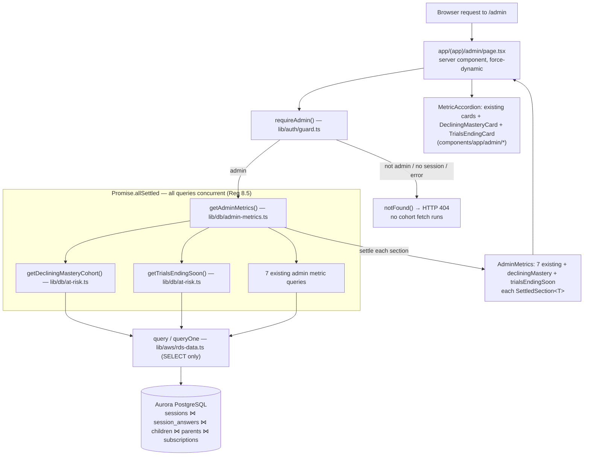

# Design Document

## Overview

At-Risk Learner Insights extends the already-shipped Admin Dashboard at `/admin` with two operator-only, **read-only** lifecycle cohorts:

1. **Children with declining mastery** — children whose recent mastery trend is negative, computed by scaling the app's existing per-child relational analytics (`getImprovementVelocity` / `getMasteryTimeline` in `lib/db/analytics.ts`) into **one window query across all children**.
2. **Trials ending soon** — parents whose subscription is `trialing` with a `trial_end` inside the next N days (default 3), computed with **one `subscriptions` JOIN `parents` query**.

The feature introduces **no new infrastructure and no new authorization path**. It reuses, unchanged, the four pillars of the admin-dashboard design:

- **Authorization** — the existing `requireAdmin()` guard (fail-closed, HTTP 404) at the `/admin` page boundary.
- **Data access** — the existing `SELECT`-only RDS Data API helpers (`query`/`queryOne` from `lib/aws/rds-data.ts`).
- **Resilience** — the existing `SettledSection<T>` wrapper and the `Promise.allSettled` aggregator in `lib/db/admin-metrics.ts`.
- **UI** — the existing `MetricSection`/`MetricAccordion` collapsible-card shell and the `StatTile`/`StatChip`/`StatGrid`/`SubHeading` presentational helpers in `components/app/admin/`.

The feature has three moving parts:

1. **Insights_Service** — a new server-only module `lib/db/at-risk.ts` exposing two typed, `SELECT`-only cohort query functions plus pure mapping/classification helpers. (Decision and justification in [Module placement](#module-placement).)
2. **Aggregator fold-in** — the two cohort queries are added to the existing `getAdminMetrics()` `Promise.allSettled` array so they run **concurrently with the existing metric queries** (Req 8.5) and inherit per-section resilience (Req 9.2, 9.3).
3. **Two new metric cards** — `DecliningMasteryCard` and `TrialsEndingCard` server components rendered inside the existing `MetricAccordion` on `app/(app)/admin/page.tsx`.

### Design principles (carried from admin-dashboard)

- **Reuse, don't reinvent.** The mastery trend is the same relational workload as `getImprovementVelocity` (window functions + `LAG()` over `sessions` ⋈ `session_answers`), not a new metric (Req 8.1). The auth, resilience, and UI shells are reused verbatim.
- **One engine query per cohort.** Each cohort is computed by a single SQL statement that does its aggregation and window computation in Aurora, with an explicit `LIMIT` — never by fetching rows and looping in application code (Req 8.2, 8.3).
- **PII firewall by construction.** The payload types literally have no field for forbidden data, so leakage is prevented at the type level, not just by query discipline (see [Data Models](#data-models)).

### The documented PII exception

The admin-dashboard v1 was intentionally aggregate-only with **no Child_PII**. This surface introduces a **deliberate, documented exception** on a legitimate-interest basis of operational support and safeguarding. For **this surface only**:

- Admins MAY see the **parent email address** and the child's **`display_name`** (the only child identifier the schema collects).
- Everything else stays forbidden: no Cognito `sub`, no `stripe_customer_id`, no question `text`/`options`/`correct_index`, no other child or parent attribute (Req 7).

This exception is encoded structurally: the two cohort payload types carry **only** `childDisplayName` + `parentEmail` + a single numeric metric each. It supersedes admin-dashboard Req 7.5/12.3 for this surface only and leaves every other admin surface's privacy discipline untouched (Req 7.6, 7.7).

## Architecture



### Request flow

1. A request hits `/admin`. The page is `force-dynamic`, so cohort values are always computed live per request (Req 1.6).
2. The page calls `requireAdmin()` **before** any data fetch. On denial (no session, not in `admins`, or guard error) the guard calls `notFound()` → HTTP 404 and control never reaches the aggregator, so no cohort data is computed, fetched, or revealed (Req 1.1, 1.3, 1.4).
3. On success the page calls `getAdminMetrics()`, which now dispatches the two cohort queries alongside the seven existing metric queries in a single `Promise.allSettled`. The cohort queries do **not** wait on the existing metric queries — they all run concurrently (Req 8.5).
4. Each section is settled independently: a failed cohort query becomes `{ ok: false }` for that section only; every other section (cohorts and existing metrics alike) still renders (Req 9.2, 9.3).
5. The page renders the two new cards inside the existing `MetricAccordion`.

### Module placement

**Decision: a new server-only module `lib/db/at-risk.ts` for the query/mapping logic, folded into the existing `getAdminMetrics()` aggregator for execution.**

Justification:

- **Cohesion / separation of concerns.** `admin-metrics.ts` documents itself as an *aggregate, PII-minimal* service. The at-risk cohorts operate under a *different, narrower PII contract* (the documented exception that permits `display_name` + `parentEmail`). Keeping the cohort queries and their PII-exception rationale in their own file keeps each module's privacy contract self-describing and avoids diluting the admin-metrics "no Child_PII" docstring. It also mirrors the existing `lib/db/*` layout (`analytics.ts`, `revenue.ts`, `admin-metrics.ts` are each a focused reader).
- **Concurrency requirement (Req 8.5).** The cohorts must execute concurrently with the existing metrics. The simplest, lowest-risk way to guarantee that — rather than spawning a second parallel aggregator and racing two `Promise.allSettled` calls — is to add the two cohort functions to the **existing** `getAdminMetrics()` array. They then share the one concurrency barrier and the one `settle()` resilience combinator, and the page keeps a single `await getAdminMetrics()`.

So `admin-metrics.ts` imports the two query functions from `at-risk.ts` and extends `AdminMetrics` with two new `SettledSection` fields. `at-risk.ts` stays `SELECT`-only and consistent with the `query`/`queryOne` conventions.

### Module map

| Concern | File | Status |
| --- | --- | --- |
| Cohort queries + pure helpers | `lib/db/at-risk.ts` | new |
| Aggregator + `AdminMetrics` type | `lib/db/admin-metrics.ts` | extend (2 new sections, 2 new entries in `allSettled`) |
| Admin page | `app/(app)/admin/page.tsx` | extend (render 2 new cards) |
| Cohort cards | `components/app/admin/declining-mastery-card.tsx`, `trials-ending-card.tsx` | new |
| Card barrel | `components/app/admin/index.ts` | extend (2 new exports) |
| Authorization, RDS helpers, MetricSection shell | `lib/auth/guard.ts`, `lib/aws/rds-data.ts`, `components/app/admin/metric-section.tsx` | reused unchanged |

## Components and Interfaces

### 1. Insights_Service (`lib/db/at-risk.ts`)

A new server-only module (`import "server-only"`). Every function issues **exactly one `SELECT`** via the RDS Data API helpers and returns a typed object. No function performs authorization — the gate runs once at the `/admin` page boundary (Req 1.1, 1.2), exactly as the existing Metrics_Service functions do.

Tunable defaults are named constants so they are visible, testable, and bound query cost (Req 2.2, 2.3, 4.2, 8.3):

```typescript
import "server-only"
import { query } from "@/lib/aws/rds-data"

/** Most-recent completed sessions per child over which the slope is computed (Req 2.2). */
export const MASTERY_TREND_WINDOW = 5
/** Minimum completed sessions for a child's slope to be meaningful (Req 2.3, 2.4). */
export const MIN_COMPLETED_SESSIONS = 2
/** Forward-looking trial window in days: [now, now + N days] (Req 4.2). */
export const TRIAL_ENDING_WINDOW_DAYS = 3
/** Explicit per-cohort row cap, bounding query cost (Req 2.6, 4.5, 8.3). */
export const COHORT_ROW_LIMIT = 50

/** Completed-session predicate, identical to lib/db/analytics.ts so the cohort
 *  reuses the same relational definition of a "completed session" (Req 8.1). */
const COMPLETED = `s.status IN ('completed','expired') AND s.completed_at IS NOT NULL`
```

#### 1a. Declining-mastery cohort query (Req 2)

This is `getImprovementVelocity` "turned sideways": instead of one child's cumulative-accuracy series, it computes every child's series in one pass, keeps each child's most-recent `MASTERY_TREND_WINDOW` completed sessions, reduces each child's windowed series to a single signed **Recent_Mastery_Slope**, and returns only the strictly-negative ones (Req 2.1, 2.2).

**Slope definition (precise and consistent with the requirement).** The Recent_Mastery_Slope is the **net signed change in running cumulative accuracy across the window**:

```
slope = cumulative_pct(most-recent session in window) − cumulative_pct(oldest session in window)
```

This is exactly the sum of the per-session `LAG()` deltas across the window (the deltas telescope: `Σ (cumᵢ − cumᵢ₋₁) = cum_last − cum_first`), so it is equivalent to — and computed with the same running-cumulative + `LAG()` machinery as — `getImprovementVelocity` (Req 8.1). A negative value means cumulative accuracy ended the window lower than it started: declining mastery.

```sql
WITH per_session AS (
  -- One row per (child, completed session): attempts and correct in that session.
  SELECT s.child_id,
         s.id           AS session_id,
         s.completed_at,
         count(*) FILTER (WHERE sa.is_correct IS NOT NULL) AS attempts,
         count(*) FILTER (WHERE sa.is_correct)             AS correct
  FROM sessions s
  JOIN session_answers sa ON sa.session_id = s.id
  WHERE s.status IN ('completed','expired') AND s.completed_at IS NOT NULL
  GROUP BY s.child_id, s.id, s.completed_at
),
recent AS (
  -- Rank each child's completed sessions newest-first; keep the most-recent N.
  SELECT *,
         row_number() OVER (PARTITION BY child_id
                            ORDER BY completed_at DESC, session_id DESC) AS rn_desc
  FROM per_session
),
windowed AS (
  -- Within each child's recent window, running cumulative accuracy oldest→newest,
  -- plus the child's ascending position and total windowed-session count.
  SELECT child_id,
         completed_at,
         round(sum(correct) OVER w * 100.0 / NULLIF(sum(attempts) OVER w, 0)) AS cum_pct,
         row_number() OVER w                         AS rn_asc,
         count(*)     OVER (PARTITION BY child_id)    AS window_session_count
  FROM recent
  WHERE rn_desc <= :window                            -- Mastery_Trend_Window (5)
  WINDOW w AS (PARTITION BY child_id ORDER BY completed_at ASC, session_id ASC
               ROWS BETWEEN UNBOUNDED PRECEDING AND CURRENT ROW)
),
slope AS (
  -- Reduce each child's windowed series to last_cum − first_cum (= Σ LAG deltas).
  SELECT child_id,
         window_session_count,
         max(cum_pct) FILTER (WHERE rn_asc = window_session_count)
           - max(cum_pct) FILTER (WHERE rn_asc = 1)   AS mastery_slope
  FROM windowed
  GROUP BY child_id, window_session_count
)
SELECT c.display_name AS child_display_name,
       p.email        AS parent_email,
       sl.mastery_slope
FROM slope sl
JOIN children c ON c.id = sl.child_id AND c.deleted_at IS NULL
JOIN parents  p ON p.id = c.parent_id
WHERE sl.window_session_count >= :minSessions        -- Min_Completed_Sessions (2)  (Req 2.3, 2.4)
  AND sl.mastery_slope < 0                            -- strictly negative only       (Req 2.3)
ORDER BY sl.mastery_slope ASC,                        -- steepest decline first        (Req 2.5)
         c.display_name ASC, c.id ASC                 -- stable, unique tie-break      (Req 2.5)
LIMIT :limit;                                         -- applied after ordering        (Req 2.6, 8.3, 8.4)
```

Notes:

- **Single engine query (Req 2.1, 8.2).** All aggregation, the window function, the windowing, the slope reduction, the joins, the ordering, and the limit happen in one statement; the application does no per-row cohort computation.
- **Threshold (Req 2.3, 2.4).** `window_session_count` is the number of completed sessions in the child's window (capped at 5). Since `MIN_COMPLETED_SESSIONS` (2) ≤ the cap, requiring `window_session_count >= :minSessions` is exactly "child has at least `MIN_COMPLETED_SESSIONS` completed sessions". A single-session child has `window_session_count = 1` and is excluded.
- **Tie-break (Req 2.5).** `c.id` is the primary key, so `(mastery_slope, display_name, id)` is a total, deterministic order — reproducible across identical requests.
- **NULL guard.** A session with zero scored attempts yields `NULL` cum_pct (via `NULLIF`); a child with a `NULL` slope is excluded by `mastery_slope < 0`.
- **PII (Req 3.5, 3.6, 7.3, 7.4).** Only `display_name` and `email` are selected for individuals — no other child column, no `sub`, no `stripe_customer_id`, no question columns.

```typescript
export interface DecliningMasteryRow {
  child_display_name: string
  parent_email: string
  mastery_slope: number
}

export async function getDecliningMasteryCohort(): Promise<DecliningMasteryItem[]> {
  const rows = await query<DecliningMasteryRow>(DECLINING_MASTERY_SQL, {
    window: MASTERY_TREND_WINDOW,
    minSessions: MIN_COMPLETED_SESSIONS,
    limit: COHORT_ROW_LIMIT,
  })
  return rows.map(mapDecliningMasteryRow)
}
```

#### 1b. Trials-ending-soon cohort query (Req 4)

One `subscriptions` ⋈ `parents` query, evaluated against a **single request-time instant `:now`** that is bound from the application and used for both the window filter and (downstream) the days-remaining display, so the whole cohort computation sees one constant `now` (Req 4.1).

```sql
SELECT p.email     AS parent_email,
       s.trial_end
FROM subscriptions s
JOIN parents p ON p.id = s.parent_id
WHERE s.status = 'trialing'                                          -- (Req 4.2)
  AND s.trial_end >= :now                                           -- exclude past trials (Req 4.3)
  AND s.trial_end <= :now::timestamptz + make_interval(days => :windowDays)  -- inclusive upper bound (Req 4.2)
ORDER BY s.trial_end ASC,                                           -- soonest-ending first (Req 4.4)
         p.email ASC, s.id ASC                                      -- stable, unique tie-break (Req 4.4)
LIMIT :limit;                                                       -- after ordering (Req 4.5, 8.3, 8.4)
```

- **Inclusive both bounds (Req 4.2).** `trial_end >= :now AND trial_end <= :now + N days` is the closed interval `[now, now + N days]`. A trial ending exactly at `now` or exactly at `now + N days` is included; one strictly before `now` is excluded (Req 4.3).
- **Single constant `now` (Req 4.1).** `:now` is one bound `Date`, reused for the lower bound, the upper-bound interval base, and the TS days-remaining computation — never two separate `now()` reads.
- **Tie-break (Req 4.4).** `s.id` is the primary key → total deterministic order.
- **PII (Req 5.4, 5.5, 7.1, 7.2).** Only `email` and `trial_end` are selected; `stripe_customer_id`, `sub`, and all other parent columns are never read.

```typescript
export interface TrialEndingRow {
  parent_email: string
  trial_end: string
}

export async function getTrialsEndingSoon(now: Date = new Date()): Promise<TrialEndingItem[]> {
  const rows = await query<TrialEndingRow>(TRIALS_ENDING_SQL, {
    now,
    windowDays: TRIAL_ENDING_WINDOW_DAYS,
    limit: COHORT_ROW_LIMIT,
  })
  return rows.map((r) => mapTrialEndingRow(r, now))
}
```

#### 1c. Pure mapping/classification helpers (no I/O — unit/property testable)

Mirroring the admin-metrics convention (`mapInvoiceRow`, `classifyWithin30Days`, `settle`), the logic the SQL relies on is extracted into pure functions so the properties run in-memory without a database:

```typescript
/** Net signed change across a windowed cumulative-accuracy series (oldest→newest).
 *  Equals last − first = Σ of consecutive LAG() deltas (telescoping). (Req 2.2) */
export function recentMasterySlope(cumulativeSeries: number[]): number | null {
  if (cumulativeSeries.length === 0) return null
  return cumulativeSeries[cumulativeSeries.length - 1] - cumulativeSeries[0]
}

/** Cohort membership: strictly-negative slope AND enough completed sessions (Req 2.3, 2.4). */
export function qualifiesAsDecliningMastery(
  slope: number | null,
  completedInWindow: number,
  minSessions: number = MIN_COMPLETED_SESSIONS,
): boolean {
  return slope !== null && slope < 0 && completedInWindow >= minSessions
}

/** Slope rendered with an explicit leading sign: "-12", "+3", "0" (Req 3.3). */
export function formatSignedSlope(slope: number): string {
  if (slope > 0) return `+${slope}`
  return String(slope) // negatives already carry "-"; zero renders "0"
}

/** Trial-window membership against one constant `now`: trialing AND
 *  now <= trial_end <= now + N days (inclusive), past trials excluded (Req 4.2, 4.3). */
export function inTrialEndingWindow(
  status: string,
  trialEnd: Date,
  now: Date,
  windowDays: number = TRIAL_ENDING_WINDOW_DAYS,
): boolean {
  if (status !== "trialing") return false
  const t = trialEnd.getTime()
  const upper = now.getTime() + windowDays * 86_400_000
  return t >= now.getTime() && t <= upper
}

/** Whole days until trial_end, rounded UP, never negative (Req 5.2). */
export function computeDaysRemaining(trialEnd: string | Date, now: Date): number {
  const ms = new Date(trialEnd).getTime() - now.getTime()
  return Math.max(0, Math.ceil(ms / 86_400_000))
}

export function mapDecliningMasteryRow(row: DecliningMasteryRow): DecliningMasteryItem {
  return {
    childDisplayName: row.child_display_name,
    parentEmail: row.parent_email,
    masterySlope: Number(row.mastery_slope),
  }
}

export function mapTrialEndingRow(row: TrialEndingRow, now: Date): TrialEndingItem {
  return {
    parentEmail: row.parent_email,
    trialEnd: row.trial_end,
    daysRemaining: computeDaysRemaining(row.trial_end, now),
  }
}
```

### 2. Aggregator fold-in (`lib/db/admin-metrics.ts`)

`AdminMetrics` gains two sections and `getAdminMetrics()` gains two entries in the existing `Promise.allSettled` array (reusing the existing `settle()` combinator). No other change.

```typescript
import { getDecliningMasteryCohort, getTrialsEndingSoon } from "@/lib/db/at-risk"
import type { DecliningMasteryItem, TrialEndingItem } from "@/lib/db/at-risk"

export interface AdminMetrics {
  // ...the seven existing sections, unchanged...
  decliningMastery: SettledSection<DecliningMasteryItem[]>
  trialsEndingSoon: SettledSection<TrialEndingItem[]>
}

export async function getAdminMetrics(): Promise<AdminMetrics> {
  const [
    revenue, invoices, subscriptions, users, engagement, content, operations,
    decliningMastery, trialsEndingSoon,        // ← new, dispatched in the SAME batch (Req 8.5)
  ] = await Promise.allSettled([
    getRevenueSummary(),
    getRecentInvoices(),
    getSubscriptionMetrics(),
    getUserMetrics(),
    getEngagementMetrics(),
    getContentMetrics(),
    getOperationalMetrics(),
    getDecliningMasteryCohort(),               // ← new
    getTrialsEndingSoon(),                     // ← new
  ])
  return {
    revenue: settle(revenue),
    invoices: settle(invoices),
    subscriptions: settle(subscriptions),
    users: settle(users),
    engagement: settle(engagement),
    content: settle(content),
    operations: settle(operations),
    decliningMastery: settle(decliningMastery),
    trialsEndingSoon: settle(trialsEndingSoon),
  }
}
```

Because both cohort promises sit in the single `Promise.allSettled` array, they start concurrently with the existing seven and never await them (Req 8.5), and a rejection in either becomes `{ ok: false }` for that section alone (Req 9.2, 9.3).

### 3. Admin page integration (`app/(app)/admin/page.tsx`)

Unchanged auth/fetch flow (`force-dynamic`, `requireAdmin()` before `getAdminMetrics()`). Two new cards are added to the existing `MetricAccordion`, grouped after the existing operational metrics:

```tsx
<MetricAccordion defaultValue={["revenue"]}>
  {/* ...existing seven cards... */}
  {/* At-risk learners / lifecycle group */}
  <DecliningMasteryCard section={metrics.decliningMastery} />
  <TrialsEndingCard section={metrics.trialsEndingSoon} />
</MetricAccordion>
```

### 4. Cohort cards (`components/app/admin/declining-mastery-card.tsx`, `trials-ending-card.tsx`)

Presentational server components mirroring the existing cards. Each accepts a `SettledSection<T>`, passes `hasError={!section.ok}` to `MetricSection`, and renders the cohort body or the empty state when `section.ok && data.length === 0`. They reuse `StatGrid`/`StatTile`/`StatChip`/`SubHeading` and a `preview` count in the section header. They are exported from `components/app/admin/index.ts`.

- **`DecliningMasteryCard`** (accent `rose`): one row per child (up to the limit) showing `childDisplayName`, the owning `parentEmail`, and the slope via `formatSignedSlope(masterySlope)`, in the order the service returned (steepest decline first) (Req 3.1–3.4). Empty state: "No children currently show a declining mastery trend." (Req 3.7).
- **`TrialsEndingCard`** (accent `amber`): one row per member showing `parentEmail` and `daysRemaining` (e.g. "2 days left"), soonest-ending first (Req 5.1–5.3). Empty state: "No trials are ending in the next 3 days." (Req 5.6).

Because the props are `SettledSection<DecliningMasteryItem[]>` / `SettledSection<TrialEndingItem[]>`, the cards **cannot** render a forbidden field — the data simply has no such property (the type-level PII firewall).

## Data Models

All types live in `lib/db/at-risk.ts` (raw `*Row` shapes for the SELECTs, payload `*Item` shapes for rendering) and are re-exported through the extended `AdminMetrics`.

```typescript
// ---- Raw DB rows (exact SELECT column shapes) ----
export interface DecliningMasteryRow {
  child_display_name: string
  parent_email: string
  mastery_slope: number          // strictly negative integer (filtered in SQL)
}

export interface TrialEndingRow {
  parent_email: string
  trial_end: string              // ISO timestamp
}

// ---- Payload items (what the cards render) ----
export interface DecliningMasteryItem {
  childDisplayName: string       // the ONLY child identifier permitted (Req 3.5, 7.3)
  parentEmail: string            // the ONLY parent PII permitted (Req 3.2, 7.1)
  masterySlope: number           // signed mastery metric, < 0 (Req 3.3)
}

export interface TrialEndingItem {
  parentEmail: string            // the ONLY parent PII permitted (Req 5.1, 7.1)
  daysRemaining: number          // non-negative whole days, rounded up (Req 5.2)
  trialEnd: string               // ISO timestamp backing the ordering/display
}

// ---- Aggregate of settled sections ----
import type { SettledSection } from "@/lib/db/admin-metrics"

export interface AtRiskInsights {
  decliningMastery: SettledSection<DecliningMasteryItem[]>   // ≤ COHORT_ROW_LIMIT
  trialsEndingSoon: SettledSection<TrialEndingItem[]>        // ≤ COHORT_ROW_LIMIT
}
```

`AtRiskInsights` is the conceptual grouping of the two sections; in implementation those two `SettledSection` fields are folded directly into `AdminMetrics` (per [Module placement](#module-placement)) so the page makes one `getAdminMetrics()` call.

**PII firewall by construction.** Neither `DecliningMasteryItem` nor `TrialEndingItem` has a field for a Cognito `sub`, a `stripe_customer_id`, a child `year_group`/`avatar_color`/`id`, a question `text`/`options`/`correct_index`, or any parent attribute beyond `email`. The permitted set is *exactly* `{ childDisplayName, parentEmail, masterySlope }` and `{ parentEmail, daysRemaining, trialEnd }`. Forbidden data cannot reach a payload because the types have no slot for it — the same type-level guarantee the admin-dashboard design relies on, narrowed to this surface's documented exception (Req 3.5, 3.6, 5.4, 5.5, 7.1–7.5).

## Correctness Properties

*A property is a characteristic or behavior that should hold true across all valid executions of a system — essentially, a formal statement about what the system should do. Properties serve as the bridge between human-readable specifications and machine-verifiable correctness guarantees.*

These properties are derived from the prework analysis. The acceptance criteria collapse into a small set of universally-quantified properties over the **pure** logic extracted from the I/O layer (slope reduction, classification, trial-window membership, days-remaining, ordering/bound, the PII firewall, SELECT-only discipline, and per-section resilience). The remaining criteria are reused-guard behavior, single-statement/concurrency structure, or rendering specifics — covered by example tests and structural review (see [Testing Strategy](#testing-strategy)). Each property targets a pure function so it can be tested deterministically without a live database.

### Property 1: Recent mastery slope is the net signed change across the window

*For any* non-empty series of running cumulative-accuracy values (oldest→newest), `recentMasterySlope(series)` SHALL equal `last − first`, which SHALL equal the sum of the consecutive deltas across the series (the telescoping identity that reconciles the "signed change" definition with the `LAG()` per-session deltas), and SHALL be `null` for an empty series.

**Validates: Requirements 2.2, 8.1**

### Property 2: Declining-mastery classification

*For any* slope value (including `null`) and any non-negative completed-session count and any minimum threshold, `qualifiesAsDecliningMastery(slope, count, min)` SHALL return true if and only if the slope is non-null AND strictly negative AND the count is greater than or equal to the threshold; in every other case (null slope, zero/positive slope, or too few sessions) it SHALL return false.

**Validates: Requirements 2.3, 2.4**

### Property 3: Slope is formatted with an explicit leading sign

*For any* number, `formatSignedSlope(n)` SHALL produce a string carrying an explicit leading sign — a `+` prefix for a positive value, a `-` prefix for a negative value (so every displayed declining slope is unmistakably negative), and `"0"` for zero — and parsing the formatted string back to a number SHALL recover `n`.

**Validates: Requirements 3.3**

### Property 4: Trial-ending-window membership

*For any* subscription status, any `trial_end` instant, any single reference instant `now`, and any window length `N` days, `inTrialEndingWindow(status, trialEnd, now, N)` SHALL return true if and only if the status is `trialing` AND `now <= trial_end <= now + N days` (both bounds inclusive); a `trial_end` exactly on either boundary SHALL be included, and a `trial_end` strictly before `now` SHALL be excluded.

**Validates: Requirements 4.2, 4.3**

### Property 5: Days-remaining is a rounded-up, non-negative whole number

*For any* `trial_end` instant and reference instant `now`, `computeDaysRemaining(trialEnd, now)` SHALL equal `max(0, ceil((trialEnd − now) / one day))`: an integer, never negative, that rounds any partial day up to the next whole day.

**Validates: Requirements 5.2**

### Property 6: Cohort ordering and bound

*For any* set of candidate cohort rows and any positive limit, the ordered-and-bounded result (for the declining-mastery cohort ordered by `masterySlope` ascending then by the unique tie-break key; for the trials cohort ordered by `trialEnd` ascending then by the unique tie-break key) SHALL contain no more than `limit` rows, SHALL be sorted in non-decreasing order of its primary key with a total, deterministic tie-break (so identical inputs yield an identical order), and the rows retained SHALL be exactly the smallest `limit` rows under that order (steepest declines / soonest-ending trials kept).

**Validates: Requirements 2.5, 2.6, 4.4, 4.5, 8.3, 8.4**

### Property 7: PII firewall over every cohort payload

*For any* `DecliningMasteryItem` and *for any* `TrialEndingItem` produced by the Insights_Service, the serialized payload's keys SHALL be a subset of `{ childDisplayName, parentEmail, masterySlope }` and `{ parentEmail, daysRemaining, trialEnd }` respectively, and SHALL therefore contain no Cognito `sub`, no `stripe_customer_id`, no child attribute other than `display_name`, no parent attribute other than `email`, and no question `text`/`options`/`correct_index`.

**Validates: Requirements 3.5, 3.6, 5.4, 5.5, 7.1, 7.2, 7.3, 7.4, 7.5**

### Property 8: Insights_Service issues only read statements

*For any* SQL statement defined by the Insights_Service, the statement SHALL be read-only — its first significant keyword is `SELECT` or a `WITH … SELECT` CTE — and SHALL contain no `INSERT`, `UPDATE`, `DELETE`, `MERGE`, `UPSERT`, `ALTER`, `DROP`, `CREATE`, `TRUNCATE`, or other data-mutating / DDL keyword.

**Validates: Requirements 6.1, 8.2**

### Property 9: Per-section failure isolation

*For any* assignment of success/failure outcomes to the independent metric and cohort queries, `getAdminMetrics()` SHALL resolve (never reject) with a result that marks exactly the failed sections — including either cohort section — as `{ ok: false }` and every other section as `{ ok: true, data }`, so a failure in one cohort never removes or blanks any other cohort section or any existing admin metric section.

**Validates: Requirements 9.2, 9.3**

## Error Handling

| Condition | Handling | Requirement |
| --- | --- | --- |
| No session / not an admin / guard error at `/admin` | Reused `requireAdmin()` calls `notFound()` → HTTP 404; control never reaches `getAdminMetrics()`, so no cohort is computed or revealed | 1.1, 1.3, 1.4, 9.4 |
| A single cohort query throws | `Promise.allSettled` captures the rejection; `settle()` makes that section `{ ok: false }`; its card renders the inline `MetricSection` error chrome; every other section (cohorts + existing metrics) renders normally | 9.2, 9.3 |
| Child with a `NULL` slope (a windowed session had zero scored attempts) | `NULLIF` guards the division; the `mastery_slope < 0` filter excludes `NULL`, so the child is simply absent from the cohort | 2.3 |
| Child with fewer than `MIN_COMPLETED_SESSIONS` completed sessions | `window_session_count >= :minSessions` excludes them in SQL; the classification helper enforces the same threshold | 2.3, 2.4 |
| No qualifying children / no ending trials | Query returns zero rows; the mapper returns `[]`; the card shows its empty-state message | 3.7, 5.6 |
| Trial ending exactly at `now` or exactly at `now + N days` | Closed interval `[now, now + N days]` includes both boundaries | 4.2 |
| Trial already expired (`trial_end < now`) | Excluded by the `trial_end >= :now` bound | 4.3 |
| More than `COHORT_ROW_LIMIT` qualifying rows | `LIMIT` after the ascending `ORDER BY` keeps exactly the steepest-decline / soonest-ending rows | 2.6, 4.5, 8.3, 8.4 |
| Aurora not configured (`isAuroraConfigured()` false) | The RDS helpers throw; surfaced as a per-section error via `allSettled`; the rest of the dashboard still renders | 9.2, 9.3 |

Because denial is implemented by **throwing** (`notFound()`), there is structurally no code path on which a non-admin reaches a cohort query (Req 1.1, 1.3). Because each cohort is a single `SELECT`, a successful load leaves every record unchanged (Req 6.5).

## Testing Strategy

This feature uses the project's existing stack — **Vitest** + **fast-check** — following the established pattern in `app/(app)/billing/actions.test.ts` (a single `fc.assert(fc.property(...), { numRuns: 200 })` per property, with a reference model encoding the rule). No new heavy dependencies, and **no property-based testing of the live database, Cognito, or the RDS Data API** — those are exercised, if at all, by thin example/integration assertions, not 100-iteration loops.

### Test design: extract pure logic

The properties target the pure helpers in `lib/db/at-risk.ts`, which take already-fetched rows / primitive inputs and contain no I/O:

- `recentMasterySlope(series)`, `qualifiesAsDecliningMastery(slope, count, min)`, `formatSignedSlope(n)`, `inTrialEndingWindow(status, trialEnd, now, N)`, `computeDaysRemaining(trialEnd, now)`, `mapDecliningMasteryRow(row)`, `mapTrialEndingRow(row, now)`.
- A pure ordering/bound helper (e.g. `orderAndLimit(rows, compareKey, limit)`, or comparators mirroring the SQL `ORDER BY … LIMIT`) so Property 6 runs in-memory against an oversized random dataset.
- The two cohort SQL strings exposed as module constants (`DECLINING_MASTERY_SQL`, `TRIALS_ENDING_SQL`) so Property 8 can assert against the literal text.
- The aggregator resilience (Property 9) reuses the existing `settle()` combinator and a `Promise.allSettled` over injected success/failure promises, extending the admin-dashboard resilience test to the two new sections.

### Property-based tests (fast-check, minimum 100 iterations each — config `{ numRuns: 200 }`)

Each correctness property maps to a **single** property-based test, tagged with the feature and property text:

```
// Feature: at-risk-learner-insights, Property 4: Trial-ending-window membership
// Validates: Requirements 4.2, 4.3
```

| Test | Generators | Assertion |
| --- | --- | --- |
| P1 slope reduction | random numeric series (incl. empty, length 1, negatives) | `recentMasterySlope` = last − first = Σ consecutive deltas; `null` for empty |
| P2 declining classification | random slope (incl. `null`, 0, ±), random count, random min | true iff slope non-null & < 0 & count ≥ min |
| P3 signed formatting | random integers/floats (incl. 0, ±) | string carries explicit sign; `Number(parse) === n`; zero → `"0"` |
| P4 trial-window membership | random status, random `trialEnd` clustered around `now`, `now`, `now+N`, and the exact boundaries; random N | included iff `trialing` & `trialEnd ∈ [now, now+N]`; boundaries inclusive; past excluded |
| P5 days-remaining | random `trialEnd`/`now` pairs (past, fractional-day, exact-day) | `= max(0, ceil(Δ/day))`; integer; ≥ 0 |
| P6 ordering & bound | random oversized row sets + random limit, for each cohort's key | length ≤ limit; non-decreasing primary key; total deterministic tie-break; retained = smallest `limit` by order |
| P7 PII firewall | random `DecliningMasteryItem` / `TrialEndingItem` built from random rows | `Object.keys` ⊆ the permitted set; no forbidden key ever present |
| P8 SELECT-only | the two SQL string constants | matches `/^\s*(WITH|SELECT)\b/i`; contains no write/DDL keyword |
| P9 resilience | random success/failure vector over all 9 sections | aggregator resolves; exactly failed sections `ok:false`, rest `ok:true` |

### Example / edge-case unit tests (Vitest)

- `DecliningMasteryCard` renders one row per item with `childDisplayName`, `parentEmail`, and `formatSignedSlope(masterySlope)`, preserving service order (Req 3.1, 3.2, 3.4); empty data → "no declining mastery trend" empty state (Req 3.7).
- `TrialsEndingCard` renders `parentEmail` and a days-remaining label per member, soonest-ending first (Req 5.1, 5.3); empty data → "no trials ending in the next 3 days" empty state (Req 5.6).
- `mapTrialEndingRow` for a `trial_end` ~36 hours out with a fixed `now` yields `daysRemaining = 2` (ceil) (Req 5.2).
- A guard-denial example asserts `getAdminMetrics()` is never invoked when `requireAdmin()` throws (reuses the admin-dashboard guard) (Req 1.3).

### Structural / smoke checks (review or lightweight assertions)

- `app/(app)/admin/page.tsx` exports `dynamic = "force-dynamic"` and calls `requireAdmin()` before `getAdminMetrics()`; the two new cards are rendered inside the existing `MetricAccordion` (Req 1.1, 1.6, 9.1).
- Each cohort is computed by exactly one SQL statement that aggregates and windows in the engine; `getDecliningMasteryCohort()` and `getTrialsEndingSoon()` sit in the **same** `Promise.allSettled` batch as the existing metrics (Req 2.1, 4.1, 8.2, 8.5).
- The mastery slope reuses the `COMPLETED` predicate and the running-cumulative + `LAG()` machinery of `lib/db/analytics.ts` rather than a parallel implementation (Req 8.1).
- The Insights_Service exposes no mutating function; the cards present no create/update/delete control and trigger no outbound message (Req 6.2, 6.3, 6.4).
- The PII exception is confined to `at-risk.ts` and its two cards; the existing admin-metrics payload types are unchanged (Req 7.6, 7.7).

### Why not property-test everything

The reused `requireAdmin()` guard (Req 1.x, 9.4) is already property-tested in the admin-dashboard spec and is exercised here only structurally. Cohort SQL correctness against real data (the window/`LAG()` math executing in Aurora) belongs in a thin integration check with a seeded fixture, not a 100-iteration loop — the *pure reduction* the SQL mirrors (Property 1) and the *classification/ordering/bound* logic (Properties 2, 6) are what the property suite verifies deterministically in-memory.
