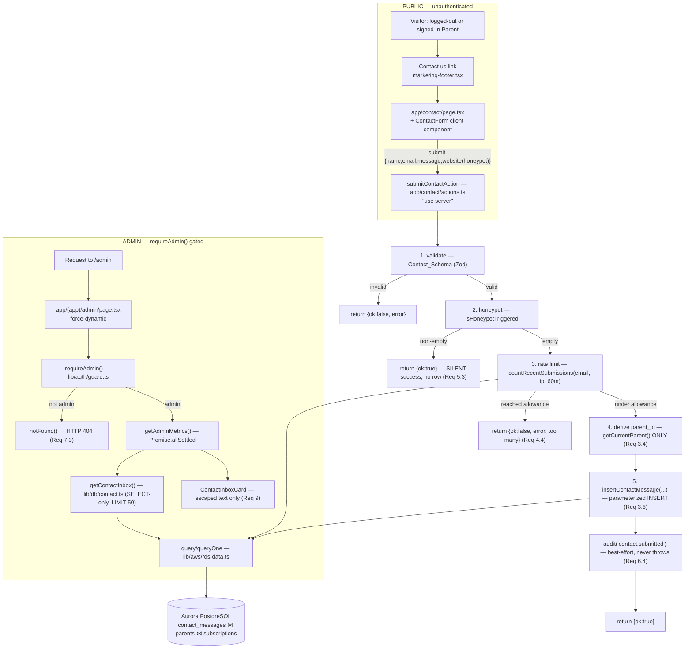

# Design Document

> **Version: v2.** v1 designed the public contact channel and the read-only admin inbox (Req 1–10). v2 is a **targeted amendment** adding a single, one-way admin status mutation — *acknowledge* (`new → seen`) — and the expandable inbox UI that surfaces and triggers it (Req 11, 12). All v1 sections are preserved; v2 changes are marked inline and summarized in [the v2 amendment](#v2-amendment-the-inbox-gains-a-single-one-way-status-mutation-req-11-12). **No database migration** — the `status` column already exists.

## Overview

Parent Contact Inbox adds two surfaces to ApexMaths:

1. **A public "Contact us" channel** — a server-rendered form, reachable from the marketing footer by a logged-out Visitor or a signed-in Parent, that submits `{ name, email, message }` to a server action. The action validates, runs anti-abuse controls, derives the submitter's Parent identity **only from the verified server session**, and persists one row to a **new Aurora table `contact_messages`**.
2. **An operator-only inbox** — a new read-only `MetricSection` card folded into the existing `/admin` dashboard that LEFT JOINs `contact_messages → parents → subscriptions` so an Admin triages each message with sender context (the linked Parent's email and subscription status), distinguishing an *active* subscriber from a *trialing* one from a logged-out Visitor.

The defining design point is **relational linkage**: when the submitter is a verified, signed-in Parent the message captures that Parent's `id` as `parent_id`; for logged-out Visitors `parent_id` is null. The foreign key uses `ON DELETE SET NULL` (matching the existing `revenue_events` GDPR precedent in `001_schema.sql`), so erasure de-attributes the message rather than deleting it.

### This feature adds a public, unauthenticated, write-capable endpoint

Unlike every other write path in the app (all of which sit behind `requireParent`/`requireOnboardedParent`/`requireEntitledParent`), the Submit_Action accepts writes from **anyone on the internet**. That makes anti-abuse a first-class, structural concern rather than an afterthought. The endpoint is hardened by **five independent layers**, every one of which must pass before a row is written:

| Abuse vector | Mitigation | Where |
| --- | --- | --- |
| Malformed / oversized payloads | Bounded-length Zod validation (`Contact_Schema`): name 1–80, email 3–254 + syntactic check, message 10–2000, all trimmed | `lib/db/contact.ts` pure validator, called first in the action |
| Bot spam (form-filler bots) | Honeypot field — non-empty ⇒ **silent success** (no row, no tell) | pure `isHoneypotTriggered`, checked before persistence |
| Volumetric spam (same person/host) | DB-backed rate limit: ≤ 5 per email AND ≤ 5 per source IP per rolling 60 min, counted over recent rows — no new infra | `countRecentSubmissions` + pure `isRateLimited` |
| Identity spoofing | `parent_id` derived **only** from `getCurrentParent()` (verified Cognito session); never from form/header/query/cookie | Submit_Action, `deriveParentId` |
| Stored XSS / injection | Parameterized INSERT (never string-built SQL); admin view renders escaped text only (React default), no `dangerouslySetInnerHTML` | `insertContactMessage`, `ContactInboxCard` |

### Reuse, don't reinvent

The feature introduces **no new infrastructure and no new authorization path**. It reuses, unchanged, the platform pillars the admin-dashboard and at-risk-insights specs already established:

- **Authorization** — the existing `requireAdmin()` guard (fail-closed, HTTP 404) at the `/admin` page boundary (Req 7).
- **Data access** — the existing RDS Data API helpers (`query`/`queryOne` from `lib/aws/rds-data.ts`) for the parameterized INSERT, the rate-limit count, and the `SELECT`-only inbox read (Req 3.6, 4.5, 11.1).
- **Resilience** — the existing `SettledSection<T>` wrapper and the `Promise.allSettled` aggregator in `lib/db/admin-metrics.ts`; the inbox folds in exactly as the at-risk cohorts did (Req 7, 8).
- **Audit** — the existing append-only `audit()` writer (`lib/db/audit.ts`), extended with one new `AuditAction`, written best-effort (Req 6).
- **UI** — the existing `MetricSection` collapsible-card shell and `StatTile`/`StatChip`/`SubHeading` helpers (Req 8.8); the existing form primitives (`useActionState`, `SubmitButton`, `Input`, `Label`) for the public form.

### Deliberate, documented PII collection

The contact form **deliberately collects contact PII** — submitter name, email, free-text message. Unlike the rest of the app (which minimises PII), this is a legitimate, consented support channel the operator explicitly chose to offer. The erasure behavior (`ON DELETE SET NULL`) and a bounded admin projection (`ContactInboxItem` carries only the permitted fields — no Cognito `sub`, no `stripe_customer_id`, no child data) keep the surface inside a documented privacy envelope (Req 10).

### The rate-limit IP column — a deliberate privacy trade-off

To rate-limit per source IP without new infrastructure, the design stores the request IP in a **nullable `source_ip TEXT` column** used **only** for the throttle count. This is the one new piece of PII the table holds beyond the documented `{name,email,message}`. It is mitigated structurally: `source_ip` is **never selected by the inbox query** and has **no slot in `ContactInboxItem`**, so it can never reach the admin view. (Decision and the alternative considered in [Storing the IP for rate limiting](#decision-storing-the-ip-for-rate-limiting).)

## Architecture



### Public submission flow (the ordered gauntlet)

The Submit_Action enforces the five layers **in a fixed order**, and **no `contact_messages` row is written unless all of validation, honeypot, and rate-limit pass**:

1. **Validate** with `Contact_Schema` before anything else (Req 2.1). On failure: return a descriptive validation error; **no persistence** (Req 2.2–2.4).
2. **Honeypot** check. A non-empty honeypot returns a **successful-looking** result to the Visitor but writes **no row** and does not reveal the trigger (Req 5.2, 5.3).
3. **Rate limit**. Count prior rows from the same email and the same source IP within the rolling window; if either count has **reached** the allowance, reject as a Throttled_Submission with a "try again later" message and **no persistence** (Req 4.1–4.4).
4. **Derive `parent_id`** from `getCurrentParent()` **only** — the verified Cognito session. Signed in ⇒ `parent.id`; logged out ⇒ `null`. No client-supplied identifier is ever read (Req 3.2–3.4).
5. **Persist** exactly one row via a parameterized INSERT with `status='new'` and `created_at=now()` (Req 2.5, 2.6, 3.6), then **best-effort audit** `contact.submitted` (Req 6.1, 6.2) — an audit failure never surfaces to the Visitor and never undoes the insert (Req 6.4).

### Admin inbox flow

Identical to the at-risk cohorts: `/admin` is `force-dynamic`, calls `requireAdmin()` **before** any fetch (denial ⇒ `notFound()` ⇒ 404, no inbox query runs — Req 7.1–7.3, 7.5), then `getAdminMetrics()` dispatches `getContactInbox()` in the **same** `Promise.allSettled` batch so it runs concurrently and a failure degrades only its own section (Req 8). The `ContactInboxCard` renders the rows as escaped text inside the existing `MetricSection` (Req 8.8, 9).

### Module map

| Concern | File | Status (v1) | v2 change |
| --- | --- | --- | --- |
| Migration: `contact_messages` table + indexes | `scripts/sql/003_contact.sql` | new | **unchanged** — `status` column already exists; **no migration** |
| Data layer: schema, types, INSERT, rate-limit count, inbox read, pure helpers | `lib/db/contact.ts` | new | extend — `cm.status` in `CONTACT_INBOX_SQL`; `status` on `ContactInboxRow`/`ContactInboxItem`/`mapContactInboxRow`; new `acknowledgeContactMessage(id)`; pure `nextStatusOnAcknowledge`/`parseContactId` |
| Submit_Action | `app/contact/actions.ts` | new | unchanged |
| **Acknowledge_Action** | `app/(app)/admin/contact-actions.ts` | — | **new** (`"use server"`) — admin-only, guarded one-way status write |
| Contact form page (server) | `app/contact/page.tsx` | new | unchanged |
| Contact form (client) | `components/marketing/contact-form.tsx` | new | unchanged |
| Inbox card (server: maps data → client list) | `components/app/admin/contact-inbox-card.tsx` | new | extend — delegates rows to the new client component |
| **Inbox message list / row (client)** | `components/app/admin/contact-message-list.tsx` | — | **new** (`"use client"`) — per-row expand/collapse, unread styling, acknowledge control |
| Footer "Contact us" link | `components/marketing/marketing-footer.tsx` | extend (1 link) | unchanged |
| Aggregator + `AdminMetrics` type | `lib/db/admin-metrics.ts` | extend (1 section, 1 `allSettled` entry) | unchanged (payload now carries `status`) |
| Admin page render | `app/(app)/admin/page.tsx` | extend (1 card) | unchanged |
| Card barrel | `components/app/admin/index.ts` | extend (1 export) | extend (1 export for the client list, if surfaced) |
| New `AuditAction` value | `lib/db/audit.ts` | extend (`'contact.submitted'`) | extend (`'contact.acknowledged'`) |
| Authorization, RDS helpers, MetricSection shell, form primitives | `lib/auth/guard.ts`, `lib/aws/rds-data.ts`, `components/app/admin/metric-section.tsx`, `components/ui/*` | reused unchanged | reused unchanged (`requireAdmin()` now also called *inside* the Acknowledge_Action) |

### Decision: storing the IP for rate limiting

**Decision: add a nullable `source_ip TEXT` column to `contact_messages`, populated from the `x-forwarded-for` header, used solely as a `WHERE` filter in the rate-limit count and never projected to the inbox.**

Justification and alternatives:

- **Requirement 4.5 forbids new infrastructure** and explicitly blesses "a database-backed count over recent Contact_Messages". A per-IP count needs the IP to live somewhere queryable; the lowest-risk place is a column on the same table, counted with `created_at >= now() - interval '60 minutes'`.
- **Alternative considered — hash the IP.** Storing `sha256(ip+salt)` would reduce the stored value's sensitivity. Rejected for v1 because (a) it complicates the count query and the pure rate-limit logic for marginal benefit on a column that is already never displayed and never leaves the server, and (b) a stable salt is itself a secret to manage. The privacy guarantee here comes from **non-exposure** (the column has no slot in `ContactInboxItem` and is never selected), which a hash would not improve. This is noted as a future hardening option.
- **Privacy implication (documented).** `source_ip` is the one PII field beyond `{name,email,message}`. It is collected for abuse prevention only, is never shown to operators, and is de-attributed alongside the rest of the row when the linked Parent is erased (the row is retained per the GDPR pattern; the IP is not tied to `parent_id`). Reading the IP is best-effort: when the header is absent, `source_ip` is `null` and only the per-email limit applies.

### v2 amendment: the inbox gains a single, one-way status mutation (Req 11, 12)

> **Scope of this amendment.** Everything above and in the v1 sections below is unchanged. v2 adds exactly **one** new capability — an Admin can *acknowledge* a message, moving its `status` from `new` to `seen` — plus the UI to surface and trigger it. No other behavior, table, guard, or PII boundary changes.

This is the **first and only write the admin surface performs**. Until now `/admin` was strictly read-only (a `SELECT`-only inbox folded into `Promise.allSettled`); v2 introduces a single mutation entry point, the **Acknowledge_Action**. Because that action is an *independently-invocable server action* — reachable by anyone who can craft a POST to it, not merely by rendering `/admin` — it cannot lean on the page-level `requireAdmin()` gate. It must **re-establish authorization itself**. The amendment therefore treats the new write with the same fail-closed discipline the public Submit_Action uses for anonymous writes:

1. **`requireAdmin()` first** — the action calls the reused guard before reading or mutating anything; denial ⇒ `notFound()` ⇒ HTTP 404 with no mutation (Req 11.5, 11.6). This mirrors the page boundary but runs *inside* the action so the protection travels with the entry point.
2. **Validate the id (Zod)** — a supplied message id is parsed as a non-empty trimmed string before any SQL; missing/invalid ⇒ validation error, no mutation (Req 11.7).
3. **One guarded, one-way `UPDATE`** — a single parameterized statement, `UPDATE contact_messages SET status='seen' WHERE id = :id AND status = 'new'`. The **`AND status = 'new'` clause is the load-bearing invariant**: it makes the transition *one-way* (a `seen` row matches zero rows, so it can never revert to `new` — Req 11.3) and *idempotent at the SQL level* (re-acknowledging a `seen` row updates 0 rows and is a silent no-op — Req 11.4). No client value is interpolated; both `:id` and the literal `'seen'`/`'new'` are fixed or bound (Req 11.2).
4. **Best-effort audit** — `audit({ action: "contact.acknowledged", … })`, which already swallows its own errors, so a logging failure never undoes the committed status change (Req 11.8, 11.9).
5. **`revalidatePath('/admin')`** — invalidates the dynamic admin render so the inbox re-fetches and the row now shows `seen` with its acknowledge control gone, without a manual reload (Req 12.6).

**No database migration.** The `contact_messages.status` column already exists (`TEXT NOT NULL DEFAULT 'new'`, shipped in `003_contact.sql` for v1). The *only* data-layer read change is that the inbox `SELECT` must now also return `cm.status`, surfaced as a new top-level `status: "new" | "seen"` field on `ContactInboxItem` (it is **not** part of `SenderContext` — status is a property of the message, not the sender).

**The inbox stays a single mutation, no more.** Reply, archive, delete, and outbound messaging remain out of scope; the *only* permitted mutation of `contact_messages` from the inbox is this `new → seen` transition (Req 11.10).

### Reading the source IP on Vercel

Vercel terminates TLS at the edge and forwards the client IP in the standard `x-forwarded-for` header (a comma-separated list whose **first** entry is the original client). The action reads it through `headers()` from `next/headers` — the same primitive `app/(app)/billing/actions.ts` already uses for `x-forwarded-host`:

```typescript
import { headers } from "next/headers"

/** First hop of x-forwarded-for is the original client IP on Vercel; null when absent. */
export async function readSourceIp(): Promise<string | null> {
  const h = await headers()
  const xff = h.get("x-forwarded-for")
  if (!xff) return null
  const first = xff.split(",")[0]?.trim()
  return first && first.length > 0 ? first : null
}
```

## Components and Interfaces

### 1. Migration (`scripts/sql/003_contact.sql`)

A new migration file — `002_adaptive.sql` is the next-used number, so `003` is free. It follows the `001_schema.sql` conventions exactly: `CREATE TABLE IF NOT EXISTS`, `CREATE INDEX IF NOT EXISTS`, TEXT ids defaulting to `gen_random_uuid()::text`, `TIMESTAMPTZ` timestamps, and `ON DELETE SET NULL` on the `parents` FK (the `revenue_events` precedent). It is idempotent and safe to re-run.

```sql
-- ============================================================================
-- 003_contact.sql — Parent Contact Inbox: public contact submissions table
-- ============================================================================
-- Idempotent, additive migration. Applied by scripts/migrate.mjs alongside the
-- existing baseline (001) and adaptive (002) files.
--
-- Relational linkage: parent_id REFERENCES parents(id) ON DELETE SET NULL — a
-- signed-in submitter's message is attributed to their parent row; on erasure
-- the message is RETAINED but de-attributed (GDPR pattern, matching
-- revenue_events). Logged-out submissions store parent_id = NULL.
--
-- PII note: source_ip is collected ONLY for the rate-limit count. It is never
-- selected by the inbox query and has no field in ContactInboxItem.
-- ============================================================================

CREATE TABLE IF NOT EXISTS contact_messages (
  id         TEXT PRIMARY KEY DEFAULT gen_random_uuid()::text,
  parent_id  TEXT REFERENCES parents(id) ON DELETE SET NULL,   -- NULL when logged out (Req 3.1, 3.3, 3.5)
  name       TEXT NOT NULL CHECK (char_length(btrim(name)) BETWEEN 1 AND 80),       -- Name_Bounds (Req 2.2)
  email      TEXT NOT NULL CHECK (char_length(email) BETWEEN 3 AND 254),            -- Email_Bounds (Req 2.3)
  message    TEXT NOT NULL CHECK (char_length(btrim(message)) BETWEEN 10 AND 2000), -- Message_Bounds (Req 2.4)
  status     TEXT NOT NULL DEFAULT 'new',                       -- v1 is read-only; only 'new' is ever written (Req 2.6)
  source_ip  TEXT,                                              -- rate-limit only; never displayed (privacy note above)
  created_at TIMESTAMPTZ NOT NULL DEFAULT now()
);

-- Inbox read: most-recent-first, bounded (Req 8.1).
CREATE INDEX IF NOT EXISTS idx_contact_created ON contact_messages(created_at DESC);

-- Rate-limit counts over the rolling window (Req 4.2, 4.3).
CREATE INDEX IF NOT EXISTS idx_contact_email_created ON contact_messages(email, created_at);
CREATE INDEX IF NOT EXISTS idx_contact_ip_created    ON contact_messages(source_ip, created_at);

-- Sender-context join key (Req 8.2).
CREATE INDEX IF NOT EXISTS idx_contact_parent ON contact_messages(parent_id);
```

The DB-level `CHECK` constraints are a defense-in-depth backstop to the Zod validation, not a replacement: the action always validates first and returns friendly errors, but the constraints guarantee no out-of-bounds row can exist even if a future caller bypasses the action.

### 2. Data layer (`lib/db/contact.ts`)

A new server-only module (`import "server-only"`). It owns the Zod schema, the typed shapes, the three DB functions (one parameterized INSERT, one rate-limit count `SELECT`, one inbox `SELECT`), and the **pure, I/O-free helpers** the properties exercise (validation, rate-limit decision, honeypot check, sender-context mapping). No function performs authorization — the inbox read is gated once at the `/admin` boundary, exactly like the Metrics_Service.

Tunable anti-abuse defaults are named constants so they are visible, testable, and bound cost (Req 4.2, 8.1):

```typescript
import "server-only"
import { z } from "zod"
import { query, queryOne } from "@/lib/aws/rds-data"
import type { SubscriptionStatus } from "@/lib/domain"

/** Rolling rate-limit window, minutes (Req 4.2, 4.3). */
export const RATE_LIMIT_WINDOW_MINUTES = 60
/** Max submissions per email AND per source IP within the window (Req 4.2, 4.3). */
export const RATE_LIMIT_MAX = 5
/** Inbox_Row_Limit — bounds inbox query cost (Req 8.1). */
export const INBOX_ROW_LIMIT = 50
```

#### 2a. Validation schema and pure validator (Req 2)

The honeypot field is named `website` (a plausible-looking field bots fill) and is validated as "expected empty". `Contact_Schema` mirrors the app's Zod conventions (`.trim()`, `.min/.max` with friendly messages, `.email()`), exactly like `app/(auth)/actions.ts` and `app/(app)/children/actions.ts`.

```typescript
export const Contact_Schema = z.object({
  name: z
    .string()
    .trim()
    .min(1, "Please enter your name.")
    .max(80, "That name is a bit long — keep it under 80 characters."),
  email: z
    .string()
    .trim()
    .toLowerCase()
    .min(3, "Enter a valid email address.")
    .max(254, "That email address is too long.")
    .email("Enter a valid email address."),
  message: z
    .string()
    .trim()
    .min(10, "Please add a little more detail (at least 10 characters).")
    .max(2000, "That message is too long — keep it under 2000 characters."),
})

export type ContactInput = z.infer<typeof Contact_Schema>

export interface ContactValidationResult {
  ok: boolean
  data?: ContactInput
  error?: string
}

/** Pure: validate raw fields against the bounds; first issue message on failure (Req 2.1–2.4). */
export function validateContactInput(raw: {
  name: unknown
  email: unknown
  message: unknown
}): ContactValidationResult {
  const parsed = Contact_Schema.safeParse(raw)
  if (!parsed.success) {
    return { ok: false, error: parsed.error.issues[0]?.message ?? "Please check the details." }
  }
  return { ok: true, data: parsed.data }
}

/** Pure: a genuine submission leaves the honeypot empty; any non-empty value is a bot (Req 5.2). */
export function isHoneypotTriggered(honeypot: unknown): boolean {
  return typeof honeypot === "string" && honeypot.trim().length > 0
}
```

#### 2b. Rate-limit count and pure decision (Req 4)

The count is one parameterized `SELECT` over recent rows — no new infrastructure (Req 4.5). The **decision** is a pure function so the boundary (`reached the allowance ⇒ reject`) is property-testable in-memory.

```typescript
/** Prior submissions in the window for this email and this IP (Req 4.2, 4.3, 4.5). */
export async function countRecentSubmissions(
  email: string,
  ip: string | null,
  windowMinutes: number = RATE_LIMIT_WINDOW_MINUTES,
): Promise<{ byEmail: number; byIp: number }> {
  const row = await queryOne<{ by_email: number; by_ip: number }>(
    `SELECT
       COUNT(*) FILTER (WHERE email = :email)::int                                   AS by_email,
       COUNT(*) FILTER (WHERE :ip IS NOT NULL AND source_ip = :ip)::int              AS by_ip
     FROM contact_messages
     WHERE created_at >= now() - make_interval(mins => :windowMinutes)`,
    { email, ip, windowMinutes },
  )
  return { byEmail: Number(row?.by_email ?? 0), byIp: Number(row?.by_ip ?? 0) }
}

/** Pure: reject once either count has REACHED the allowance (>=), boundary inclusive (Req 4.2, 4.3). */
export function isRateLimited(
  counts: { byEmail: number; byIp: number },
  max: number = RATE_LIMIT_MAX,
): boolean {
  return counts.byEmail >= max || counts.byIp >= max
}
```

The `>=` is the precise reading of Req 4.2/4.3 "has *reached* the allowance": with `RATE_LIMIT_MAX = 5`, the 6th attempt in a window is the first rejected, because by then 5 prior rows exist and `5 >= 5`.

#### 2c. Parent-id derivation and sender-context mapping (Req 3, 8)

```typescript
import { getCurrentParent } from "@/lib/auth/session"

/** Verified-session-only parent id. Never reads any client-supplied identifier (Req 3.2–3.4). */
export async function deriveParentId(): Promise<string | null> {
  const parent = await getCurrentParent()
  return parent?.id ?? null
}
```

The sender-context mapping is pure and total over the three cases of Req 8.4–8.6:

```typescript
export type SenderContext =
  | { kind: "logged_out" }                                        // parent_id null (Req 8.5)
  | { kind: "linked"; parentEmail: string; subscriptionStatus: SubscriptionStatus | "none" } // (Req 8.4, 8.6)

/** Pure: map a joined row's nullable parent/subscription columns to a total SenderContext. */
export function mapSenderContext(row: {
  parent_id: string | null
  linked_parent_email: string | null
  subscription_status: string | null
}): SenderContext {
  if (row.parent_id === null || row.linked_parent_email === null) {
    return { kind: "logged_out" }                                 // never invent an identity (Req 8.5)
  }
  return {
    kind: "linked",
    parentEmail: row.linked_parent_email,
    subscriptionStatus: (row.subscription_status as SubscriptionStatus | null) ?? "none", // no sub ⇒ "none" (Req 8.6)
  }
}
```

#### 2d. Inbox read (Req 8, 10, 11) — the PII firewall query

A **single** `LEFT JOIN contact_messages → parents → subscriptions`, ordered newest-first, bounded by `INBOX_ROW_LIMIT`. The `SELECT` list is the PII firewall: it names **only** the permitted columns. It never selects `parents.id`/`sub`, `parents.stripe_customer_id`, `source_ip`, or any child column (none is even joined).

```typescript
export const CONTACT_INBOX_SQL = `
  SELECT cm.id,
         cm.name        AS submitter_name,
         cm.email       AS submitter_email,
         cm.message,
         cm.created_at,
         cm.status,
         cm.parent_id,
         p.email        AS linked_parent_email,
         s.status       AS subscription_status
  FROM contact_messages cm
  LEFT JOIN parents p       ON p.id = cm.parent_id
  LEFT JOIN subscriptions s ON s.parent_id = cm.parent_id
  ORDER BY cm.created_at DESC
  LIMIT :limit`

interface ContactInboxRow {
  id: string
  submitter_name: string
  submitter_email: string
  message: string
  created_at: string
  status: string                     // 'new' | 'seen' (v2 — Req 11.1)
  parent_id: string | null
  linked_parent_email: string | null
  subscription_status: string | null
}

export async function getContactInbox(): Promise<ContactInboxItem[]> {
  const rows = await query<ContactInboxRow>(CONTACT_INBOX_SQL, { limit: INBOX_ROW_LIMIT })
  return rows.map(mapContactInboxRow)
}

/** Pure: project a joined row to the PII-bounded payload (Req 8.3–8.6, 10.2–10.4, 11.1). */
export function mapContactInboxRow(row: ContactInboxRow): ContactInboxItem {
  return {
    id: row.id,
    submitterName: row.submitter_name,
    submitterEmail: row.submitter_email,
    message: row.message,
    createdAt: row.created_at,
    status: normalizeMessageStatus(row.status),  // coerce to the closed union (Req 11.1)
    sender: mapSenderContext(row),
  }
}
```

The `status` column is added to the `SELECT` list (v2 — Req 11.1) and carried as a new top-level field on `ContactInboxItem`; it deliberately sits **outside** `SenderContext` because the status describes the *message*, not the *sender*. `subscription_status` (the join column `s.status`) and the message `cm.status` are distinct: the `SELECT` aliases the message status as `status` and the subscription status as `subscription_status`, so they never collide.

Because `subscriptions` has a `UNIQUE (parent_id)` constraint (per `001_schema.sql`), the `LEFT JOIN` yields at most one subscription row per message — no row fan-out.

#### 2f. Message-status helpers and the guarded one-way acknowledge write (v2 — Req 11)

The acknowledgement's *rule* is extracted into two **pure, I/O-free helpers** so the one-way/idempotent transition and the id validation are property-testable without a database, and the *effect* is a single guarded parameterized `UPDATE`.

```typescript
export type MessageStatus = "new" | "seen"

/** Pure: coerce a raw DB status into the closed union; anything unexpected is treated as 'new'
 *  (fail-safe — an unknown status is shown as unread rather than silently hidden). (Req 11.1) */
export function normalizeMessageStatus(raw: unknown): MessageStatus {
  return raw === "seen" ? "seen" : "new"
}

/** Pure: the one-way acknowledge transition. `new` advances to `seen`; `seen` stays `seen`.
 *  It is one-way (never returns 'new' once 'seen') and idempotent
 *  (nextStatusOnAcknowledge(nextStatusOnAcknowledge(s)) === nextStatusOnAcknowledge(s)). (Req 11.2–11.4) */
export function nextStatusOnAcknowledge(current: MessageStatus): MessageStatus {
  return "seen"
}

/** Zod: a supplied message id must be a non-empty trimmed string (Req 11.7). */
export const ContactId_Schema = z.string().trim().min(1, "A message id is required.")

/** Pure: parse/validate a raw id before any SQL; `ok:false` on missing/blank (Req 11.7). */
export function parseContactId(raw: unknown): { ok: true; id: string } | { ok: false; error: string } {
  const parsed = ContactId_Schema.safeParse(raw)
  return parsed.success
    ? { ok: true, id: parsed.data }
    : { ok: false, error: parsed.error.issues[0]?.message ?? "Invalid message id." }
}

/**
 * The single, one-way status write — the only mutation the admin surface performs.
 * A lone parameterized `UPDATE` whose `AND status = 'new'` guard is load-bearing:
 *   • one-way — a `seen` row matches zero rows, so it can never revert to `new` (Req 11.3);
 *   • idempotent — re-acknowledging a `seen` (or unknown) id updates 0 rows, a silent no-op (Req 11.4);
 *   • safe — `:id` is bound, and the only column written is `status`, set to the literal `'seen'` (Req 11.2, 11.10).
 * No authorization here — the Acknowledge_Action calls `requireAdmin()` before invoking this (Req 11.5).
 */
export async function acknowledgeContactMessage(id: string): Promise<void> {
  await query(
    `UPDATE contact_messages
        SET status = 'seen'
      WHERE id = :id
        AND status = 'new'`,
    { id },
  )
}
```

`nextStatusOnAcknowledge` is intentionally total and constant over the closed `MessageStatus` union — it documents the transition the SQL guard enforces and gives the property suite a deterministic model. The DB-level guarantee and the pure model agree: acknowledging is one-way and idempotent.

#### 2e. Parameterized INSERT (Req 2.5, 2.6, 3.6)

```typescript
/** Persist exactly one Contact_Message via a parameterized statement (Req 2.5, 2.6, 3.6). */
export async function insertContactMessage(input: {
  name: string
  email: string
  message: string
  parentId: string | null
  sourceIp: string | null
}): Promise<void> {
  await query(
    `INSERT INTO contact_messages (parent_id, name, email, message, source_ip, status)
     VALUES (:parentId, :name, :email, :message, :sourceIp, 'new')`,
    {
      parentId: input.parentId,
      name: input.name,
      email: input.email,
      message: input.message,
      sourceIp: input.sourceIp,
    },
  )
}
```

`status` is hard-coded to `'new'` in the SQL text and `created_at` defaults to `now()` at the DB — neither is client-supplied (Req 2.6). Every value is bound, never interpolated (Req 3.6, 9.2).

### 3. Submit_Action (`app/contact/actions.ts`)

A `"use server"` module returning the established `{ ok, error? }` result shape (mirroring `ChildActionState`/`ActionState`). It orchestrates the pure helpers and the DB calls in the fixed order; it contains **no validation or decision logic of its own** beyond sequencing — every rule lives in a pure helper so it is testable.

```typescript
"use server"

import { headers } from "next/headers"
import {
  validateContactInput,
  isHoneypotTriggered,
  countRecentSubmissions,
  isRateLimited,
  deriveParentId,
  insertContactMessage,
} from "@/lib/db/contact"
import { audit } from "@/lib/db/audit"

export interface ContactActionState {
  ok: boolean
  error?: string
}

export async function submitContactAction(
  _prev: ContactActionState,
  formData: FormData,
): Promise<ContactActionState> {
  // 1. Validate (Req 2.1–2.4) — before any persistence.
  const v = validateContactInput({
    name: formData.get("name"),
    email: formData.get("email"),
    message: formData.get("message"),
  })
  if (!v.ok || !v.data) return { ok: false, error: v.error }

  // 2. Honeypot (Req 5.2, 5.3) — silent success, no row, no tell.
  if (isHoneypotTriggered(formData.get("website"))) {
    return { ok: true }
  }

  // 3. Rate limit per email AND per source IP (Req 4.1–4.4).
  const ip = await readSourceIp()
  const counts = await countRecentSubmissions(v.data.email, ip)
  if (isRateLimited(counts)) {
    return { ok: false, error: "You've sent a few messages already. Please try again later." }
  }

  // 4. Parent id from the VERIFIED session only (Req 3.2–3.4).
  const parentId = await deriveParentId()

  // 5. Persist exactly one row (Req 2.5, 2.6, 3.6).
  await insertContactMessage({ ...v.data, parentId, sourceIp: ip })

  // 6. Best-effort audit (Req 6.1, 6.2, 6.4) — audit() already swallows its own errors.
  await audit({ action: "contact.submitted", parentId: parentId ?? undefined })

  return { ok: true }
}
```

Notes:

- **`readSourceIp()`** is the helper shown in [Reading the source IP](#reading-the-source-ip-on-vercel); it may live in this file or in `lib/db/contact.ts`. It returns `null` when the header is absent, in which case the per-IP count is `0` and only the per-email limit applies.
- **Audit safety (Req 6.4).** `audit()` already wraps its write in try/catch and never throws (see `lib/db/audit.ts`), so a logging failure cannot undo the insert or surface to the Visitor. The audit detail carries **no PII beyond what the log already stores** — only the action and the verified `parent_id` (Req 6.3); the submitter's email/name/message are deliberately not put in `detail`.
- **No `revalidatePath`/`redirect`.** The form shows an inline success state, so the action returns a result rather than redirecting (consistent with `createChildAction`'s result return).

### 3b. Acknowledge_Action (v2 — `app/(app)/admin/contact-actions.ts`)

A **new** `"use server"` module, co-located with the admin route group and kept **separate from the public `app/contact/actions.ts`** so the public Submit_Action and the admin-only mutation never share a file or surface. It is the **first write the admin surface performs**, and because it is an independently-invocable server action it **re-establishes authorization itself** rather than relying on the `/admin` page guard.

The control flow is fixed and fail-stopped — each step returns before the next can run, and **no `contact_messages` row is touched unless the guard passes and the id validates**:

```typescript
"use server"

import { z } from "zod"
import { revalidatePath } from "next/cache"
import { requireAdmin } from "@/lib/auth/guard"
import { parseContactId, acknowledgeContactMessage } from "@/lib/db/contact"
import { audit } from "@/lib/db/audit"

export interface AcknowledgeActionState {
  ok: boolean
  error?: string
}

/**
 * Transition one Contact_Message from `new` to `seen`. Independently invocable,
 * so it guards itself (Req 11.5). Form-friendly signature: reads the id from
 * FormData so a `<form action={...}>` button can submit it directly.
 */
export async function acknowledgeContactAction(formData: FormData): Promise<AcknowledgeActionState> {
  // 1. Authorize INSIDE the action — denial ⇒ notFound() ⇒ HTTP 404, no mutation (Req 11.5, 11.6).
  const admin = await requireAdmin()

  // 2. Validate the supplied id BEFORE any SQL (Req 11.7).
  const parsed = parseContactId(formData.get("id"))
  if (!parsed.ok) return { ok: false, error: parsed.error }

  // 3. The single guarded one-way UPDATE (… AND status='new'): new→seen, else 0-row no-op (Req 11.2–11.4).
  await acknowledgeContactMessage(parsed.id)

  // 4. Best-effort audit — audit() swallows its own errors, so a logging failure
  //    never undoes the committed status change (Req 11.8, 11.9).
  await audit({ action: "contact.acknowledged", parentId: admin.id })

  // 5. Refresh the dynamic admin render so the row now shows `seen`
  //    and its acknowledge control disappears — no manual reload (Req 12.6).
  revalidatePath("/admin")

  return { ok: true }
}
```

Notes:

- **Self-guarding is the security crux of v2.** `requireAdmin()` runs as the *first* statement, before the id is even read, exactly as it does at the page boundary — but here it travels *with* the entry point so a direct POST to the action (bypassing a page render) is still fail-closed to 404 (Req 11.5, 11.6). `requireAdmin()` returns the authenticated admin Parent, whose `id` is the only identifier put in the audit entry (no submitter PII — consistent with Req 6.3's discipline).
- **Idempotent and one-way by construction.** The guard column lives in the SQL (`AND status = 'new'`), not in branching code: acknowledging a `new` row updates exactly one row; acknowledging an already-`seen` row (or a non-existent/stale id) updates **zero** rows and still returns `{ ok: true }` — a silent, error-free no-op (Req 11.3, 11.4). There is no code path that sets `status` back to `'new'`.
- **Signature.** A `formData` parameter suits a `<form action={…}>` submit button and `useActionState`/`useTransition`. A thin `(id: string)` overload could wrap the same body if a non-form caller is ever needed; the FormData form is the canonical one used by the client list.
- **Separation from the public action.** Living under `app/(app)/admin/` (an authenticated route group) keeps it adjacent to the surface it serves and ensures editing the admin mutation can never accidentally weaken the anonymous public Submit_Action, which stays in `app/contact/actions.ts`.
- **The only admin write.** This action issues the *sole* mutation reachable from the inbox; there is no reply/archive/delete action (Req 11.10).

### 4. Contact form page + client component (Req 1, 5.1, 10.1)

**`app/contact/page.tsx`** — a server component, reachable logged-out (it lives outside the `(app)` and `(auth)` groups, so no guard runs). It reads the current parent **only to prefill the email** and renders the marketing chrome + the client form:

```tsx
import type { Metadata } from "next"
import { getCurrentParent } from "@/lib/auth/session"
import { MarketingFooter } from "@/components/marketing/marketing-footer"
import { ContactForm } from "@/components/marketing/contact-form"

export const metadata: Metadata = { title: "Contact us", description: "Get in touch with the ApexMaths team." }

export default async function ContactPage() {
  const parent = await getCurrentParent() // null when logged out — used only to prefill (Req 1.4)
  return (
    <>
      <main className="mx-auto w-full max-w-xl px-4 py-12 sm:px-6">
        <h1 className="font-heading text-2xl font-bold tracking-tight sm:text-3xl">Contact us</h1>
        <p className="mt-2 text-sm text-muted-foreground">
          Have a question or some feedback? Send us a message and we'll get back to you.
        </p>
        <ContactForm defaultEmail={parent?.email ?? ""} />
      </main>
      <MarketingFooter />
    </>
  )
}
```

**`components/marketing/contact-form.tsx`** — a `"use client"` component using `useActionState(submitContactAction, ...)` and the shared `SubmitButton`, exactly like `SignInForm`. It renders name/email/message inputs, a **visually hidden honeypot** field, and success/error states:

```tsx
"use client"

import { useActionState } from "react"
import { submitContactAction, type ContactActionState } from "@/app/contact/actions"
import { SubmitButton } from "@/components/auth/submit-button"
import { Label } from "@/components/ui/label"
import { Input } from "@/components/ui/input"
import { Textarea } from "@/components/ui/textarea"
import { AlertCircle, MailCheck } from "lucide-react"

const initial: ContactActionState = { ok: false }

export function ContactForm({ defaultEmail }: { defaultEmail?: string }) {
  const [state, action] = useActionState(submitContactAction, initial)

  if (state.ok) {
    return (
      <div className="mt-6 flex items-start gap-3 rounded-xl border border-success/30 bg-success/10 p-4">
        <MailCheck className="mt-0.5 size-5 shrink-0 text-success" />
        <p className="text-sm text-foreground">Thanks — your message has been sent. We'll be in touch.</p>
      </div>
    )
  }

  return (
    <form action={action} className="mt-6 flex flex-col gap-4" noValidate>
      {state.error ? (
        <div role="alert" className="flex items-start gap-2 rounded-lg border border-destructive/30 bg-destructive/10 p-3 text-sm text-destructive">
          <AlertCircle className="mt-0.5 size-4 shrink-0" />
          <span>{state.error}</span>
        </div>
      ) : null}

      <div className="flex flex-col gap-1.5">
        <Label htmlFor="name">Your name</Label>
        <Input id="name" name="name" type="text" autoComplete="name" required maxLength={80} />
      </div>
      <div className="flex flex-col gap-1.5">
        <Label htmlFor="email">Email address</Label>
        <Input id="email" name="email" type="email" autoComplete="email" required defaultValue={defaultEmail} placeholder="you@example.com" />
      </div>
      <div className="flex flex-col gap-1.5">
        <Label htmlFor="message">Message</Label>
        <Textarea id="message" name="message" required minLength={10} maxLength={2000} rows={6} />
      </div>

      {/* Honeypot: hidden from genuine users + bots-only. aria-hidden + tabIndex -1 + off-screen (Req 5.1). */}
      <div aria-hidden="true" className="absolute left-[-9999px] h-0 w-0 overflow-hidden">
        <label htmlFor="website">Website</label>
        <input id="website" name="website" type="text" tabIndex={-1} autoComplete="off" />
      </div>

      <SubmitButton className="mt-1 w-full" pendingText="Sending...">Send message</SubmitButton>
    </form>
  )
}
```

The honeypot is hidden via off-screen positioning + `aria-hidden` + `tabIndex={-1}` rather than `display:none` (some bots skip `display:none` fields), so genuine users (including screen-reader and keyboard users) never see or tab to it, but naive form-fillers populate it (Req 5.1). Client-side `maxLength`/`required` are UX affordances only — the server is the source of truth (Req 2.1).

### 5. Footer link (`components/marketing/marketing-footer.tsx`)

One link added to the existing "Product" column (or a small "Support" column), pointing at `/contact` (Req 1.1):

```tsx
<FooterColumn
  title="Product"
  links={[
    { href: "#how-it-works", label: "How it works" },
    { href: "#features", label: "Features" },
    { href: "#pricing", label: "Pricing" },
    { href: "/contact", label: "Contact us" },   // ← new (Req 1.1)
  ]}
/>
```

### 6. Admin inbox: aggregator fold-in + card

**`lib/db/admin-metrics.ts`** gains one section, exactly as the at-risk cohorts did:

```typescript
import { getContactInbox } from "@/lib/db/contact"
import type { ContactInboxItem } from "@/lib/db/contact"

export interface AdminMetrics {
  // ...existing nine sections, unchanged...
  contactInbox: SettledSection<ContactInboxItem[]>
}

export async function getAdminMetrics(): Promise<AdminMetrics> {
  const [/* ...existing... */, contactInbox] = await Promise.allSettled([
    /* ...existing nine queries... */
    getContactInbox(),                       // ← dispatched in the SAME batch (Req 8 concurrency)
  ])
  return {
    /* ...existing... */
    contactInbox: settle(contactInbox),      // ← failure isolated to this section
  }
}
```

**`components/app/admin/contact-inbox-card.tsx`** — a presentational server component (accent `steel`) mirroring `RecentInvoicesCard`. It accepts `SettledSection<ContactInboxItem[]>`, passes `hasError={!section.ok}`, shows the message count as `preview`, renders the empty state when `section.ok && data.length === 0` (Req 8.7), and otherwise lists each message. Every displayed value is a `{jsxExpression}` (React escapes by default) — **no `dangerouslySetInnerHTML` anywhere** (Req 9.1):

```tsx
import { Inbox } from "lucide-react"
import type { ContactInboxItem, SettledSection } from "@/lib/db/admin-metrics"
import { MetricSection } from "@/components/app/admin/metric-section"
import { Empty, EmptyHeader, EmptyMedia, EmptyTitle, EmptyDescription } from "@/components/ui/empty"
import { formatAdminDate } from "@/components/app/admin/format"

export function ContactInboxCard({ section }: { section: SettledSection<ContactInboxItem[]> }) {
  return (
    <MetricSection
      id="contact" title="Contact inbox" description="50 most recent contact messages"
      icon={<Inbox className="size-5" />} accent="steel" hasError={!section.ok}
      preview={section.ok ? <>{section.data.length}<span className="ml-1 text-xs font-normal text-muted-foreground">messages</span></> : null}
    >
      {section.ok ? (
        section.data.length === 0 ? (
          <Empty className="rounded-xl border border-dashed border-border py-8">
            <EmptyHeader>
              <EmptyMedia variant="icon"><Inbox className="size-6" /></EmptyMedia>
              <EmptyTitle>No contact messages yet</EmptyTitle>
              <EmptyDescription>Messages sent through the contact form will appear here.</EmptyDescription>
            </EmptyHeader>
          </Empty>
        ) : (
          <ul className="flex flex-col gap-2">
            {section.data.map((m) => (
              <li key={m.id} className="rounded-xl border border-border bg-secondary/40 p-3.5">
                <div className="flex items-center justify-between gap-3">
                  <span className="truncate text-sm font-medium text-foreground">{m.submitterName}</span>
                  <span className="shrink-0 text-xs text-muted-foreground">{formatAdminDate(m.createdAt)}</span>
                </div>
                <div className="text-xs text-muted-foreground">{m.submitterEmail}</div>
                {/* Sender context — escaped text only (Req 8.4–8.6, 9.1) */}
                <div className="mt-1 text-xs">
                  {m.sender.kind === "linked" ? (
                    <span className="text-foreground">
                      Account: {m.sender.parentEmail} · {m.sender.subscriptionStatus}
                    </span>
                  ) : (
                    <span className="text-muted-foreground">Logged-out visitor</span>
                  )}
                </div>
                <p className="mt-2 whitespace-pre-wrap break-words text-sm text-foreground">{m.message}</p>
              </li>
            ))}
          </ul>
        )
      ) : null}
    </MetricSection>
  )
}
```

The card presents the message count as `preview` and the empty state when there are no rows. **In v2 the card stays a server component but delegates row rendering to a client component** so each message can expand/collapse and (when unread) offer an acknowledge control — see [6b](#6b-expandable-inbox-rows--unread-styling--acknowledge-control-v2). It still uses **no `dangerouslySetInnerHTML`** anywhere (Req 9.1). It is exported from `components/app/admin/index.ts` and rendered on `app/(app)/admin/page.tsx` inside the existing `MetricAccordion`.

> **v2 note.** The code block above is the v1 server-only card. In v2 the `<ul>…</ul>` body is replaced by a single `<ContactMessageList items={section.data} />` (a client component); the surrounding `MetricSection`, error chrome, `preview`, and empty state are unchanged. The card remains a server component that fetches/maps nothing new beyond the now-present `status` field flowing through `ContactInboxItem`.

### 6b. Expandable inbox rows + unread styling + acknowledge control (v2 — `components/app/admin/contact-message-list.tsx`)

A **new** `"use client"` component renders the list as **individually expandable rows** (Req 12.1). The server card passes the already-mapped, PII-firewalled `ContactInboxItem[]` as a prop — the client component receives **no** new data and adds **no** fetch; it only adds interaction and styling. The Acknowledge_Action is imported directly (a server action can be imported into a client component and used as a `<form action>`).

```tsx
"use client"

import { useState } from "react"
import { ChevronRight } from "lucide-react"
import type { ContactInboxItem } from "@/lib/db/contact"
import { acknowledgeContactAction } from "@/app/(app)/admin/contact-actions"
import { formatAdminDate } from "@/components/app/admin/format"
import { SubmitButton } from "@/components/auth/submit-button"

export function ContactMessageList({ items }: { items: ContactInboxItem[] }) {
  return (
    <ul className="flex flex-col gap-2">
      {items.map((m) => (
        <ContactMessageRow key={m.id} item={m} />
      ))}
    </ul>
  )
}

function ContactMessageRow({ item: m }: { item: ContactInboxItem }) {
  const [expanded, setExpanded] = useState(false)
  const isUnread = m.status === "new"

  return (
    <li
      // Req 12.5 — unread gets a distinct treatment: left accent border + tinted bg + unread dot;
      // seen renders muted.
      className={[
        "rounded-xl border p-3.5 transition-colors",
        isUnread
          ? "border-l-2 border-l-primary border-border bg-primary/5"
          : "border-border bg-secondary/20 text-muted-foreground",
      ].join(" ")}
    >
      {/* Collapsed summary: name · date · email · sender-context (Req 12.2). The whole header toggles. */}
      <button
        type="button"
        onClick={() => setExpanded((v) => !v)}
        aria-expanded={expanded}
        className="flex w-full flex-col gap-1 text-left"
      >
        <div className="flex items-center justify-between gap-3">
          <span className="flex min-w-0 items-center gap-2">
            {isUnread ? <span aria-hidden className="size-2 shrink-0 rounded-full bg-primary" /> : null}
            <span className="truncate text-sm font-medium text-foreground">{m.submitterName}</span>
            <span className="sr-only">{isUnread ? "Unread" : "Seen"}</span>
          </span>
          <span className="flex shrink-0 items-center gap-2">
            <span className="text-xs text-muted-foreground">{formatAdminDate(m.createdAt)}</span>
            <ChevronRight className={`size-4 transition-transform ${expanded ? "rotate-90" : ""}`} />
          </span>
        </div>
        <span className="text-xs text-muted-foreground">{m.submitterEmail}</span>
        {/* Sender context — escaped text only (Req 8.4–8.6, 9.1) */}
        <span className="text-xs">
          {m.sender.kind === "linked"
            ? `Account: ${m.sender.parentEmail} · ${m.sender.subscriptionStatus}`
            : "Logged-out visitor"}
        </span>
      </button>

      {expanded ? (
        <div className="mt-3 border-t border-border pt-3">
          {/* Full message revealed only when expanded (Req 12.3). React escapes the untrusted text. */}
          <p className="whitespace-pre-wrap break-words text-sm text-foreground">{m.message}</p>

          {/* Acknowledge control: shown ONLY while expanded AND unread (Req 12.4, 12.7). */}
          {isUnread ? (
            <form action={acknowledgeContactAction} className="mt-3">
              <input type="hidden" name="id" value={m.id} />
              <SubmitButton variant="secondary" size="sm" pendingText="Marking as seen…">
                Mark as seen
              </SubmitButton>
            </form>
          ) : null}
        </div>
      ) : null}
    </li>
  )
}
```

Design points:

- **Server/client split.** `ContactInboxCard` stays a server component (it owns the `MetricSection` shell, error chrome, empty state, and the `SettledSection` contract). It renders `<ContactMessageList items={section.data} />`; the client component owns only per-row `useState` expand/collapse and the acknowledge `<form>`. The action is passed by **direct import** into the client module (the canonical Next.js pattern for `"use server"` actions consumed by `"use client"` components).
- **Acknowledge submission.** The control is a `<form action={acknowledgeContactAction}>` with a hidden `id` input, driven by the shared `SubmitButton` (which already uses `useFormStatus` for a pending state). On success the action's `revalidatePath('/admin')` re-renders the dynamic admin page, the row arrives with `status: "seen"`, the unread treatment drops to muted, and the control is no longer rendered (Req 12.6, 12.7). `useActionState`/`useTransition` are interchangeable here if inline error/optimistic feedback is wanted; the form-action form is the baseline.
- **Conditional control by status.** The acknowledge button renders **iff** `m.status === "new"` *and* the row is expanded (Req 12.4); a `seen` message never offers it, even when expanded (Req 12.7).
- **Unread vs seen styling.** Unread rows carry a left accent border, a tinted background, and an unread dot (plus an `sr-only` "Unread" label for assistive tech); `seen` rows render muted (Req 12.5).
- **Untrusted text still escaped.** Every displayed value remains a `{jsxExpression}`; moving rendering into a client component does not change React's default escaping, and there is still no `dangerouslySetInnerHTML` (Req 9.1, 9.2).

### 7. New audit action (`lib/db/audit.ts`)

The `AuditAction` union gains contact members under a "Contact" group — `contact.submitted` (v1) and `contact.acknowledged` (v2):

```typescript
  // Contact
  | "contact.submitted"
  | "contact.acknowledged"   // v2 — written best-effort when a message moves new→seen (Req 11.8)
```

The acknowledgement audit entry carries only `action` and the authenticated admin's `parentId` — no submitter name/email/message in `detail`, matching the audit-minimalism discipline used for `contact.submitted` (Req 6.3). It is written best-effort after the committed `UPDATE`; `audit()` already swallows its own errors, so a failure cannot undo the status change (Req 11.9).

## Data Models

All contact types live in `lib/db/contact.ts` (raw `*Row` shapes for the SELECTs, payload `*Item`/context shapes for rendering) and the inbox payload is re-exported through the extended `AdminMetrics`.

```typescript
// ---- Validated input ----
export type ContactInput = z.infer<typeof Contact_Schema>   // { name, email, message }, all trimmed & bounded

// ---- Raw DB row (exact inbox SELECT column shape) ----
interface ContactInboxRow {
  id: string
  submitter_name: string
  submitter_email: string
  message: string
  created_at: string                 // ISO timestamp
  status: string                     // 'new' | 'seen' — message status (v2, Req 11.1)
  parent_id: string | null
  linked_parent_email: string | null // null ⇒ logged-out submitter
  subscription_status: string | null // null ⇒ linked parent has no subscription row
}

// ---- Message status (closed union; the only mutable field) ----
export type MessageStatus = "new" | "seen"  // v2 — Req 11

// ---- Sender context (total over the three triage cases) ----
export type SenderContext =
  | { kind: "logged_out" }                                                                   // Req 8.5
  | { kind: "linked"; parentEmail: string; subscriptionStatus: SubscriptionStatus | "none" } // Req 8.4, 8.6

// ---- Inbox payload item (what the card renders — the PII firewall) ----
export interface ContactInboxItem {
  id: string
  submitterName: string              // Visitor-provided (Req 8.3, 10.2)
  submitterEmail: string             // Visitor-provided (Req 8.3, 10.2)
  message: string                    // Visitor-provided, untrusted text (Req 8.3, 9.2)
  createdAt: string                  // ISO timestamp (Req 8.3)
  status: MessageStatus              // 'new' | 'seen' — drives unread styling + acknowledge control (Req 11.1, 12.4, 12.5, 12.7)
  sender: SenderContext              // linked parent email + sub status, or logged-out (Req 8.4–8.6)
}
```

**PII firewall by construction.** `ContactInboxItem` has **no field** for `parents.id`/Cognito `sub`, `stripe_customer_id`, `source_ip`, or any child attribute — the permitted set is *exactly* `{ id, submitterName, submitterEmail, message, createdAt, status, sender }`, and `sender` carries at most `{ parentEmail, subscriptionStatus }`. The v2 `status` addition is a closed `"new" | "seen"` union, not PII; it widens the permitted key set by exactly one non-sensitive field. Forbidden data cannot reach the admin view because the type has no slot for it and the `CONTACT_INBOX_SQL` `SELECT` list never names those columns (Req 10.2–10.4). This is the same type-level guarantee the admin-dashboard and at-risk specs rely on.

The `source_ip` column exists only on the table and is referenced only by `countRecentSubmissions`; it is absent from every payload type, so the rate-limit PII never crosses into rendering.

## Correctness Properties

*A property is a characteristic or behavior that should hold true across all valid executions of a system — essentially, a formal statement about what the system should do. Properties serve as the bridge between human-readable specifications and machine-verifiable correctness guarantees.*

These properties are derived from the prework analysis. The acceptance criteria collapse into a small set of universally-quantified properties over the **pure** logic extracted from the I/O layer: input validation, the honeypot check, the rate-limit decision, the parent-linkage rule, the sender-context mapping, the inbox ordering/bound, the PII firewall, the SELECT-only discipline, per-section resilience, and (v2) the one-way/idempotent acknowledge transition, the status carry in the inbox payload, and the acknowledge-id validation. Each property targets a pure function so it can be tested deterministically without a live database, Cognito, or the RDS Data API. The remaining criteria are reused-guard behavior (including the Acknowledge_Action's self-guard), single-statement/structural facts (the guarded one-way `UPDATE`), best-effort audit, FK-engine behavior, and rendering/interaction specifics (the expandable rows, unread styling, and acknowledge control) — covered by example tests, integration checks, and structural review (see [Testing Strategy](#testing-strategy)).

### Property 1: Validation accepts exactly the in-bounds, well-formed inputs

*For any* triple of raw `name`, `email`, and `message` strings, `validateContactInput` SHALL return `ok: true` **if and only if** the trimmed `name` length is within `[1, 80]` AND the `email` is a syntactically valid address whose length is within `[3, 254]` AND the trimmed `message` length is within `[10, 2000]`; in every other case it SHALL return `ok: false` with a descriptive error and SHALL NOT yield validated data — so no out-of-bounds input can reach persistence.

**Validates: Requirements 2.1, 2.2, 2.3, 2.4**

### Property 2: A non-empty honeypot is always detected

*For any* honeypot value, `isHoneypotTriggered(value)` SHALL return true if and only if the value is a string whose trimmed length is greater than zero; a missing, non-string, empty, or all-whitespace value SHALL return false. (A triggered honeypot causes the action to skip persistence while returning success — verified by example for the silent-success response shape.)

**Validates: Requirements 5.2**

### Property 3: Rate-limit decision rejects once either count reaches the allowance

*For any* pair of window counts `{ byEmail, byIp }` and any allowance `max`, `isRateLimited(counts, max)` SHALL return true if and only if `byEmail >= max` OR `byIp >= max` (the boundary is inclusive: a count exactly equal to `max` rejects); when both counts are strictly below `max` it SHALL return false, permitting persistence.

**Validates: Requirements 4.2, 4.3**

### Property 4: Parent linkage comes only from the verified session

*For any* verified-session value (a Parent with an `id`, or `null` for a logged-out Visitor), the derived `parent_id` SHALL equal that Parent's `id` when a Parent is present and SHALL be `null` when the session is absent — and SHALL depend on nothing else (no form field, header, query parameter, or non-session cookie), so a client-supplied identifier can never determine linkage.

**Validates: Requirements 3.2, 3.3, 3.4**

### Property 5: Sender-context mapping is total over the three triage cases

*For any* joined inbox row, `mapSenderContext` SHALL produce: a `logged_out` context when `parent_id` is null OR the linked parent email is null (never inventing an identity); a `linked` context carrying the linked parent's email and the linked subscription status when both `parent_id` and a subscription row are present; and a `linked` context whose subscription status is `"none"` (never an invented status) when `parent_id` is present but no subscription row exists.

**Validates: Requirements 8.4, 8.5, 8.6**

### Property 6: Inbox ordering and bound

*For any* set of candidate `contact_messages` rows and any positive limit, the ordered-and-bounded inbox result SHALL contain no more than the limit (default 50) rows, SHALL be sorted by `created_at` descending (most recent first), and the rows retained SHALL be exactly the most-recent `limit` rows under that order.

**Validates: Requirements 8.1**

### Property 7: PII firewall over every inbox payload

*For any* `ContactInboxItem` produced by the Inbox_Service from any joined row, the serialized payload's keys SHALL be a subset of `{ id, submitterName, submitterEmail, message, createdAt, sender }`, and the `sender` object's keys SHALL be a subset of `{ kind, parentEmail, subscriptionStatus }`; the payload SHALL therefore contain no `parents.id`/Cognito `sub`, no `stripe_customer_id`, no `source_ip`, and no child attribute — forbidden data has no slot to occupy.

**Validates: Requirements 10.2, 10.3, 10.4**

### Property 8: Inbox service issues only read statements

*For any* SQL statement defined by the Inbox_Service (the `CONTACT_INBOX_SQL` constant), the statement SHALL be read-only — its first significant keyword is `SELECT` or a `WITH … SELECT` CTE — and SHALL contain no `INSERT`, `UPDATE`, `DELETE`, `MERGE`, `UPSERT`, `ALTER`, `DROP`, `CREATE`, or `TRUNCATE` keyword, so loading the inbox cannot mutate any `contact_messages` row. The sole mutation reachable from the inbox is the Acknowledge_Action's guarded one-way `UPDATE`.

**Validates: Requirements 11.10**

### Property 9: Per-section failure isolation

*For any* assignment of success/failure outcomes to the independent admin queries (including the contact-inbox query), `getAdminMetrics()` SHALL resolve (never reject) with a result that marks exactly the failed sections — including the contact-inbox section — as `{ ok: false }` and every other section as `{ ok: true, data }`, so a failure in the inbox query never blanks any other admin section and a failure elsewhere never blanks the inbox.

**Validates: Requirements 8.1, 8.8**

### Property 10: Acknowledge is a one-way, idempotent status transition

*For any* message status `s ∈ { new, seen }`, `nextStatusOnAcknowledge(s)` SHALL equal `seen` — so acknowledging a `new` message advances it to `seen`, acknowledging a `seen` message leaves it `seen` (the transition is **one-way**: the result is never `new` once `seen`), and the operation is **idempotent**: `nextStatusOnAcknowledge(nextStatusOnAcknowledge(s)) === nextStatusOnAcknowledge(s)`. This models the SQL guard `UPDATE … SET status='seen' WHERE id=:id AND status='new'`, under which a `seen` row matches zero rows and so can neither revert nor change again.

**Validates: Requirements 11.2, 11.3, 11.4**

### Property 11: Inbox payload carries a valid message status

*For any* joined inbox row, the `ContactInboxItem` produced by `mapContactInboxRow` SHALL carry a `status` field whose value is exactly one of `{ new, seen }` (any unrecognized stored value is normalized to `new`, never dropped or invented), and the payload's key set SHALL remain a subset of `{ id, submitterName, submitterEmail, message, createdAt, status, sender }` — the status carry widens the permitted keys by exactly the one non-sensitive `status` field and introduces no forbidden data.

**Validates: Requirements 11.1**

### Property 12: Acknowledge id validation accepts exactly non-empty trimmed ids

*For any* raw id value, `parseContactId(raw)` SHALL return `ok: true` with the trimmed id **if and only if** the value is a string whose trimmed length is greater than zero; for a missing, non-string, empty, or all-whitespace value it SHALL return `ok: false` with a descriptive error and SHALL yield no id — so a missing or invalid id can never reach the `UPDATE`.

**Validates: Requirements 11.7**

## Error Handling

| Condition | Handling | Requirement |
| --- | --- | --- |
| Invalid submission (bounds / email syntax) | `validateContactInput` returns `{ ok: false, error }`; the action returns the first descriptive message; **no row written** | 2.1, 2.2, 2.3, 2.4 |
| Non-empty honeypot (bot) | Action returns `{ ok: true }` (success-looking) but **writes no row** and gives no indication the honeypot fired | 5.2, 5.3 |
| Rate limit reached (per email or per IP) | `isRateLimited` true ⇒ action returns `{ ok: false, error: "…try again later." }`; **no row written** | 4.2, 4.3, 4.4 |
| `x-forwarded-for` header absent | `readSourceIp()` returns `null`; the per-IP count is `0`, so only the per-email limit applies; `source_ip` stored as `null` | 4.3, 4.5 |
| Audit write fails | `audit()` swallows its own error (existing try/catch); the action has already inserted the row and returns `{ ok: true }`; failure never surfaces to the Visitor | 6.4 |
| Aurora not configured / INSERT throws | The RDS helper throws; the action rejects and the form shows a generic error; no partial row (single statement) | 2.5 |
| Linked Parent later deleted | FK `ON DELETE SET NULL` sets the message's `parent_id` to null; the row (and its free-text) is retained; the inbox renders it as a logged-out Visitor | 3.5, 10.5 |
| Linked Parent has no subscription row | `LEFT JOIN` yields `subscription_status = null`; `mapSenderContext` maps it to `"none"` (not an invented status) | 8.6 |
| No messages in the table | Inbox query returns zero rows; the mapper returns `[]`; the card shows its empty-state message | 8.7 |
| More than 50 messages | `ORDER BY created_at DESC LIMIT 50` keeps exactly the 50 most-recent | 8.1 |
| Non-admin requests `/admin` | Reused `requireAdmin()` calls `notFound()` → HTTP 404; control never reaches `getAdminMetrics()`, so `getContactInbox()` never runs and no message data is revealed | 7.1, 7.3, 7.4 |
| One admin query throws (incl. the inbox) | `Promise.allSettled` + `settle()` mark only that section `{ ok: false }`; every other section, and the inbox card's own error chrome, render normally | 8, 9 (resilience) |
| **Acknowledge: non-admin invokes the action** | `requireAdmin()` (first statement) calls `notFound()` → HTTP 404; control never reaches `parseContactId`/`acknowledgeContactMessage`, so **no row is mutated** | 11.5, 11.6 |
| **Acknowledge: missing / blank / non-string id** | `parseContactId` returns `{ ok: false, error }`; the action returns the validation error before any SQL; **no row mutated** | 11.7 |
| **Acknowledge: id refers to an already-`seen` (or non-existent/stale) message** | The guarded `UPDATE … WHERE id=:id AND status='new'` matches **zero** rows; the action returns `{ ok: true }` — a silent, error-free no-op; status stays `seen` (idempotent, one-way) | 11.3, 11.4 |
| **Acknowledge: audit write fails** | `audit()` swallows its own error; the `UPDATE` is already committed, so the `new → seen` change is retained and the failure never surfaces | 11.8, 11.9 |
| **Acknowledge: revalidation after success** | `revalidatePath('/admin')` invalidates the dynamic render; the next fetch returns the row as `seen`, dropping the unread styling and the acknowledge control | 12.6, 12.7 |
| **Acknowledge: Aurora not configured / `UPDATE` throws** | The RDS helper throws; the action rejects and the row is unchanged (single statement, no partial write); the audit and revalidate never run | 11.2 |

Because the submission gauntlet is **fail-stopped** — each of validation, honeypot, and rate-limit returns before reaching `insertContactMessage` — there is structurally no path on which a malformed, bot, or throttled submission writes a row (Req 2.2–2.4, 4.2, 4.3, 5.2). Because parent linkage flows only through `deriveParentId` → `getCurrentParent`, there is no path on which a client-supplied id determines `parent_id` (Req 3.4). Because the inbox **read** is a single `SELECT`, a successful admin load leaves every row unchanged, and the *only* write the admin surface performs is the Acknowledge_Action's guarded one-way `UPDATE` (Req 11.10). That action is itself fail-stopped — `requireAdmin()` then `parseContactId` each return before any SQL — so neither an unauthorized caller nor an invalid id can mutate a row (Req 11.5–11.7), and the `AND status='new'` guard makes the write one-way and idempotent at the SQL level (Req 11.3, 11.4).

## Testing Strategy

This feature uses the project's existing stack — **Vitest** + **fast-check** — following the established pattern in `app/(app)/billing/actions.test.ts` (a single `fc.assert(fc.property(...), { numRuns: 200 })` per property, with a reference model encoding the rule). No new heavy dependencies, and **no property-based testing of the live database, Cognito, or the RDS Data API** — those are exercised, if at all, by thin example/integration assertions, not 100-iteration loops.

This feature adds a **public, unauthenticated, write-capable endpoint**, so the test suite deliberately concentrates on the anti-abuse logic: every gate (validation, honeypot, rate limit) is a pure function with a property test, and the action wiring (gate ordering, single insert, best-effort audit) is pinned by example tests with mocked helpers.

### Test design: extract pure logic

The properties target the pure helpers in `lib/db/contact.ts`, which take raw inputs / already-fetched rows and contain no I/O:

- `validateContactInput(raw)`, `isHoneypotTriggered(value)`, `isRateLimited(counts, max)`, `mapSenderContext(row)`, `mapContactInboxRow(row)`.
- (v2) `nextStatusOnAcknowledge(status)`, `normalizeMessageStatus(raw)`, and `parseContactId(raw)` — the one-way/idempotent transition, the status carry, and the id validation, all pure.
- The parent-linkage rule modeled as a pure function of a session value (`Parent | null` ⇒ `id | null`), mirroring how `deriveParentId` consumes `getCurrentParent()`.
- A pure ordering/bound helper (e.g. `orderAndLimitByCreatedAtDesc(rows, limit)`) so Property 6 runs in-memory against an oversized random dataset, mirroring the SQL `ORDER BY created_at DESC LIMIT 50`.
- The inbox SQL exposed as the module constant `CONTACT_INBOX_SQL` so Property 8 asserts against the literal text.
- The aggregator resilience (Property 9) reuses the existing `settle()` combinator and a `Promise.allSettled` over injected success/failure promises, extending the admin-dashboard/at-risk resilience test to the new inbox section.

### Property-based tests (fast-check, minimum 100 iterations each — config `{ numRuns: 200 }`)

Each correctness property maps to a **single** property-based test, tagged with the feature and property text, e.g.:

```
// Feature: parent-contact-inbox, Property 3: Rate-limit decision rejects once either count reaches the allowance
// Validates: Requirements 4.2, 4.3
```

| Test | Generators | Assertion |
| --- | --- | --- |
| P1 validation bounds | random name/email/message incl. whitespace-only, boundary lengths (0,1,80,81 / 2,3,254,255 / 9,10,2000,2001), valid + garbage emails | `ok` iff trimmed name ∈ [1,80] ∧ email valid ∧ len ∈ [3,254] ∧ trimmed message ∈ [10,2000]; else `ok:false` with error, no data |
| P2 honeypot | random values incl. `undefined`, non-strings, `""`, whitespace, non-empty | triggered iff string ∧ trimmed length > 0 |
| P3 rate-limit decision | random `byEmail`, `byIp`, `max` (incl. equal-to-max boundary) | rejected iff `byEmail >= max ∨ byIp >= max`; permitted iff both `< max` |
| P4 parent linkage | random session value: `{id}` or `null` | derived id = `id` when present, `null` when absent; depends on nothing else |
| P5 sender-context mapping | random joined rows over the 3 cases (null parent, parent+sub, parent+no-sub) | `logged_out` iff parent/email null; `linked` with email+status; `"none"` when sub null |
| P6 ordering & bound | random oversized row sets + random limit, random `created_at`s (incl. ties) | length ≤ limit; sorted `created_at` desc; retained = most-recent `limit` |
| P7 PII firewall | random `ContactInboxRow` ⇒ `mapContactInboxRow` | `Object.keys(item)` ⊆ permitted set; `sender` keys ⊆ permitted set; no forbidden key ever present |
| P8 SELECT-only | the `CONTACT_INBOX_SQL` constant | matches `/^\s*(WITH|SELECT)\b/i`; contains no write/DDL keyword |
| P9 resilience | random success/failure vector over all admin sections incl. the inbox | aggregator resolves; exactly failed sections `ok:false`, rest `ok:true` |
| P10 acknowledge transition | status `s ∈ {new, seen}` (and via `normalizeMessageStatus`, arbitrary raw values) | `nextStatusOnAcknowledge(s) === "seen"` for all `s`; one-way (never `new` from `seen`); idempotent: `next(next(s)) === next(s)` |
| P11 status carry | random `ContactInboxRow` incl. `status ∈ {new, seen}` and unknown strings | `mapContactInboxRow(row).status ∈ {new, seen}` (unknown ⇒ `new`); `Object.keys(item)` ⊆ permitted set incl. `status`; no forbidden key |
| P12 acknowledge id validation | random raw ids: `undefined`, non-strings, `""`, whitespace, valid non-empty | `ok` iff string ∧ trimmed length > 0; else `ok:false` with error, no id |

### Example / edge-case unit tests (Vitest)

- **Submit_Action happy path (Req 2.5, 6.1, 6.2):** with `validateContactInput` valid, honeypot empty, and `isRateLimited` false (helpers mocked), `submitContactAction` calls `insertContactMessage` **exactly once** and `audit` once with `action: "contact.submitted"` and the verified `parentId`.
- **Honeypot silent success (Req 5.3):** a non-empty `website` field ⇒ action returns `{ ok: true }` and `insertContactMessage` is **not** called.
- **Throttled message (Req 4.4):** `isRateLimited` true ⇒ action returns `{ ok: false }` with the "try again later" copy and no insert.
- **Audit failure tolerated (Req 6.4):** `audit` mocked to reject (or its internal swallow) ⇒ action still returns `{ ok: true }` after the insert.
- **Logged-out vs signed-in linkage (Req 3.2, 3.3):** `getCurrentParent` mocked to a parent ⇒ insert receives that `parentId`; mocked to `null` ⇒ insert receives `null`.
- **Card rendering (Req 8.3, 8.7, 9.1):** `ContactInboxCard` with one item shows name/email/message/date; with `[]` shows the empty state; a `message` containing `"<script>alert(1)</script>"` renders as literal text (React escaping), and the component contains no `dangerouslySetInnerHTML`.
- **Form fields (Req 1.3, 5.1, 10.1):** `ContactForm` renders name/email/message inputs and a hidden, `aria-hidden`, `tabIndex=-1` `website` honeypot, and no other PII inputs.
- **Guard denial (Req 7.3):** reuses the admin-dashboard guard test — `requireAdmin()` throwing ⇒ `getAdminMetrics()` (and thus `getContactInbox()`) is never invoked.

#### v2 — Acknowledge_Action and expandable UI

- **Acknowledge self-guard (Req 11.5, 11.6):** with `requireAdmin()` mocked to throw (its `notFound()`), `acknowledgeContactAction` rejects and `acknowledgeContactMessage`/`audit`/`revalidatePath` are **never** called — no mutation on denial.
- **Acknowledge happy path (Req 11.2, 11.8, 12.6):** admin authorized, valid `id` in FormData ⇒ `acknowledgeContactMessage(id)` called **exactly once**, then `audit` once with `action: "contact.acknowledged"` and the admin's `parentId`, then `revalidatePath("/admin")`.
- **Acknowledge invalid id (Req 11.7):** FormData with missing/blank `id` ⇒ action returns `{ ok: false, error }` and `acknowledgeContactMessage` is **not** called (no mutation).
- **Acknowledge idempotent no-op (Req 11.3, 11.4):** `acknowledgeContactMessage` issues the `… WHERE id=:id AND status='new'` statement; an already-`seen` id updates 0 rows and the action still resolves `{ ok: true }` (asserted via the SQL text + a mocked 0-row result).
- **Acknowledge audit failure tolerated (Req 11.9):** `audit` mocked to reject (or its internal swallow) ⇒ action still returns `{ ok: true }` and `revalidatePath` still runs after the committed `UPDATE`.
- **Expandable rows (Req 12.1, 12.2, 12.3):** `ContactMessageList` (RTL) — each row starts collapsed showing name/date/email/sender-context and **not** the full message; toggling one row reveals its full message and does not expand the others.
- **Conditional acknowledge control (Req 12.4, 12.7):** an expanded **`new`** row renders a "Mark as seen" control wired to `acknowledgeContactAction` with a hidden `id`; an expanded **`seen`** row renders **no** such control.
- **Unread styling (Req 12.5):** a `new` row carries the unread treatment (accent border + tint + unread dot + `sr-only` "Unread"); a `seen` row renders muted without the dot.
- **XSS-as-text in client rows (Req 9.1):** a `message` of `"<script>alert(1)</script>"` renders as literal text when expanded; `ContactMessageList` contains no `dangerouslySetInnerHTML`.

### Integration tests (1–3 examples, not property loops)

- **FK erasure (Req 3.5, 10.5):** seed a parent + a linked message, delete the parent, assert the message row still exists with `parent_id = null` and its free-text intact. This verifies the `ON DELETE SET NULL` engine behavior, not our code, so 1 example suffices.
- **Inbox join shape (Req 8.2):** seed messages for a logged-out submitter, an active subscriber, and a trialing subscriber; assert `getContactInbox()` returns the three with the correct `sender` contexts. A thin happy-path check that the single LEFT-JOIN query wires up, not a 100-iteration loop.

### Structural / smoke checks (review or lightweight assertions)

- **Migration (Req 2.6, 3.1, 3.6):** `scripts/sql/003_contact.sql` defines `parent_id TEXT REFERENCES parents(id) ON DELETE SET NULL`, the three `CHECK` bounds, `status` default `'new'`, `created_at` default `now()`, and the four indexes; every statement is `IF NOT EXISTS`-guarded.
- **Parameterized writes (Req 3.6, 9.2):** `insertContactMessage` and `countRecentSubmissions` use only named binds (`:param`); no string interpolation of user data into SQL.
- **Gate ordering (Req 2.1, 4.1):** in `submitContactAction`, `validateContactInput` precedes the honeypot check, which precedes `countRecentSubmissions`/`isRateLimited`, which precedes `insertContactMessage`.
- **Session-only linkage (Req 3.4):** the action never reads a `parentId`/`parent_id` from `formData`, headers, or query params; `deriveParentId` uses only `getCurrentParent()`.
- **Audit minimalism (Req 6.3):** the `audit()` call carries only `action` and `parentId` — no `name`/`email`/`message` in `detail`.
- **Admin wiring (Req 7.1, 7.5, 8.8):** `app/(app)/admin/page.tsx` exports `dynamic = "force-dynamic"` and calls `requireAdmin()` before `getAdminMetrics()`; the inbox is a `MetricSection` card folded into the existing `MetricAccordion`; `getContactInbox()` sits in the same `Promise.allSettled` batch.
- **Single permitted mutation (Req 11.10, 11.2):** `lib/db/contact.ts` exposes exactly one mutating function reachable from the inbox path — `acknowledgeContactMessage` — whose statement is a lone `UPDATE contact_messages SET status='seen' WHERE id=:id AND status='new'` (named bind, the `AND status='new'` guard present, only `status` written); there is no reply/archive/delete function, and `ContactMessageList` renders only the "Mark as seen" control.
- **Inbox selects status (Req 11.1):** `CONTACT_INBOX_SQL` includes `cm.status`, and `mapContactInboxRow` copies it (via `normalizeMessageStatus`) onto `ContactInboxItem.status`.
- **Acknowledge parameterized write (Req 11.2):** `acknowledgeContactMessage` uses only the named `:id` bind; no string interpolation of the id into SQL.
- **Acknowledge guards itself (Req 11.5):** `acknowledgeContactAction` calls `requireAdmin()` as its first statement, before `parseContactId` and before any DB call; it lives under `app/(app)/admin/` and is separate from the public `app/contact/actions.ts`.
- **No new infrastructure / no migration (Req 4.5, v2):** the rate limit is a `SELECT COUNT(*)` over `contact_messages`; the acknowledge is a status `UPDATE` on the existing `status` column — no new service, table, or migration is introduced.
- **Footer link (Req 1.1):** `marketing-footer.tsx` includes a link to `/contact` labelled "Contact us".
- **Logged-out reachability (Req 1.4):** `app/contact/page.tsx` lives outside the `(app)`/`(auth)` route groups and invokes no guard; `getCurrentParent()` is used only to prefill and tolerates `null`.

### Why not property-test everything

The reused `requireAdmin()` guard (Req 7.x, and the Acknowledge_Action's self-guard at Req 11.5/11.6) is already property-tested in the admin-dashboard spec and is exercised here only structurally and by one example. The FK erasure behavior (Req 3.5, 10.5) and the join shape (Req 8.2) are Aurora/engine behavior best pinned by a seeded integration example, not a 100-iteration loop. The HTML-escaping guarantee (Req 9.1) and the expandable-row/unread-styling/acknowledge-control UI (Req 12.x) are React rendering/interaction, asserted by example/RTL tests plus the structural "no `dangerouslySetInnerHTML`" check. The best-effort audit (Req 11.8/11.9) and the `revalidatePath` refresh (Req 12.6) are side effects pinned by example. What the property suite verifies deterministically in-memory is exactly the feature's own decision logic — the validation bounds, the anti-abuse gates, the linkage rule, the sender-context mapping, the ordering/bound, the PII firewall, the SELECT-only discipline, per-section resilience, and (v2) the one-way/idempotent acknowledge transition, the status carry, and the acknowledge-id validation.
