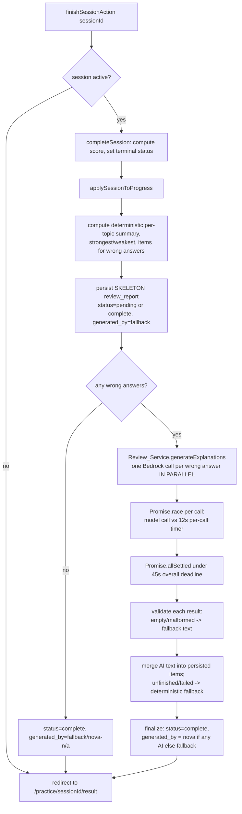
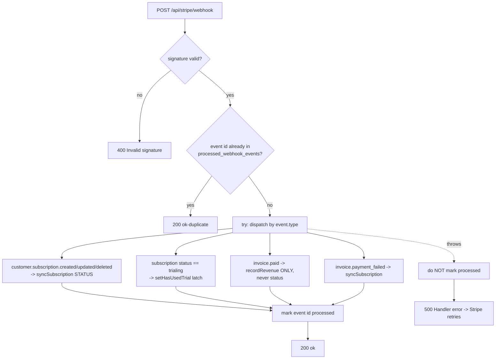

# Design Document

## Overview

This feature completes ApexMaths so its behaviour matches the working sibling reference (documented in `instructions.me`) while staying entirely on the existing **Next.js 16 (App Router) / Vercel serverless / Cognito / Aurora PostgreSQL (RDS Data API) / Bedrock Nova 2 Lite / Stripe** stack. No Firebase, Firestore, Gemini, Cloud Run, background queues, or cron are introduced.

The work is delivered as four tiers plus two cross-cutting changes, all traceable to the 20 requirements:

- **Tier 1 — Trial-abuse prevention & one-active-session guard** (Req 1–4): a server-only `has_used_trial` flag, a trial-eligibility decision at checkout, a webhook write that latches the flag on `trialing`, and a one-active-session-per-child invariant in the practice service.
- **Tier 2 — Synchronous per-session AI review** (Req 5–8): the marquee feature. On session completion we compute and persist the score and per-topic summary *first*, then generate one Bedrock explanation per wrong answer **in parallel, within the completing request**, bounded by a per-call timeout and an overall time budget, with deterministic fallback for any item that fails, times out, or is malformed. The route declares `maxDuration = 60`.
- **Tier 3 — Revenue tracking from `invoice.paid`** (Req 9–12): record each paid invoice idempotently, maintain a singleton revenue summary, never touch subscription status from invoice events, and guard the whole webhook with `processed_webhook_events`.
- **Tier 4 — GDPR hard-delete** (Req 13–17): true erasure across Stripe, Aurora (hard `DELETE` with FK cascade), and Cognito, gated by a typed `DELETE` confirmation, with an append-only audit written first.
- **Cross-cutting A — Stripe Embedded Checkout** (Req 18): `ui_mode: 'embedded'`, return `client_secret`, with completion routing + fallback.
- **Cross-cutting B — Domain reconciliation** (Req 19–20): year groups narrowed to 4–6; mastery thresholds pinned to 0.8 / 0.5 with a new `insufficient_data` band below a minimum-attempts threshold.

### Key design decisions

1. **Synchronous review is a platform constraint, not a preference.** Vercel freezes CPU once the HTTP response is sent, so the reference's Cloud-Run-style fire-and-forget review would be starved. We generate the review inside the completing request and rely on an **overall time budget** (not just per-call timeouts) as the real guarantee that the request stays inside `maxDuration`.

2. **Score/summary persistence is decoupled from AI.** The deterministic skeleton (score, per-topic summary, strongest/weakest, one item per wrong answer with placeholder text) is persisted *before* any model call. AI only enriches the already-persisted report. An AI failure or timeout can never lose the score.

3. **Status isolation.** Subscription status is written *only* by `customer.subscription.*` events. `invoice.paid` does revenue only. This prevents the historical "trialing→active corrupted on every invoice" bug.

4. **Hard-delete over soft-delete.** Req 14 requires true erasure with no soft-deleted residue, so account deletion changes from the current `softDeleteParent` to a hard `DELETE` that relies on the existing `ON DELETE CASCADE` foreign keys.

5. **TEXT ids preserved.** All new id/FK columns remain `TEXT`; no `uuid` column type is introduced (per `001_schema.sql`).

---

## Architecture

### Module map

| Layer | Module | Change |
|-------|--------|--------|
| Schema | `scripts/sql/005_completion.sql` | New migration: `has_used_trial`, enum value, year-group CHECK, `revenue_summary` |
| Domain | `lib/domain.ts` | `YEAR_GROUPS`, pinned `classifyMastery`, `insufficient_data`, `MIN_ATTEMPTS_FOR_CLASSIFICATION` |
| Data | `lib/db/parents.ts` | `has_used_trial` mapping (server-only), `setHasUsedTrial`, `hardDeleteParent` |
| Data | `lib/db/sessions.ts` | `getActiveSession`, `endSession` |
| Data | `lib/db/reviews.ts` | **new** — persist/read `review_reports` |
| Data | `lib/db/revenue.ts` | **new** — `recordRevenueEvent` + summary accumulation |
| Data | `lib/db/progress.ts` | classification writes use pinned thresholds + min-attempts |
| AI | `lib/ai/review.ts` | **new** — Review_Service (parallel, bounded, fallback) |
| Auth | `lib/auth/cognito.ts` | `adminDeleteUser` (AdminDeleteUserCommand) |
| Action | `app/(app)/billing/actions.ts` | embedded checkout + trial eligibility |
| Action | `app/(app)/practice/actions.ts` | active-session guard, `endSessionAction`, review wiring in `finishSessionAction` (`maxDuration = 60`) |
| Action | `app/(app)/account/actions.ts` | hard-delete sequence |
| Route | `app/api/stripe/webhook/route.ts` | idempotency guard, `invoice.paid`, trial latch |
| UI | `components/app/subscription-checkout.tsx` | reconcile with embedded `client_secret` |
| UI | `components/app/add-child-dialog.tsx` | year options 4–6 |
| UI | `app/(app)/practice/[sessionId]/result/page.tsx` | render stored review |

### Finish-session synchronous review flow (Tier 2)



The hard guarantee is step **F** (skeleton persisted before any AI) and the **45 s overall budget** at step **K**: whatever has not resolved when the budget elapses is finalised with fallback text, so the request always returns well within the route's `maxDuration = 60`.

### Webhook dispatch flow (Tier 3)



The processed-events marker is written **only after** the handler succeeds (step M). On a thrown error we deliberately leave no marker and return 500 so Stripe's retry is not suppressed (Req 12.3).

---

## Components and Interfaces

### Tier 1 — `lib/db/parents.ts`

`has_used_trial` is read into a **server-only** shape. It is deliberately *not* added to the `Parent` interface in `lib/domain.ts` (which is imported by client components); instead a dedicated server getter exposes it so it can never be serialised to the browser (Req 1.2).

```ts
// lib/db/parents.ts

/** Server-only read of the trial flag. Not part of the client-facing Parent type. */
export async function getHasUsedTrial(parentId: string): Promise<boolean>

/**
 * Latch the trial flag to TRUE. Idempotent and monotonic: only ever sets TRUE,
 * never resets to FALSE (Req 3.2). Safe to call repeatedly.
 */
export async function setHasUsedTrial(parentId: string): Promise<void>
// SQL: UPDATE parents SET has_used_trial = TRUE WHERE id = :id
//      (no WHERE on current value needed — setting TRUE over TRUE is a no-op)

/** Hard-delete the parent row; FK ON DELETE CASCADE removes all owned data (Req 14). */
export async function hardDeleteParent(parentId: string): Promise<void>
// SQL: DELETE FROM parents WHERE id = :id
```

The `ParentRow` interface gains `has_used_trial: boolean`, but `mapParent` does **not** copy it into the returned `Parent`. A separate internal row reader is used by `getHasUsedTrial`.

### Tier 1 — `app/(app)/billing/actions.ts` (Trial_Eligibility)

```ts
type TrialDecision = { grantTrial: boolean; reason: "flag_used" | "prior_subscription" | "eligible" | "lookup_failed_eligible" }

/**
 * Decide trial eligibility (Req 2). Pure-ish: takes the flag and a Stripe lookup fn,
 * so it is unit/property testable without hitting Stripe.
 */
async function decideTrialEligibility(args: {
  hasUsedTrial: boolean
  stripeCustomerId: string | null
  listPriorSubscriptions: (customerId: string) => Promise<number> // count of status:'all' subs
}): Promise<TrialDecision>
```

Decision table (Req 2.1–2.4):

| `has_used_trial` | customer id | Stripe `subscriptions.list status:'all'` | Decision |
|---|---|---|---|
| `TRUE` | any | not queried | **no trial** (`flag_used`) |
| `FALSE` | present | ≥ 1 prior sub | **no trial** (`prior_subscription`) — precedence over 2.3 |
| `FALSE` | present | 0 prior subs | **7-day trial** (`eligible`) |
| `FALSE` | none | not queried | **7-day trial** (`eligible`) |
| `FALSE` | present | **lookup throws** | **7-day trial** (`lookup_failed_eligible`, fail-open per 2.4) |

`startSubscriptionCheckout` then sets `subscription_data.trial_period_days` **only when** `grantTrial` is true, and never writes subscription status (Req 2.5). Embedded-checkout shape is covered under Cross-cutting A.

### Tier 1 — `lib/db/sessions.ts` + `app/(app)/practice/actions.ts` (one active session)

```ts
// lib/db/sessions.ts

/**
 * The single active, non-expired session for a child, or null.
 * "active" means status='active' AND now() <= expires_at (Req 4.4).
 */
export async function getActiveSession(childId: string, parentId: string): Promise<PracticeSession | null>
// SQL: SELECT ... FROM sessions
//      WHERE child_id=:childId AND parent_id=:parentId
//        AND status='active' AND now() <= expires_at
//      ORDER BY started_at DESC LIMIT 1

/** End an active session by moving it to a terminal status (Req 4.5). */
export async function endSession(sessionId: string, parentId: string): Promise<PracticeSession | null>
// SQL: UPDATE sessions SET status='abandoned', completed_at=now()
//      WHERE id=:sessionId AND parent_id=:parentId AND status='active'
//      RETURNING ...
```

`startSessionAction` returns a richer result so the UI can offer resume/end (Req 4.2):

```ts
type StartResult =
  | { error: string }
  | { activeSession: { id: string; childId: string } } // existing active session blocks the start
  | void // success (redirects into the player)
```

Guard ordering and race-safety (Req 4.1): the active-session check runs **before** `createSession` inserts anything. Because `createSession` pre-seeds answer slots, a double-create would be expensive to unwind, so we minimise the race window by:
1. calling `getActiveSession` first and returning `{ activeSession }` if one exists; then
2. relying on a **partial unique index** added in the migration —
   `CREATE UNIQUE INDEX uniq_active_session_per_child ON sessions(child_id) WHERE status = 'active'` —
   so that even under a concurrent double-submit, the second `INSERT ... status='active'` fails at the DB and is caught and surfaced as `{ activeSession }`. This makes the one-active-session rule a hard DB invariant, not just an application check.

> Note on `expires_at`: the partial unique index treats an expired-but-still-`active` row as occupying the slot. `expireIfElapsed` / `getActiveSession` flip such rows to `expired` lazily; `startSessionAction` calls `expireIfElapsed` on any found active session before deciding, so a genuinely expired session never blocks a new start (Req 4.3, 4.4).

```ts
// app/(app)/practice/actions.ts
export async function endSessionAction(sessionId: string): Promise<{ error: string } | void>
// requireEntitledParent -> endSession(sessionId, parent.id) -> revalidate -> allow new start
```

### Tier 2 — `lib/ai/review.ts` (Review_Service)

```ts
// Safe, PII-free context for one wrong answer (Req 7). No names/ids/imageUrl.
export interface ReviewItemContext {
  questionId: string          // opaque stable id (e.g. "q-m1-002"), not personal
  topic: Topic
  questionText: string
  options: string[]
  correctAnswerText: string   // correct option text (post-session is safe, Req 7.5)
  selectedAnswerText: string | null
  imageDescription: string | null // server-only; NEVER returned to client (Req 7.4)
  yearGroup: number | null
}

export interface ReviewItemResult {
  questionId: string
  explanation: string
  nextStep: string
  source: "nova" | "fallback"
}

export interface ReviewServiceConfig {
  perCallTimeoutMs: number   // default 12_000
  overallBudgetMs: number    // default 45_000
  maxConcurrency: number     // default 30 (== max mock questions); effectively "all in parallel"
}

/**
 * Generate one explanation per wrong answer, in parallel, bounded by a per-call
 * timeout and an overall budget. Never throws: any item that fails, times out,
 * is empty, or is malformed gets deterministic fallback text (Req 8.4–8.6).
 */
export async function generateReviewExplanations(
  items: ReviewItemContext[],
  config?: Partial<ReviewServiceConfig>,
): Promise<ReviewItemResult[]>

/** Deterministic fallback text for one item (no model). Pure function. */
export function fallbackExplanation(item: ReviewItemContext): { explanation: string; nextStep: string }
```

Internal mechanics:

- **Per call**: `Promise.race([ generateOneExplanation(item), timeout(perCallTimeoutMs) ])`. A timeout resolves to a fallback result (never rejects).
- **Overall budget**: a single `deadline = Date.now() + overallBudgetMs`. All calls are launched together; results are collected with `Promise.allSettled` raced against a global timer. Any item not settled by the deadline is finalised with `fallbackExplanation` (Req 8.6).
- **Concurrency**: at ≤ 30 items (mock max) we launch all in parallel. `maxConcurrency` is provided for safety; the **overall budget is the real guarantee**, independent of how many calls are in flight.
- **Validation** (Req 8.5): a successful response must have non-empty trimmed `explanation` and `nextStep`; otherwise fallback.

Structured output mirrors `report-actions.ts` (`generateText` + `experimental_output` / `Output.object` with zod):

```ts
const reviewItemSchema = z.object({
  explanation: z.string().min(1).describe("Why the correct answer is right, in 2-4 plain sentences a 10-year-old understands"),
  nextStep: z.string().min(1).describe("One concrete, encouraging next step to practise this skill"),
})

const SYSTEM = `You are a UK 11+ maths tutor explaining one multiple-choice question a child got wrong.
You have NO personal information about the child and must never invent any.
Explain the METHOD that leads to the correct answer, then give one short next step.
Keep it warm, concrete and concise.`

// user prompt is built from ReviewItemContext ONLY (topic label, question text,
// figure description, options A.., correct answer text). Identical firewall to help/route.ts.
```

### Tier 2 — `lib/db/reviews.ts`

```ts
export type ReviewStatus = "pending" | "complete"
export type ReviewGeneratedBy = "nova" | "fallback"

export interface ReviewItem {
  questionId: string
  explanation: string
  nextStep: string
}

export interface ReviewDocument {
  perTopicSummary: Array<{ topic: Topic; attempted: number; correct: number }>
  strongestTopic: Topic | "n/a"
  weakestTopic: Topic | "n/a"
  items: ReviewItem[]
  status: ReviewStatus
}

/** Insert (or overwrite) the one report per session. Idempotent on session_id (UNIQUE). */
export async function upsertReviewReport(input: {
  sessionId: string
  document: ReviewDocument
  generatedBy: ReviewGeneratedBy
}): Promise<void>
// INSERT INTO review_reports (session_id, summary, generated_by)
// VALUES (:sid, :doc::jsonb, :by)
// ON CONFLICT (session_id) DO UPDATE SET summary=EXCLUDED.summary, generated_by=EXCLUDED.generated_by

export async function getReviewReport(sessionId: string): Promise<{ document: ReviewDocument; generatedBy: ReviewGeneratedBy } | null>
```

### Tier 2 — `app/(app)/practice/actions.ts` (`finishSessionAction`)

```ts
// At the top of the file, so the completing request can run long enough (Req 8.7):
export const maxDuration = 60

export async function finishSessionAction(
  sessionId: string,
  reason: "completed" | "expired" = "completed",
): Promise<void>
```

New flow (replacing the current body):
1. `completeSession(sessionId, reason)` → score + terminal status (existing).
2. `applySessionToProgress(...)` (existing).
3. Build deterministic `ReviewDocument` (summary, strongest/weakest, one item per wrong answer with fallback text), `status` = `complete` if no wrong answers else `pending`.
4. `upsertReviewReport(...)` — **persist before any AI** (Req 6.2).
5. If wrong answers exist: `generateReviewExplanations(...)`, merge results into items, `upsertReviewReport(... status:'complete', generatedBy: anyNova ? 'nova' : 'fallback')` (Req 5.8, 8.9).
6. `revalidatePath('/dashboard')`; `redirect('/practice/{id}/result')`.

Deterministic summary helpers (pure, testable) live alongside or in `lib/domain.ts`:

```ts
export function computePerTopicSummary(answers: SessionAnswer[]): Array<{ topic: Topic; attempted: number; correct: number }>
export function strongestWeakest(summary: Array<{ topic: Topic; attempted: number; correct: number }>):
  { strongest: Topic | "n/a"; weakest: Topic | "n/a" }
// strongest/weakest by correct/attempted ratio; ties broken alphabetically by topic key (Req 5.2);
// weakest = "n/a" iff fewer than 2 topics have >=1 attempt (Req 5.3).
```

### Tier 2 — result page

`app/(app)/practice/[sessionId]/result/page.tsx` additionally calls `getReviewReport(sessionId)` and renders, under each wrong answer, the stored `explanation` and `nextStep`. It renders the persisted score/summary regardless of review status, and shows a gentle "explanations still finishing" note only if `status === 'pending'` (rare — the synchronous flow normally finalises to `complete`). `imageDescription` is never read into the page payload (Req 7.4).

### Tier 3 — `lib/db/revenue.ts`

```ts
export interface RevenueEventInput {
  parentId: string | null
  stripeInvoiceId: string
  amountPence: number
  currency: string
  occurredAt: Date
}

/**
 * Record one paid invoice and update the singleton summary in ONE transaction.
 * Idempotent on stripe_invoice_id: if the invoice already exists, skip entirely
 * without re-reading amount (Req 9.2, 9.3) and do NOT touch the summary.
 * Returns whether a new event was recorded.
 */
export async function recordRevenueEvent(input: RevenueEventInput): Promise<{ recorded: boolean }>

export interface RevenueSummary {
  totalRevenuePence: number
  payingParentCount: number
  firstPaidAt: string | null
}
export async function getRevenueSummary(): Promise<RevenueSummary>
```

Transaction body (Req 9, 10):
```
withTransaction:
  ins = INSERT INTO revenue_events (parent_id, stripe_invoice_id, amount_pence, currency, occurred_at)
        VALUES (...) ON CONFLICT (stripe_invoice_id) DO NOTHING RETURNING id
  if ins empty -> return { recorded:false }            -- duplicate invoice, do nothing (9.3)
  priorCount = SELECT count(*) FROM revenue_events
               WHERE parent_id=:pid AND id <> :newId    -- prior events for this parent
  INSERT INTO revenue_summary (id, total_revenue_pence, paying_parent_count, first_paid_at)
    VALUES ('current', :amt, CASE WHEN priorCount=0 THEN 1 ELSE 0 END, :occurredAt)
  ON CONFLICT (id) DO UPDATE SET
    total_revenue_pence = revenue_summary.total_revenue_pence + EXCLUDED.total_revenue_pence,
    paying_parent_count = revenue_summary.paying_parent_count
                          + CASE WHEN :priorCount = 0 THEN 1 ELSE 0 END,   -- 10.2 / 10.3
    first_paid_at = COALESCE(revenue_summary.first_paid_at, EXCLUDED.first_paid_at) -- 10.4 set once
  return { recorded:true }
```

### Tier 3 — webhook route changes

```ts
// app/api/stripe/webhook/route.ts (additions)

// 1. Idempotency guard (Req 12). Conditional insert AFTER signature check, returns "already seen".
async function markEventProcessed(eventId: string, type: string): Promise<{ firstTime: boolean }>
// INSERT INTO processed_webhook_events (event_id, type) VALUES (:id,:type)
// ON CONFLICT (event_id) DO NOTHING RETURNING event_id

// 2. invoice.paid handler — revenue ONLY, never status (Req 11.1)
case "invoice.paid": {
  const invoice = event.data.object as Stripe.Invoice
  if ((invoice.amount_paid ?? 0) > 0) {          // Req 9.4 skip <= 0
    const parent = invoice.customer ? await getParentByStripeCustomerId(custId) : null
    await recordRevenueEvent({
      parentId: parent?.id ?? null,
      stripeInvoiceId: invoice.id,
      amountPence: invoice.amount_paid,
      currency: invoice.currency ?? "gbp",
      occurredAt: new Date((invoice.status_transitions?.paid_at ?? event.created) * 1000),
    })
  }
  break
}

// 3. Trial latch on trialing subscription (Req 3.1)
//    inside syncSubscription, after resolving parentId:
if (sub.status === "trialing") await setHasUsedTrial(parentId)
```

Idempotency ordering (Req 12.1–12.3): verify signature → **check** `processed_webhook_events` (if present return 200 without processing) → dispatch in `try` → on success `markEventProcessed` then 200 → on throw, return 500 **without** marking. `invoice.paid` is added to the registered event list. The check-then-mark split (rather than mark-first) ensures a handler error never leaves a suppressing marker.

### Tier 4 — `lib/auth/cognito.ts`

```ts
/**
 * Hard-delete a Cognito user so the email is freed for re-registration (Req 15).
 * Non-fatal at the call site. Requires the IAM permission cognito-idp:AdminDeleteUser.
 */
export async function adminDeleteUser(username: string): Promise<void>
// new AdminDeleteUserCommand({ UserPoolId, Username })  // username = email or sub
```

> **Infra / CDK note (out-of-band):** the Vercel IAM user currently has **no** Cognito permissions. `AdminDeleteUserCommand` needs `cognito-idp:AdminDeleteUser` on the user pool ARN. This is an IAM/CDK change to be made when deploying; until then `adminDeleteUser` will fail and is treated as non-fatal (Req 15.2), so deletion still completes.

### Tier 4 — `app/(app)/account/actions.ts` (`deleteMyAccount`)

Redesigned to hard-delete with strict ordering (Req 13–17):

```ts
export async function deleteMyAccount(confirmation: string): Promise<{ error?: string }>
```

Sequence:
1. **Confirm** (Req 17): `confirmation.trim().toUpperCase() === "DELETE"` else return error, erase nothing.
2. **Audit first** (Req 16): write append-only `parent.deleted` audit with `{ parentUid, email, stripeCustomerId }` (no child PII). If the audit write fails, **abort** and erase nothing. (Uses a non-swallowing audit write here — see Error Handling.)
3. **Stripe erasure** (Req 13): cancel any `active|trialing|past_due` subscriptions, then `customers.del(stripeCustomerId)`. On **any** Stripe/network error, abort leaving the account fully intact.
4. **Aurora hard-delete** (Req 14): `hardDeleteParent(parent.id)` — FK `ON DELETE CASCADE` removes children, sessions, session_answers, progress, subscriptions, review_reports (review_reports cascade via `sessions`). No soft-delete residue.
5. **Cognito delete** (Req 15): `adminDeleteUser(parent.email)` — non-fatal, log and continue on failure.
6. **Sign out + clear cookies**: `globalSignOut(accessToken)`, `clearSessionCookies()`, redirect `/?deleted=1`.

FK cascade verification (Req 14.2): from `001_schema.sql`, `subscriptions`, `children`, `sessions`, `progress`, `revenue_events(parent_id ON DELETE SET NULL)` reference `parents`; `session_answers` and `review_reports` reference `sessions`. Deleting the parent cascades to children/sessions/etc.; `review_reports` is removed transitively via `sessions`. `revenue_events.parent_id` is intentionally `SET NULL` so the revenue ledger survives erasure with the parent link removed (financial record retention; no personal data remains on it).

### Cross-cutting A — embedded checkout

```ts
// app/(app)/billing/actions.ts
export async function startSubscriptionCheckout(): Promise<{ clientSecret: string | null; error?: string }>
```

Changes:
- `ui_mode: "embedded"` (fixes the invalid `"embedded_page"`).
- Apply `decideTrialEligibility`; set `subscription_data.trial_period_days` only when eligible (remove the always-on trial).
- `return_url: ${origin}/billing?status=complete` (Req 18.3).
- Return `session.client_secret` (Req 18.1). If Stripe not configured, return `{ clientSecret: null, error: "billing unavailable" }` (Req 18.6).

`components/app/subscription-checkout.tsx` already uses `EmbeddedCheckoutProvider` / `EmbeddedCheckout` with `fetchClientSecret`, which calls `startSubscriptionCheckout`. It is reconciled to:
- treat `{ clientSecret: null }` as the error path (already does) — render the error message and prevent embedded render (Req 18.2);
- on completion, Stripe redirects to `return_url`; the billing page reads `?status=complete` and, if that navigation fails, provides an explicit "Go to billing" fallback link / retried `router.replace` (Req 18.4).

### Cross-cutting B — `lib/domain.ts`

```ts
export const YEAR_GROUPS = [4, 5, 6] as const
export type YearGroup = (typeof YEAR_GROUPS)[number]

export const MASTERY_CLASSIFICATIONS = ["insufficient_data", "needs_focus", "developing", "strong"] as const
export type MasteryClassification = (typeof MASTERY_CLASSIFICATIONS)[number]

export const MIN_ATTEMPTS_FOR_CLASSIFICATION = 10

/**
 * Pinned thresholds (Req 20). score is a FRACTION in [0,1].
 * Precedence: insufficient_data (below min attempts) takes absolute priority.
 */
export function classifyMastery(attempts: number, score: number): MasteryClassification {
  if (attempts < MIN_ATTEMPTS_FOR_CLASSIFICATION) return "insufficient_data"
  if (score >= 0.8) return "strong"
  if (score >= 0.5) return "developing"
  return "needs_focus"
}
```

`lib/db/progress.ts` is updated so its inline SQL `CASE` and the `classifyMastery` call use the new signature (attempts + fractional score) and thresholds (0.8/0.5), and write `insufficient_data` when attempts < 10. `CLASSIFICATION_LABELS` gains an `insufficient_data: "Not enough data yet"` entry. The add-child UI (`add-child-dialog.tsx`) offers only `[4, 5, 6]`; `children/actions.ts` Zod schema constrains `yearGroup` to 4–6 and rejects others (Req 19.3).

---

## Data Models

### Migration — `scripts/sql/005_completion.sql`

The migrate runner (`scripts/migrate.mjs`) splits files into individual statements and executes each **separately** (not wrapped in one transaction). This matters for `ALTER TYPE ... ADD VALUE`, which Postgres forbids inside a transaction block — running it as its own statement satisfies that constraint.

```sql
-- 005_completion.sql — practice-billing-gdpr-completion

-- Req 1: server-only trial flag on parents (default FALSE, never client-serialised)
ALTER TABLE parents ADD COLUMN IF NOT EXISTS has_used_trial BOOLEAN NOT NULL DEFAULT FALSE;

-- Req 20: add the insufficient_data band to the mastery enum.
-- ALTER TYPE ... ADD VALUE cannot run inside a transaction block; the migrate
-- runner executes each statement individually, so this is safe as its own stmt.
-- IF NOT EXISTS makes re-runs idempotent.
ALTER TYPE mastery_classification ADD VALUE IF NOT EXISTS 'insufficient_data';

-- Req 19: narrow children.year_group from 3..8 to 4..6.
-- Existing rows outside 4..6 (e.g. Year 3 or 7 from the old UI) must be reconciled
-- before the new CHECK is valid. We clamp/null them, then swap the constraint.
UPDATE children SET year_group = NULL WHERE year_group IS NOT NULL AND year_group NOT BETWEEN 4 AND 6;
ALTER TABLE children DROP CONSTRAINT IF EXISTS children_year_group_check;
ALTER TABLE children ADD CONSTRAINT children_year_group_check CHECK (year_group IS NULL OR year_group BETWEEN 4 AND 6);

-- Req 4: hard one-active-session-per-child invariant (partial unique index).
CREATE UNIQUE INDEX IF NOT EXISTS uniq_active_session_per_child
  ON sessions(child_id) WHERE status = 'active';

-- Req 10: singleton revenue summary (id is always 'current').
CREATE TABLE IF NOT EXISTS revenue_summary (
  id                  TEXT PRIMARY KEY DEFAULT 'current',
  total_revenue_pence BIGINT NOT NULL DEFAULT 0,
  paying_parent_count INT NOT NULL DEFAULT 0,
  first_paid_at       TIMESTAMPTZ,
  updated_at          TIMESTAMPTZ NOT NULL DEFAULT now()
);
```

> Reused as-is (no migration needed): `review_reports` (session_id unique, summary jsonb, generated_by), `revenue_events` (stripe_invoice_id unique, amount_pence, currency, occurred_at, parent_id ON DELETE SET NULL), `processed_webhook_events` (event_id PK).

> The original column CHECK is currently anonymous (`year_group INT CHECK (...)`), so Postgres auto-named it `children_year_group_check`. The `DROP CONSTRAINT IF EXISTS` uses that conventional name; if the deployed name differs, the design note for the implementer is to look up `information_schema.table_constraints` for the children table and drop the actual name.

### Review summary JSON shape (stored in `review_reports.summary`)

```jsonc
{
  "perTopicSummary": [
    { "topic": "number", "attempted": 6, "correct": 4 },
    { "topic": "algebra", "attempted": 4, "correct": 1 }
  ],
  "strongestTopic": "number",        // Topic | "n/a"
  "weakestTopic": "algebra",         // Topic | "n/a" (only when < 2 topics attempted)
  "status": "complete",              // "pending" | "complete"
  "items": [                          // exactly one per WRONG answer
    {
      "questionId": "q-al-014",
      "explanation": "To solve 3x + 2 = 11 ...",  // nova or deterministic fallback
      "nextStep": "Practise one-step equations ..."
    }
  ]
}
```
`generated_by` (`'nova' | 'fallback'`) is the existing column, not part of the JSON. `imageDescription` never appears in this document (Req 7.4).

### Revenue types

```ts
interface RevenueEventRow { id: string; parent_id: string | null; stripe_invoice_id: string; amount_pence: number; currency: string; occurred_at: string }
interface RevenueSummaryRow { id: string; total_revenue_pence: number; paying_parent_count: number; first_paid_at: string | null; updated_at: string }
```
(TypeScript camelCase shapes `RevenueSummary` defined above; all ids `TEXT`.)

---

## Correctness Properties

*A property is a characteristic or behavior that should hold true across all valid executions of a system — essentially, a formal statement about what the system should do. Properties serve as the bridge between human-readable specifications and machine-verifiable correctness guarantees.*

Most of the feature's risky logic is pure or mockable (trial decision, mastery classification, deterministic summaries, the bounded review orchestrator with an injected model, revenue accumulation against an in-memory/mocked data layer), which makes property-based testing the right tool. UI rendering, Stripe/Cognito wiring, and exact route config are covered by example/integration/smoke tests in the Testing Strategy instead.

### Property 1: Trial granted iff eligible

*For any* combination of `has_used_trial`, presence/absence of a Stripe customer id, and prior-subscription count (including a lookup that throws), `decideTrialEligibility` grants a trial **iff** `has_used_trial` is `FALSE` **and** the lookup did not return a prior subscription — and when the lookup throws it grants the trial whenever `has_used_trial` is `FALSE` (fail-open).

**Validates: Requirements 2.1, 2.2, 2.3, 2.4, 18.5**

### Property 2: Trial flag is monotonic

*For any* sequence of `setHasUsedTrial` / webhook operations applied to a parent, the `has_used_trial` value only ever transitions `FALSE → TRUE` and never `TRUE → FALSE`; once `TRUE` it stays `TRUE`, and repeated sets are idempotent.

**Validates: Requirements 3.1, 3.2, 3.3**

### Property 3: At most one active session per child

*For any* interleaving of start/end/expire operations for a child, at no point do two sessions for that child satisfy "active" (`status='active'` and `now() <= expires_at`) simultaneously; a start is rejected with the existing active session's id while one exists, and succeeds once the only prior sessions are terminal or expired.

**Validates: Requirements 4.1, 4.3, 4.4, 4.5**

### Property 4: Per-topic summary preserves counts

*For any* set of recorded session answers, the computed per-topic summary has, for every topic, `attempted` equal to the number of graded answers in that topic and `correct` equal to the number of correct ones, and `correct <= attempted`; the sum of `attempted` across topics equals the number of graded answers.

**Validates: Requirements 5.1**

### Property 5: Strongest/weakest determinism and n/a rule

*For any* per-topic summary, `strongestWeakest` is deterministic, breaks ties alphabetically by topic key, and sets `weakestTopic = "n/a"` **iff** fewer than 2 topics have at least one attempt (a tie among ≥ 2 attempted topics never yields `"n/a"`).

**Validates: Requirements 5.2, 5.3**

### Property 6: Review item count equals wrong-answer count

*For any* completed session, the persisted Review_Report contains exactly one `items` entry per incorrect answer, each with non-empty `explanation` and `nextStep`, and no items for correct/unanswered slots.

**Validates: Requirements 5.4**

### Property 7: Zero incorrect answers means no model call

*For any* completed session with zero incorrect answers, the Review_Service produces a Review_Report with an empty `items` array and performs no model invocation.

**Validates: Requirements 5.5**

### Property 8: Review always finalises with text for every item, regardless of the model

*For any* set of wrong-answer contexts and *for any* model behaviour — success, error, per-call timeout, overall-budget overrun, empty response, or malformed response — `generateReviewExplanations` never throws, returns exactly one result per input, and every result has non-empty `explanation` and `nextStep` (falling back to deterministic text where the model did not yield valid content).

**Validates: Requirements 5.6, 8.2, 8.3, 8.4, 8.5, 8.6**

### Property 9: Score and summary are persisted before any AI work

*For any* completing session, even when the model always throws or hangs past the overall budget, the Review_Report's score and per-topic summary are persisted and readable; an AI failure or timeout never loses them.

**Validates: Requirements 6.2, 6.3, 6.4**

### Property 10: `generated_by` reflects the actual source

*For any* completed Review_Report, `generated_by = 'nova'` iff at least one item's explanation came from a successful, validated model response, and `generated_by = 'fallback'` when every item used deterministic fallback text.

**Validates: Requirements 5.8, 8.9**

### Property 11: Exactly one report per session

*For any* sequence of Review_Report writes for a single session id (including re-runs of finish), exactly one report row exists for that session afterward (idempotent upsert on the unique `session_id`).

**Validates: Requirements 5.7**

### Property 12: PII firewall on review prompts

*For any* generated `ReviewItemContext`, the built model prompt contains only question text, options, `imageDescription`, the correct answer text, and the child's year group, and contains none of: child display name, parent email, parent id, child id, session id, Stripe ids, or the question `imageUrl`.

**Validates: Requirements 7.1, 7.2, 7.3, 7.5**

### Property 13: `imageDescription` never reaches the client

*For any* persisted Review_Report and its client-rendered projection, no field equals or contains the question's `imageDescription`.

**Validates: Requirements 7.4**

### Property 14: Revenue recorded iff amount positive and unseen (idempotent)

*For any* sequence of `invoice.paid` events, a Revenue_Event is recorded for an invoice **iff** its `amount_paid > 0` and that invoice id has not been recorded before; recording the same invoice id again is a no-op that leaves exactly one row and does not re-validate the amount.

**Validates: Requirements 9.1, 9.2, 9.3, 9.4**

### Property 15: Recorded revenue events preserve their fields

*For any* recorded paid invoice, the stored Revenue_Event round-trips the amount in pence, the currency, the associated parent (or null), and the paid timestamp.

**Validates: Requirements 9.5**

### Property 16: Revenue summary total equals the sum of events

*For any* sequence of recorded Revenue_Events, the Revenue_Summary `total_revenue_pence` equals the sum of all recorded event amounts.

**Validates: Requirements 10.1**

### Property 17: A paying parent is counted exactly once

*For any* sequence of recorded Revenue_Events, the Revenue_Summary `paying_parent_count` equals the number of distinct parents that have at least one recorded event; a second event for an already-paying parent never increments it.

**Validates: Requirements 10.2, 10.3**

### Property 18: First-paid timestamp is set once

*For any* sequence of recorded Revenue_Events, `first_paid_at` is set when the first event overall is recorded and never changes on subsequent events.

**Validates: Requirements 10.4**

### Property 19: Invoice events never change subscription status

*For any* `invoice.paid` event processed by the webhook, the parent's subscription status is identical before and after processing; subscription status only changes in response to `customer.subscription.created/updated/deleted`.

**Validates: Requirements 11.1, 11.2**

### Property 20: Webhook event idempotency

*For any* event id that has already been recorded in `processed_webhook_events`, re-delivery is acknowledged with success and the handler side effects do not run a second time; a newly processed event records its id so subsequent duplicates are detected.

**Validates: Requirements 12.1, 12.2**

### Property 21: A failed handler leaves no suppressing marker

*For any* event whose handler throws, no `processed_webhook_events` marker is left for that event id, so a retried delivery is processed rather than skipped.

**Validates: Requirements 12.3**

### Property 22: Deletion aborts intact when a pre-Aurora step fails

*For any* deletion attempt in which the audit write or the Stripe erasure step fails, no Aurora hard-delete and no Cognito deletion occur, and the parent's data remains fully intact and retryable.

**Validates: Requirements 13.3, 16.2**

### Property 23: Hard-delete leaves no residue

*For any* parent data graph (children, sessions, answers, progress, subscription, review reports), after a successful `hardDeleteParent` no row referencing that parent (directly or transitively via sessions) remains in any owned table, and no soft-deleted residue is left.

**Validates: Requirements 14.1, 14.2, 14.3**

### Property 24: Deletion audit excludes child PII

*For any* deletion audit record, it contains only the parent uid, parent email, and Stripe customer id, and contains no child display name or other child personal data.

**Validates: Requirements 16.1, 16.3**

### Property 25: Confirmation gate

*For any* confirmation string, deletion proceeds **iff** the string trimmed and upper-cased equals `"DELETE"`; otherwise no data is erased.

**Validates: Requirements 17.1, 17.2, 17.3**

### Property 26: Year group accepted iff in range

*For any* submitted year-group value, the child create/edit validation accepts it **iff** it is `null`/absent or an integer in `{4, 5, 6}`, and rejects every other value.

**Validates: Requirements 19.1, 19.3**

### Property 27: Mastery classification thresholds and precedence

*For any* `(attempts, score)` with `score` in `[0, 1]`, `classifyMastery` returns `insufficient_data` when `attempts < MIN_ATTEMPTS_FOR_CLASSIFICATION` (absolute precedence, regardless of score); otherwise `strong` when `score >= 0.8`, `developing` when `0.5 <= score < 0.8`, and `needs_focus` when `score < 0.5`.

**Validates: Requirements 20.1, 20.2, 20.3, 20.4**

---

## Error Handling

### Trial eligibility (Req 2.4)
The Stripe `subscriptions.list` lookup is wrapped so that **any** thrown error is caught and the decision falls back to `has_used_trial` alone (fail-open: grant the trial when the flag is `FALSE`). The lookup result is never cached as authoritative.

### One active session (Req 4)
`getActiveSession` runs before insert; the partial unique index `uniq_active_session_per_child` is the backstop. A unique-violation from a concurrent `createSession` is caught and surfaced as `{ activeSession }` (resume/end), not a 500.

### Review generation (Req 5.6, 6, 8)
`generateReviewExplanations` is total — it never throws. Each per-call promise is wrapped in `Promise.race` with a 12 s timer that resolves (not rejects) to a fallback. The overall `Promise.allSettled` is raced against the 45 s budget; unsettled items are finalised with `fallbackExplanation`. The skeleton report is persisted before AI, so a thrown error anywhere in enrichment still leaves a readable, complete-enough report; the final upsert sets `status='complete'`. If persistence of the *skeleton* itself fails, the session is still completed (score is on the `sessions` row) and the result page degrades to score + summary computed from answers.

### Webhook (Req 12)
- Missing signature → 400. Invalid signature → 400.
- Duplicate event id (already in `processed_webhook_events`) → 200 without reprocessing.
- Handler throws → log, **do not** mark processed, return 500 so Stripe retries.
- Revenue recording uses `ON CONFLICT DO NOTHING`, so a retry after a partial failure cannot double-count.

### Account deletion (Req 13, 16)
Ordered, fail-closed: audit write (must succeed) → Stripe (any error aborts, account intact) → Aurora hard-delete → Cognito (non-fatal) → sign-out. The audit write at this step uses a throwing variant (unlike the normal swallowing `audit`) so a failed audit aborts the deletion. Cognito failure is logged and ignored.

### Embedded checkout (Req 18)
Stripe not configured → `{ clientSecret: null, error }`; the component shows the error and does not mount `EmbeddedCheckout`. If post-completion routing to `/billing` fails, the page provides an explicit fallback navigation link and retries `router.replace`.

### Data layer
RDS Data API errors propagate to the action/route boundary, which maps them to a friendly message; secrets are never echoed. `audit` continues to swallow its own errors everywhere except the deletion pre-condition write.

---

## Testing Strategy

### Dual approach
- **Property-based tests** verify the universal properties above across generated inputs.
- **Unit/example tests** cover specific scenarios, the Stripe/Cognito wiring (mocked), and boundary cases.
- **Integration tests** cover DB cascade behaviour and webhook signature handling against representative inputs.
- **Smoke tests** verify one-time configuration facts.

### Property-based testing
- Library: **fast-check** with the existing test runner (Vitest), since the codebase is TypeScript.
- Each property test runs **minimum 100 iterations**.
- Each property test is tagged with a comment referencing its design property, format:
  `// Feature: practice-billing-gdpr-completion, Property {number}: {property_text}`
- Each correctness property (1–27) is implemented as a **single** property-based test.
- Pure logic (Properties 1, 4, 5, 25, 26, 27) is tested directly.
- Orchestration/robustness (Properties 6–10) is tested against a **fake/injected model** (a `LanguageModel`-shaped stub that can be told to succeed, throw, hang, or return empty/malformed output) so 100+ iterations are cheap and deterministic — no real Bedrock calls.
- Data-layer invariants (Properties 2, 3, 11, 14–21, 22–24) are tested against an **in-memory fake** of the `query`/`withTransaction` surface (or a transactional test database), modelling `ON CONFLICT`, the partial unique index, and FK cascade, so revenue accumulation, idempotency, and cascade-no-residue can be exercised over generated event/operation sequences.

### Example / integration / smoke tests
- **EXAMPLE**: checkout returns `client_secret` and sets `ui_mode:'embedded'` (Req 18.1, mocked Stripe); webhook does not write status on `invoice.paid` for a concrete event (complements Property 19); start returns the existing active session id + resume/end options (Req 4.2); deletion cancels active/trialing/past_due subs and deletes the customer in order (Req 13.1/13.2, mocked Stripe); Cognito delete failure is non-fatal (Req 15.2, mocked).
- **INTEGRATION**: FK cascade actually removes children/sessions/answers/progress/subscription/review_reports on `DELETE parents` (Req 14.2) against a real Postgres/Aurora; webhook signature verification accepts a correctly signed body and rejects a tampered one (Req 12.4).
- **SMOKE**: migration applies cleanly (`has_used_trial` exists, enum has `insufficient_data`, year-group CHECK is 4–6, `revenue_summary` exists); `finishSessionAction` file exports `maxDuration = 60` and `60 > 45 (overall budget) + persist time` and `45 < 60` (Req 8.7, 8.8); `MIN_ATTEMPTS_FOR_CLASSIFICATION` is a single shared constant (Req 20.5); add-child UI offers only Year 4–6 (Req 19.2, component test).

### Test data generators
- Trial inputs: `{ hasUsedTrial: boolean, customerId: string|null, priorCount: 0..3, lookupThrows: boolean }`.
- Answers: arrays of `{ topic, isCorrect: boolean|null, answeredAt }` with mixed topics and counts up to 30 (mock max).
- Model behaviours: enum `{ ok, throw, hang, empty, malformed }` per item, plus latency draws to exercise the budget.
- Invoice events: `{ invoiceId, amountPaid: int (incl. <=0), currency, parentId|null }` sequences with duplicates.
- `(attempts, score)`: `attempts` in `0..40`, `score` in `[0,1]` including the 0.5 and 0.8 boundaries.
- Year groups: integers in `-1..10` plus `null`.
- Confirmation strings: `"DELETE"` variants with case/whitespace plus arbitrary strings.

### What is intentionally not property-tested
Stripe Embedded Checkout rendering, exact `return_url` wiring, Cognito `AdminDeleteUser` API behaviour, and CloudWatch/IAM config are integration/smoke/example concerns — their behaviour does not vary meaningfully across generated inputs and they exercise external services, so 100-iteration property tests would add cost without finding bugs.
