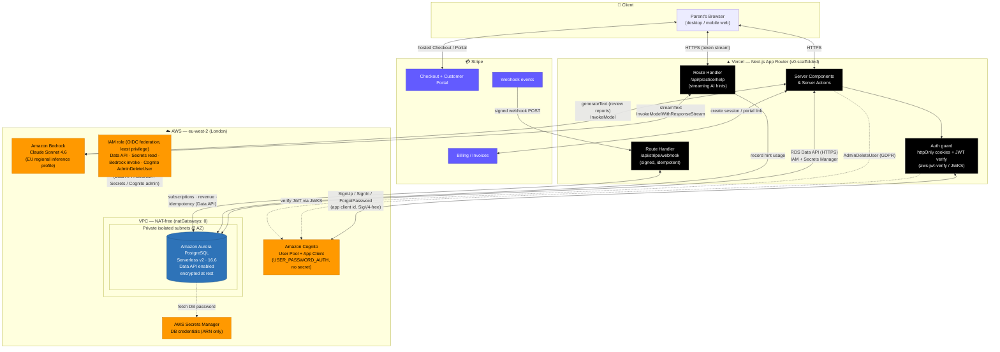

# ApexMaths — Architecture Diagram

**App:** ApexMaths — a UK 11+ maths practice platform for parents and their children (Years 4–6).
**Frontend / host:** Next.js (App Router, v0-scaffolded) on **Vercel** — serverless functions + server actions.
**Primary database:** **Amazon Aurora PostgreSQL Serverless v2** (engine 16.6), accessed over the **RDS Data API**.
**Other AWS:** Amazon **Cognito** (identity), Amazon **Bedrock** (Claude Sonnet 4.6), AWS **Secrets Manager**, **IAM**, **VPC**.
**Third party:** **Stripe** (subscriptions, billing, webhooks).
**Region:** `eu-west-2` (London). **Infra-as-code:** AWS CDK (`infra/`).

> This document is the mandatory architecture diagram for the submission. The
> Mermaid diagram below renders on GitHub and at [mermaid.live](https://mermaid.live)
> (where you can **export a PNG** for the Devpost upload). An ASCII fallback and
> the data-flow walkthrough follow.

---

## 1. System diagram (Mermaid)



---

## 2. ASCII fallback

```
                          ┌───────────────────────────┐
                          │   Parent's Browser (web)   │
                          └─────────────┬─────────────┘
                                        │ HTTPS
                                        ▼
   ┌───────────────────────────────────────────────────────────────────┐
   │              ▲ VERCEL — Next.js App Router (v0)                     │
   │  ┌───────────────┐  ┌───────────────┐  ┌─────────────────────────┐ │
   │  │ Server Comps  │  │ /api/practice │  │ /api/stripe/webhook     │ │
   │  │ & Actions     │  │ /help (stream)│  │ (signed + idempotent)   │ │
   │  └──────┬────────┘  └──────┬────────┘  └───────────┬─────────────┘ │
   │   Auth guard (httpOnly cookies, JWT verify via JWKS)                │
   └─────────┼──────────────────┼──────────────────────┼───────────────┘
             │                  │                       │
   RDS Data  │            Bedrock│ (stream)        Stripe│ webhook in
   API(HTTPS)│            invoke │                       │
             ▼                  ▼                       ▼
   ┌─────────────────────────────────────────────────────────────────────┐
   │            ☁️  AWS — eu-west-2 (London)        IAM (least privilege)  │
   │                                                                       │
   │  ┌────────────┐   ┌────────────┐   ┌──────────────────────────────┐  │
   │  │  Cognito   │   │  Bedrock   │   │  VPC (NAT-free)              │  │
   │  │ User Pool  │   │Claude Son46│   │  ┌────────────────────────┐  │  │
   │  └────────────┘   └────────────┘   │  │ private isolated subnet │  │  │
   │                                     │  │  Aurora PostgreSQL      │  │  │
   │  ┌─────────────────────────┐        │  │  Serverless v2 · 16.6   │  │  │
   │  │ Secrets Manager (ARN)   │◄───────┤  │  Data API · encrypted   │  │  │
   │  └─────────────────────────┘        │  └────────────────────────┘  │  │
   │                                     └──────────────────────────────┘  │
   └─────────────────────────────────────────────────────────────────────┘

   ┌───────────────┐
   │    Stripe     │  Checkout + Customer Portal (browser) · Billing (server) ·
   │               │  Webhooks ──► /api/stripe/webhook
   └───────────────┘
```

---

## 3. Components

| Layer | Component | Role |
|---|---|---|
| Client | Browser (web) | Parent/child UI; receives streamed AI hints over HTTPS |
| Vercel | Next.js App Router (v0-scaffolded) | Server Components, Server Actions, route handlers |
| Vercel | Auth guard (`lib/auth/session.ts`, `guard.ts`) | httpOnly cookies; verifies Cognito JWTs via `aws-jwt-verify` (JWKS); transparent refresh |
| Vercel | `/api/practice/help` | Streams step-by-step hints from Bedrock; PII-free prompt; per-session hint cap |
| Vercel | `/api/stripe/webhook` | Signature-verified, idempotent billing event sink |
| Vercel | `/contact` + Submit_Action | Public contact form → validated, honeypot + rate-limited, session-linked parameterized write to `contact_messages` |
| AWS | Amazon Cognito | Identity: signup, email verification, sign-in (USER_PASSWORD_AUTH, **no client secret**), password reset, `AdminDeleteUser` for GDPR |
| AWS | Amazon Aurora PostgreSQL Serverless v2 (16.6) | System of record; accessed via **RDS Data API**; private isolated subnets; encrypted at rest |
| AWS | AWS Secrets Manager | Holds the DB password; app references the **ARN** only — the password never enters code, env, or logs |
| AWS | Amazon Bedrock (Claude Sonnet 4.6) | AI tutor hints (streaming) and post-session review reports |
| AWS | IAM role (OIDC federation, least privilege) | Provides temporary creds for all SDK calls: Data API, Secrets read, Bedrock invoke, Cognito `AdminDeleteUser` |
| AWS | VPC (NAT-free, `natGateways: 0`) | Network isolation for Aurora; no public DB exposure |
| Third party | Stripe | Subscriptions: Checkout, Customer Portal, invoices, webhooks |

---

## 4. Key data flows

**A. Authentication**
Browser → Vercel Server Action → **Cognito** (`SignUp` / `InitiateAuth`). Tokens are
stored in httpOnly cookies; the id token is verified on each request with
`aws-jwt-verify` against Cognito's JWKS, refreshed transparently when expired. A
matching `parents` row in Aurora is keyed by the Cognito `sub`.

**B. App data (the relational core)**
Vercel Server Components / Actions → **RDS Data API (HTTPS)** → **Aurora**. There is
**no VPC entry from Vercel and no connection pool** — the Data API is stateless
HTTPS, authenticated by the **OIDC-federated IAM role** (which can read only the
least-privilege `app_user` DB secret), with the DB password fetched from
**Secrets Manager** inside AWS. Filtered random question selection, `GROUP BY`
mastery aggregation, transactional session creation, and FK-cascade GDPR deletes
all run here.

**C. AI tutor hint (streaming, adaptive)**
Browser → `/api/practice/help` → **Bedrock Claude Sonnet 4.6** via
`InvokeModelWithResponseStream`; tokens stream back to the browser. The prompt is
PII-free (maths content only); hint usage is recorded in Aurora and capped per
session. A repeat hint on the same question asks the model for a *different* correct
approach (adaptive re-explanation).

**D. AI review report (off the critical path)**
`finishSessionAction` persists the deterministic skeleton, **redirects immediately**,
and runs the per-question **Bedrock Claude Sonnet 4.6** calls in Next.js `after()`;
results are merged into `review_reports` in Aurora and the result page auto-refreshes
to show them. Bounded by per-call timeouts and an overall budget, with deterministic
fallback text.

**E. Parent analytics (live relational reads)**
Child dashboard Server Component → several parallel **Aurora** queries over the
practice event log: a **window-function** mastery-over-time series, a **`LAG()`**
improvement-velocity series, an **answers × questions JOIN** for accuracy-by-difficulty,
and **`FILTER` aggregates** for correct/wrong/skipped. A past session opens via a
read-only Server Action that reconstructs it with a single foreign-key join. No ETL,
no separate analytics store.

**F. Billing**
Browser → hosted **Stripe** Checkout / Customer Portal; Server Actions create
checkout/portal sessions. **Stripe webhooks** → `/api/stripe/webhook`, which
verifies the signature, de-duplicates via `processed_webhook_events`, and updates
`subscriptions` / `revenue_events` in Aurora.

**G. GDPR account erasure**
Server Action → single `DELETE FROM parents` in Aurora (FK `ON DELETE CASCADE`
removes all owned data) **and** Cognito `AdminDeleteUser` to free the email for
re-registration.

**H. Contact channel + operator inbox**
Public "Contact us" form (logged-out reachable) → Server Action that validates
(Zod), rejects bots (honeypot), rate-limits via a DB count, derives the sender's
`parent_id` **only** from the verified session, and writes one parameterized row to
**`contact_messages`** in Aurora (`parent_id … ON DELETE SET NULL`). The `/admin`
inbox reads it back with a single **`LEFT JOIN contact_messages → parents →
subscriptions`** so each message shows sender context (active vs trialing vs
logged-out). Read-only; stored free-text is rendered escaped.

**I. Operator lifecycle insights**
`/admin` Server Components run cohort queries over Aurora: a **window/`LAG()`**
declining-mastery cohort across all learners and a **`subscriptions ⋈ parents`**
trials-ending-soon query — dispatched concurrently with the other admin metrics.

---

## 5. Security & deployment notes

- **No DB password in code or env** — only the Secrets Manager **ARN**; the value is
  resolved inside AWS by the Data API.
- **No client secret on Cognito** — removes that leak vector; the app uses the
  no-secret `USER_PASSWORD_AUTH` flow.
- **No IAM access keys anywhere** — Vercel assumes a least-privilege IAM role via
  **OIDC federation** (short-lived, auto-expiring credentials). No long-lived AWS
  secret is stored in Vercel, the template, state, or this repo.
- **Aurora is never publicly exposed** — private isolated subnets, reached only via
  the AWS-managed Data API endpoint; the VPC runs with **zero NAT Gateways**.
- **Least-privilege IAM** — scoped to this cluster, this user pool, and the Claude
  Sonnet 4.6 model/inference-profile ARNs. The role reads only the `app_user`
  secret (DML-only DB role), never the schema-owner master secret.

### Vercel → AWS environment variables

| Vercel env var | Source (CDK output) |
|---|---|
| `AWS_REGION` | `AWSRegion` (`eu-west-2`) — set explicitly so Vercel's dynamic region can't reroute calls |
| `AWS_ROLE_ARN` | `VercelRoleArn` (role assumed via OIDC; no access keys) |
| `COGNITO_USER_POOL_ID` | `CognitoUserPoolId` |
| `COGNITO_CLIENT_ID` | `CognitoClientId` |
| `AURORA_CLUSTER_ARN` | `AuroraClusterArn` |
| `AURORA_SECRET_ARN` | `AppUserSecretArn` (least-privilege `app_user` role; ARN only) |
| `AURORA_DATABASE` | `AuroraDatabaseName` (`apex`) |
| `STRIPE_SECRET_KEY` / `STRIPE_WEBHOOK_SECRET` / `NEXT_PUBLIC_STRIPE_PUBLISHABLE_KEY` | Stripe dashboard |

---

## 6. Exporting this diagram as an image (for Devpost)

The submission requires an image. To produce a PNG from the Mermaid diagram above:

1. Open [mermaid.live](https://mermaid.live).
2. Paste the contents of the ```mermaid``` block in §1.
3. Use **Actions → Export → PNG** (or SVG), and save it into `submission/` (e.g.
   `architecture_diagram.png`).
4. Upload that image on the Devpost submission form.

> Tip: for a more "AWS-official" look you can rebuild the same boxes and arrows in
> [draw.io](https://draw.io) using the AWS 2024 icon set, then export to PNG. The
> components and flows are exactly those listed in §3 and §4.
