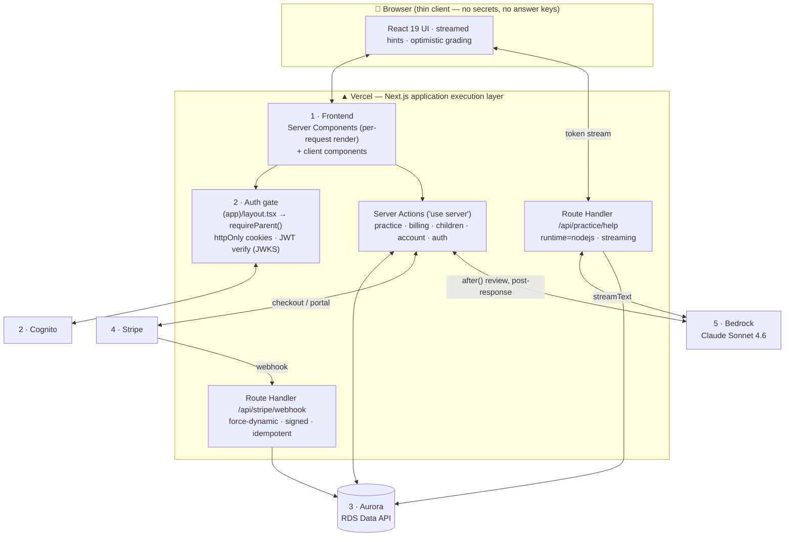

# Vercel — From Static Host to Full-Stack Orchestration Layer

**Judging criterion addressed:** *"Does the Vercel deployment go beyond a basic setup?"*

**Short answer:** ApexMaths has **no separate backend server**. Vercel *is* the
application execution layer. Every privileged operation — authentication, database
access, billing, and AI — runs inside Next.js Server Components, Server Actions,
and Route Handlers on Vercel, which orchestrate Amazon Cognito, Aurora, Bedrock,
and Stripe. The browser never holds a secret, never sees an answer key, and never
talks to a database. Vercel is the secure compute tier that a basic setup would
leave to a static frontend plus a pile of client-side API calls.

**Stack:** Next.js 16 (App Router) · React 19 · TypeScript · Tailwind v4 · deployed on Vercel (functions in **London — `lhr1` / eu-west-2**, co-located with Aurora and Bedrock).

---

## What "basic" would look like — and what we did instead

| Basic Vercel setup | ApexMaths |
|---|---|
| Static/SSR pages, data fetched client-side | **Server Components** fetch live data per request; secrets stay server-only |
| API keys shipped to the browser or a third-party BaaS | **Server Actions + Route Handlers** are the backend; all 4 SDKs (Cognito, RDS Data API, Bedrock, Stripe) run server-side |
| Auth via a drop-in widget | **Layered server-side gates** (`requireParent → requireOnboardedParent → requireEntitledParent`) enforced in the route-group layout |
| One generic serverless function | **Per-route runtime tuning**: `runtime = "nodejs"`, `maxDuration = 60`, `dynamic = "force-dynamic"` where each is actually needed |
| Request/response only | **Streaming** AI responses and **webhook ingestion** with signature verification + idempotency |

---

## The five layers Vercel orchestrates



### 1 — Frontend (rendered on the server, per request)
Pages that depend on live subscription state are `dynamic = "force-dynamic"`
(`dashboard`, `billing`, `account`, the practice player) so entitlement is read
fresh on every request rather than cached. The UI is a thin React 19 client:
Tailwind v4 + Radix primitives, `@vercel/analytics` enabled in production only.

The **child analytics dashboard** is a good example of the Server-Component model:
it issues several live Aurora queries in parallel on the server (mastery-over-time
window function, accuracy-by-difficulty join, correct/wrong/skipped `FILTER`
aggregate, and a `LAG()` improvement-velocity series) and ships only rendered
charts (recharts) to the browser — the analytical SQL never leaves the server, and
there's no separate analytics API. A past session opens in a dialog backed by a
single read-only Server Action that reconstructs it with one foreign-key join.

### 2 — Auth (Cognito, enforced server-side)
Authentication is composed in layers and enforced *before* a page renders. The
`(app)` route-group layout calls `requireParent()`, so every protected page
inherits the gate. Three tiers escalate the check:

```
requireParent          → signed in?            (else redirect /sign-in)
requireOnboardedParent → guardian/age attested? (else redirect /onboarding)
requireEntitledParent  → live Stripe entitlement? (else redirect /billing, audited)
```

Sessions are httpOnly cookies; the Cognito id token is verified on every request
with `aws-jwt-verify` against the pool's JWKS and **transparently refreshed** when
expired. No token is ever exposed to client JavaScript.

### 3 — Database (Aurora via the RDS Data API)
Server Actions and Server Components call Aurora over the **RDS Data API** (HTTPS,
IAM + Secrets Manager) through a typed wrapper with real transactions. The browser
has no database connection and no credentials. (Full rationale in
[`database.md`](./database.md).)

### 4 — Billing (Stripe, server-authoritative)
Server Actions create **Stripe-hosted Checkout and Customer Portal** sessions —
the payment page lives on Stripe's domain, so no card data touches our compute.
Redirect URLs are derived from `x-forwarded-host` so the same code works across
preview and production deployments. Inbound `/api/stripe/webhook` verifies the
Stripe signature (raw body, `force-dynamic`), **de-duplicates** events via a
`processed_webhook_events` table, and returns 500 on handler failure so Stripe
retries — entitlement is driven entirely by these server-verified events, never by
the client.

### 5 — AI (Bedrock — one model, two deliberately different UX shapes)

**One model, defined once.** Every AI surface — interactive hints, post-session
review, and the parent progress report — runs on **Claude Sonnet 4.6**, resolved
through a single accessor (`appModel()` in `lib/ai/model.ts`). There are no
per-feature model variants, so the three call sites can never drift apart. Sonnet
(over Haiku) was chosen because it conforms reliably to our structured schemas and
carries the tutoring quality; the trade-off is lower per-token throughput, which
we hide with the UX choices below.

**Region: in-region inference from London.** Our Vercel functions run in
**London — `lhr1` (eu-west-2)**, and Bedrock is invoked in the **same region
(eu-west-2)** via the **EU regional inference profile** (`eu.anthropic.claude-sonnet-4-6`),
not the `global.` cross-Region profile. Co-locating compute and inference matters:
in local measurement against eu-west-2, the regional profile roughly **halved
time-to-first-token** (~1.7s → ~0.9s) versus the global profile, with no change in
per-token price (cross-Region inference is a routing/availability decision, not a
pricing one). Keeping the function in `lhr1` next to the model avoids a
transatlantic round trip on every call.

The two AI surfaces have **different UX requirements**, so we deliberately use two
different execution shapes:

**(a) In-view & streamed — hints and the parent report.** These render while the
user watches, so latency must be *felt* as low. Both stream token-by-token:
- **Streaming hints** (`/api/practice/help`) stream Sonnet straight to the browser
  via `toTextStreamResponse()`. Repeat hints are **adaptive** — the route feeds the
  previously shown explanations back and asks for a genuinely different (still
  correct) approach.
- **Parent progress report** (`/api/children/report`) streams a structured report
  whose typed sections (momentum, summary, strengths, focus areas, next steps)
  fill in progressively. A subtle platform detail drove the design here: the
  Bedrock provider **buffers structured/tool-mode output** (`streamObject` /
  `experimental_output`) and emits it in a single chunk at the very end (~15–17s),
  so it never actually streams. We instead stream the report as **raw JSON over
  `streamText`** and parse the partial JSON on the client (the same `parsePartialJson`
  the SDK's object hook uses) — which streams from **~1s** with the sections
  appearing one by one. We verified each layer (Bedrock SDK → HTTP transport →
  browser) with a local probe (`scripts/stream-probe.mjs`) before settling on this.

**(b) Off the critical path — post-session review.** When a child finishes a test,
the parent should see their score *immediately*, not wait on per-question AI.
So `finishSessionAction` persists a deterministic **skeleton** (score, per-topic
summary, and usable fallback explanations) and **redirects right away**, then runs
the per-question Bedrock calls inside **Next.js `after()`** — work that executes
*after* the response is sent and which Vercel keeps the function alive to finish
(the practice route allows `maxDuration = 60`). The result page renders the
skeleton instantly and **auto-refreshes** (bounded polling) while the review is
`pending`; when the background work finalises it to `complete`, the AI
explanations appear in place. These calls are **non-streaming `generateText`** on
purpose — the output is persisted and polled, never shown live, so streaming would
add nothing. The review service is bounded by a per-call timeout *and* an overall
budget, never throws, and degrades every unsettled item to deterministic text, so
the report can never hang.

In short: **stream when the user is watching (hints, report); pre-compute +
persist + poll when they are not (review)** — same model, latency hidden two
different ways.

### 6 — Adaptive "Skill builder" session (maximum reuse, a pure tested core)

The newest session type, **`adaptive`** (parent label **"Skill builder"**),
shows the same server-authoritative discipline applied to *personalisation*. It
**reuses the entire existing session lifecycle unchanged** — the entitlement
gate, one-active-session guard, the answer firewall (`toClientQuestion`),
idempotent server-side grading, the server-enforced timer, the `after()` review,
and audit logging are all type-agnostic. The *only* new behaviour is **how the
ordered question ids are chosen**. That "maximum reuse, minimum new surface
area" is deliberate: a new product capability that adds almost no new attack
surface or lifecycle complexity.

The selection logic itself is split along the **pure/impure boundary, which is
also the testability boundary**:
- **`Selection_Core`** (`lib/practice/adaptive-selection.ts`) is a **pure,
  deterministic, I/O-free** function — all weighting, allocation, difficulty
  targeting, recency exclusion, fallback, and cold-start logic, depending only
  on its arguments and an **injected seeded RNG**. Because it touches nothing
  external it is exhaustively **property-tested with `fast-check`** (allocation
  always sums to the session total, no duplicate ids, completeness vs. scarcity,
  determinism under a fixed seed).
- **`Selection_Service`** (`lib/db/adaptive.ts`) is a thin **`server-only`**
  orchestrator that does the Aurora reads (mastery, accuracy-by-difficulty,
  candidate pools, the recency anti-join), runs the core, and hands the result
  to the *same* `createSession` every other type uses.

The personalisation is **user-first**: the default **weak-weighted
(inverse-mastery)** scheme concentrates practice where a child is weakest, with
**ZPD difficulty targeting** (questions pitched near the band where they score
~70–80%), a **coverage floor** so every topic stays warm, a **1-day recency
exclusion** with a fallback chain that **always fills the session to its full
count**, and graceful **cold-start "calibrating"** handling for brand-new
learners. Parents get practice that demonstrably lands where it helps most.

Finally, the **explainability** is a deliberate UX + data decision. The player
page derives the per-topic breakdown (**"Today's mix: 5 Geometry, 4
Fractions…"**) and the calibrating note **at render time** from the session's
own question ids and the pre-session progress read — **no persisted selection
state and no schema bloat** (the one migration is a recency index, nothing
more). The explanation carries only topic names and counts, so it stays
PII-free and the session proceeds even if it can't be produced.

---

## Engineering details that mark it as deliberate

- **Single security boundary.** `server-only` guards keep DB, auth, AI, and Stripe
  code out of the client bundle. An **answer firewall** (`toClientQuestion`) strips
  `correctIndex` before any question is serialised mid-session; grading is
  server-authoritative and idempotent (first answer wins), with server-enforced
  timer expiry.
- **Pure core, impure shell.** Adaptive question selection is a **pure,
  deterministic, `fast-check`-property-tested** function (injected seeded RNG,
  zero I/O) behind a thin `server-only` service that does the Aurora reads — the
  new session type reuses the whole existing lifecycle, so the only new surface
  area is *which* questions get chosen.
- **Per-route runtime decisions, not defaults.** `nodejs` runtime for the AI SDK,
  `maxDuration = 60` only where inline AI needs it, `force-dynamic` only where
  per-request freshness matters. Functions are pinned to **`lhr1` (London,
  eu-west-2)** so compute sits next to Aurora and Bedrock — same-region inference
  roughly halved the parent report's time-to-first-token versus the global
  cross-Region profile.
- **Cache coherence.** Mutations call `revalidatePath('/dashboard')` so server-rendered
  data stays consistent immediately after writes.
- **Deploy-portable.** Origin/redirect URLs are derived from forwarded headers, so
  preview and production deploys work without per-environment config changes.

---

## Do we need a separate Vercel architecture diagram?

**No — it's already covered.** The mandatory architecture diagram in
[`architecture_diagram.md`](./architecture_diagram.md) shows how the Vercel
deployment connects to every AWS component and Stripe (the system *topology*),
which is exactly what the submission requirement asks for. The Mermaid diagram in
this document is a complementary, *internal* view — how Vercel composes the five
execution layers — and is optional supporting material, not a second required
submission image.
